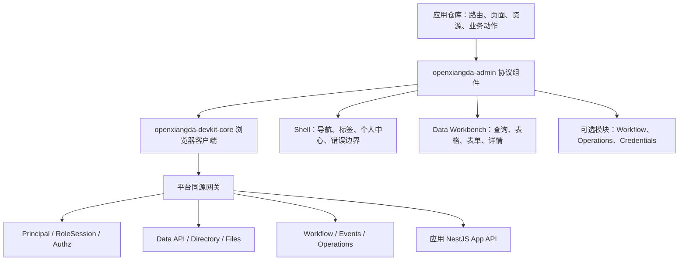
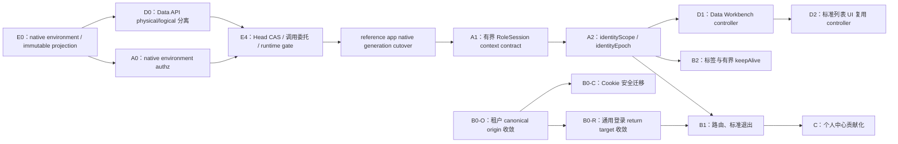

# OpenXiangda Admin Shell v2 历史设计（已废弃）

> 公开版本已匿名化客户、环境和实例标识。历史验收叙述仅作设计背景，不代表当前线上状态。

> **SUPERSEDED / 历史证据（2026-08-21）**：本文和其后续 Pro v6 决策都已被 [Vite / Refine 前端决策](./frontend-stack-decision-v2.md)与[产品北极星](./product-north-star-v2.md)取代。本文不得作为当前 UI、RoleSession、路由、CLI 或 Skill 实现依据。

状态：方案已确认并进入分阶段实现；2026-08-14 已完成平台 Native A1 有界 RoleSession context 及真实 PostgreSQL 验收

> 2026-08-16 架构修订：Admin 表现层和工具链已决定[全量切换到 Ant Design Pro v6](./ant-design-pro-v6-admin-foundation.md)。本文关于“不引入 ProComponents/Umi”“继续使用 Vite/自研 Shell”“流程提交常驻双栏预览”的结论全部废止；本文保留的现状审计以及 RoleSession、route manifest、权限、标签/保活、脏状态、Data/Workflow 合同继续作为迁移不变量，不再作为 UI 技术选型依据。

适用范围：OpenXiangda 2.0 新应用，不兼容 1.x 运行时

决策对象：`openxiangda-admin`、官方应用模板、参考应用，以及必要的平台身份协议

## 1. 决策摘要

OpenXiangda 2.0 已经具备可运行的 Admin 基础，不应再引入一套新的后台框架重写。后续建设采用以下方向：

1. 保留 `openxiangda-admin` 作为平台官方 React Admin 内核，应用只声明静态路由、菜单、数据资源和业务扩展。
2. 保留 Ant Design 6.4.2，不引入 `@ant-design/pro-components` 运行时。当前 Pro Components 2.8.10 只声明兼容 Ant Design 4/5，直接安装会形成未声明兼容和双重状态模型。借鉴 ProLayout、ProTable、ProForm 的成熟交互，但将协议、查询、权限和缓存能力落在 OpenXiangda 自己的组件中。
3. 身份、角色会话、权限解释和环境边界由平台协议负责；路由隐藏、按钮隐藏仅负责用户体验，不能替代后端授权。
4. 路由与导航来自应用仓库中的静态、可校验 manifest。平台后端不能下发任意前端组件或可执行代码。
5. 标签页存在状态、页面组件保活状态、数据查询状态是三种不同状态，必须分别建模。角色、用户、租户或环境变化时，旧身份的页面实例和数据状态必须立即失效。
6. 标准数据管理页继续基于 Data API，拆成无头查询控制器和标准 Ant Design 6 界面两层，不再增加第二套 ProTable 查询协议。
7. 个人中心由 Shell 承担基础身份信息、角色切换、会话状态和退出登录；流程代理等领域能力改为显式扩展，不再硬编码到 Shell 核心。
8. 先用本地 Mock 和新建应用验证，再发布 npm alpha 包；同一不可变应用版本先进入预发，验收通过后晋级正式环境。

## 2. 现状审计

### 2.1 已完成能力

当前 `openxiangda-admin` 已经包含：

- Principal 与 RoleSession 初始化、恢复、续期和失败重试；
- 多角色首次选择、稳定单角色使用和主动切换；
- 批量 capability explain、应用管理员绕过和页面访问边界；
- 响应式侧栏、移动端抽屉导航、面包屑、404 和路由级错误边界；
- 固定/可关闭标签、标签恢复、页面保活和当前页刷新；
- 个人中心、身份范围展示和流程代理入口；
- Data API 服务端分页、明确字段筛选、服务端排序、列设置、密度、跨页选择、CRUD、详情、审计、导入导出和文件字段；
- Workflow Kernel v2、运维诊断和凭据管理标准页面；
- 本地平台 Mock、组件测试和真实 Chromium E2E。

因此，本阶段不是“换后台模板”，而是把已有能力从可用组件提升为稳定、可扩展、可验证的框架协议。

### 2.2 需要修正的架构缺口

| 缺口 | 当前表现 | 架构风险 |
| --- | --- | --- |
| 身份展示资料缺失 | Principal 只有 `userId`，个人中心和头像只能显示 ID | 每个应用自行调用旧用户 API，产生权限、隐私和实现分叉 |
| 身份响应携带授权明细 | bootstrap 的每个 Native `RoleSubject` 直接返回 `scopeGrants.values[]`，角色选择器和个人中心逐值渲染 | 仪器、学院、项目等授权增长后，身份响应、下拉框和 DOM 一起无界膨胀；且只展示 membership 内联授权，不能代表用户+角色的完整有效范围 |
| 跨浏览器标签失效缺失 | 后端每个 loginSession/app/environment 只有一个 active RoleSession，但前端标签之间不通知 | 一个标签切换角色后，另一个标签仍展示旧身份数据，直到下一次请求被服务端拒绝 |
| 本地偏好作用域不完整 | 标签和数据页主要按 `appCode + roleSubjectKey` 保存 | 同浏览器切换租户、用户或环境时可能复用错误偏好或路径 |
| 页面保活默认过宽 | 除 `cache: false` 外，打开标签通常保持挂载 | 长时间使用后内存增长；旧身份组件可能短暂存活 |
| 菜单协议较弱 | 单 capability、无 manifest 校验、父菜单空分支语义不完整 | 复杂权限组合和错误路由只能在应用代码中补丁化处理 |
| Shell 与领域能力耦合 | 个人中心直接包含流程代理 | 不使用 Workflow 的应用仍承担领域依赖和产品假设 |
| 数据页文件过大 | 查询、偏好、筛选、表格、表单和导入导出集中在单文件 | 修改一个交互容易影响权限和查询语义，难以做精确测试 |
| 查询生命周期分散 | 每个页面自行依赖 roleSession id 和序列号处理陈旧请求 | 身份切换时缺少统一的失效协议和扩展点 |
| 退出登录非标准能力 | Shell 仅接受可选 `onLogout` | 新应用可能忘记接入退出并形成半成品 |

### 2.3 2026-08-12 实现证据审计

本次审计不以文件存在或测试名称作为完成证据，而是同时核对协议、实现、模板消费和黑盒场景。结论是：现有 Admin 应继续演进，不能重写；A-D 阶段仍有真实协议缺口，但不需要重新制作已有页面能力。

| 维度 | 已有可复用证据 | 尚未满足的设计不变量 | 处理决定 |
| --- | --- | --- | --- |
| 身份 Provider | bootstrap 校验 `appCode + environmentKey`；切换失败保留旧会话；权限批量查询、缓存清理、提前续期和页面恢复均已实现 | Context 没有完整 `identityScope`/`identityEpoch`；旧 bootstrap 没有 `subjectProfile` 且携带无界 grant 明细 | 新增有界 context serializer 并扩展现有 Provider，不建立第二套身份容器或 RoleSession 状态 |
| 路由与菜单 | 静态 `AdminRouteObject[]`、参数匹配、面包屑、直接路由 403、404 和路由错误边界已经存在 | 仅支持一个 capability；无 manifest 负向校验；父级访问继承和纯分组节点未建模 | 在现有路由协议上加入结构化访问表达式和确定性校验，不更换路由框架 |
| 标签与页面实例 | 固定/关闭/关闭其他/刷新/会话恢复和最多 12 个标签已实现 | `cache` 同时控制恢复与挂载；除 `cache:false` 外页面全部保活；无最多 6 个保活页和 LRU；存储键缺 tenant/user/environment | 拆分 tab persistence 与 keepAlive，身份 epoch 改变时同步卸载旧实例 |
| 个人中心 | 当前角色、业务范围、角色切换和 Workflow 代理均可用 | 姓名和头像退化为 userId；核心包直接依赖 Workflow；退出登录仍是可选回调 | 增加只读资料协议，把 Workflow 代理改成显式贡献，并提供默认安全退出适配器 |
| 数据管理 | Data API 服务端分页、明确字段搜索、排序、字段权限、CRUD、详情、审计、CSV、文件字段、慢请求序列保护和角色切换清选择均已实现 | 偏好键仍是 `appCode + roleSubjectKey`；查询生命周期未形成可复用 controller；单文件约 1700 行 | 先接入 identity epoch，再做保持外部行为的 controller/UI 拆分 |
| 可选模块 | `workflow`、`operations`、`credentials` 已有独立包入口，模板使用静态 lazy route | 个人中心仍静态导入 Workflow；无 Workflow 应用缺少 bundle 负向证据 | Core 不再 import Workflow；模板显式装配贡献，构建门禁验证无意外 chunk |
| 模板与黑盒 | 模板已经覆盖桌面 Shell、移动导航、列表操作、身份失败恢复及两条 Workflow 浏览器链路；生产 chunk 预算通过 | 缺跨 tenant/user/environment 的偏好隔离、keepAlive 淘汰、标准退出和路由 manifest 负向场景 | 保留已有 E2E，补充针对新协议的可证伪场景，不重写业务演示 |
| Ant Design 6 | 6.4.2 + React 19.2.8；离线扫描 37 类组件、143 处导入 | 本次 `antd lint` 无 deprecated、a11y、usage、performance 告警 | 不引入 Pro Components 运行时；后续修改继续按精确 6.4.2 API 查询和 lint |

平台侧 `users` 已经具备 `name`、`avatar`、`jobNumber` 和主部门关系，因此 `SubjectProfile` 不需要数据库迁移。资料必须通过当前 tenant 与 userId 联合查询，主部门也必须再次校验 tenant；不得把手机号、邮箱、密码、第三方账号或组织管理能力带入 context。

## 3. 架构不变量

每次实现和评审都必须满足以下不变量：

1. **后端授权权威**：前端菜单、路由和按钮裁剪不能扩大 Data API、App API、Workflow 或控制面的授权结果。
2. **环境来自可信入口**：前端不能通过业务参数覆盖 `environmentId/environmentKey`；稳定环境 UUID 由平台托管页面元数据和已验证会话确定，URL key 必须经 registry 精确核对。
3. **单一活动角色主体**：一个 RoleSession 只激活一个 `roleSubject`；普通主体引用环境 RoleMembership，应用最高管理员使用平台保留主体，不隐式合并多角色权限。
4. **身份作用域隔离**：所有 UI 偏好、页面保活、查询和授权缓存至少绑定 `tenantId + appCode + environmentId + userId + roleSubjectKey`；显示 key 不作为持久身份。
5. **身份改变即失效**：角色、用户、租户、环境或 `authzVersion` 改变时，旧作用域的授权缓存、查询、选择项和页面实例不得继续使用。
6. **身份响应有界**：context 只传当前角色和分页角色选择所需摘要，不传可随业务对象数量线性增长的完整 grant 明细；摘要绝不作为授权依据。
7. **静态前端代码**：平台只提供数据与授权协议，不向浏览器下发任意 React 组件或可执行业务代码。
8. **显式服务端查询**：列表必须分页，并使用明确字段的过滤与排序；禁止拉取大页后在浏览器筛选。
9. **字段策略闭环**：前端按字段策略裁剪显示、搜索、表单和传输，后端仍独立执行字段读写授权。
10. **组件状态有界**：标签数量、保活页面数量、查询并发、导入导出规模都必须有明确上限。
11. **失败可恢复**：身份刷新、页面渲染、查询、保存和角色切换失败时保留最后一个仍有效状态，并提供显式重试或回滚；已经收到服务端或同源标签失效证据的旧身份不能继续展示。

### 3.1 每轮实现前的架构决策门禁

本文后续每一轮修改都必须先形成可检查的决策记录。决策没有通过时只能继续审计和修订设计，不能用局部补丁提前改运行时代码。

| 检查项 | 必须回答的问题 | 不通过时的处理 |
| --- | --- | --- |
| 问题与证据 | 问题能否由源码、协议、日志或可复现测试证明，而不是由页面现象猜测 | 继续只读定位，不改代码 |
| 能力所有权 | 平台、Admin Core、可选模块、应用前端或 NestJS 后端中，谁是唯一事实来源 | 先收敛所有权，禁止新建第二套状态或接口 |
| 稳定不变量 | 身份、权限、环境、数据、发布和 1.x 隔离边界是否仍成立 | 修改设计或缩小范围 |
| 上下游契约 | 调用方、被调用方、缓存键、存储、模板、CLI 和发布门禁会受到什么影响 | 列出 additive/breaking 变化和迁移顺序 |
| 失败与并发 | 超时、重试、重复请求、切换身份、旧响应、部分成功和多会话写入如何处理 | 先定义幂等、失效和恢复语义 |
| 安全与资源 | 是否扩大授权、泄露资料、形成开放跳转、无界缓存或额外常驻资源 | fail closed，并给出上限和清理策略 |
| 回滚边界 | 是否能单独回滚；是否需要数据回滚；现网旧应用是否受影响 | 拆分提交和发布单元，禁止混合不可逆变化 |
| 可证伪验收 | 哪些 unit、contract、HTTP、浏览器和新应用场景能证明决定正确 | 先写验证矩阵，再进入实现 |

每轮提交只解决已声明的架构主题。审计过程中发现的相邻问题进入后续决策记录；除非它直接破坏本轮不变量，否则不顺手扩大修改范围。

### 3.2 当前轮决策记录：A1 有界 RoleSession context

| 门禁 | 本轮结论 |
| --- | --- |
| 问题与证据 | 当前 `bootstrapRoleSession()` 事务外读取全部有效 assignments，旧 serializer 返回完整 `scopeGrants.values[]`；`activateAssignment()` 还允许把事务外 `knownActive` 带入事务。前者会让身份响应随业务范围无界增长，后者不能表达两个标签同时切换不同角色时谁胜出。 |
| 能力所有权 | Platform native RoleSession 是唯一当前角色事实源；`resolveRoleSessionContext()` 是唯一领域状态机。native HTTP 端点只做 transport/serializer，Admin 只消费并管理页面生命周期 epoch，不建立第二套身份状态；alpha 路由不适配 native 状态。 |
| 稳定不变量 | 一个 login session/app/environment 同时最多一个 active RoleSession；一个 RoleSession 只激活一个 native role subject；identityScope 不作为授权输入；每个业务请求继续按环境 authz revision/version、membership/super-admin grant 和 scope 重新授权。 |
| 上下游契约 | K1 将 context、role-subjects、context/switch 与新版 Admin 一起置于 generation gate 后离线验证；K3 排空并撤销 alpha session；K4 原子切到 native 后只开放新端点，旧 alpha 端点稳定 410。devkit/Admin 制品必须在 K4 前已构建验证，入口文档使用 `no-store` 获取新摘要。 |
| 失败与并发 | A0 先完成 native 环境授权状态、原子版本和 role subject 局部 revision；context bootstrap/refresh/switch 使用一致事务快照，第一步取得 per-session advisory lock；switch 使用 expected RoleSession CAS。同目标重试幂等，不同目标并发返回稳定 409 后重取事实；写操作不因身份刷新自动重放。 |
| 安全与资源 | 当前项与单页最多 256 KiB，角色页默认 20/最大 50，摘要最多 8 个维度/每维 3 个 64 字符 preview；preview 不是凭据。可见标签五分钟带抖动校验，隐藏标签停止；偏好和 keepAlive 都有容量、TTL 与清理规则。 |
| 回滚边界 | K4 前可回滚 native-capable 镜像；K4 后只能回滚到理解 `native-2` 和新 context 的修复镜像，旧 Admin/端点不再恢复。reference app 可在 native 不可变 AppVersion 间移动 Head。 |
| 可证伪验收 | native context 与数据库授权 oracle/state 对照；50+ role subject cursor 稳定，authzVersion/subject-set version 变化分别 stale；超限 fail closed；两个标签同目标与不同目标切换；撤权期间旧数据遮蔽；旧路由稳定 410 且刷新后加载 native Admin。 |

本轮明确不做：不改 OAuth2/App Auth，不引入全局网络调度器，不把 S0 第三方 OAuth state 或 B0-O/B0-C/B0-R 混入 A1 实现提交。A1 必须等待 [环境配置内核](./environment-configuration-kernel-v2.md) 与 [原生授权内核](./authorization-consistency-v2.md) 的 reference app 环境切换；否则有界 context 仍会建立在开发/生产共享的授权事实之上。A1 本身不再重做 Data API 或授权存储。

### 3.3 2026-08-14 工具链实现轮：A1 消费协议

| 门禁 | 本轮结论 |
| --- | --- |
| 问题与证据 | 平台已返回 Native context，但 devkit 和 Admin 仍请求 Alpha `/authz/role-session`；本地内核已使用 native membership fixture，序列化层却又转成旧 assignment，导致本地与远程协议分叉。 |
| 能力所有权 | 平台 Native context 是唯一身份事实；`openxiangda-contracts` 拥有 wire schema，devkit 只负责 transport，local platform 只模拟同一协议，Admin Provider 在下一独立提交拥有浏览器生命周期。 |
| 稳定不变量 | 不通过修改旧 `Principal/RoleSession` 类型伪造兼容；新协议使用独立 Native schema，不带完整 scope grants，local 是不可部署的 `RuntimeMode`。 |
| 上下游契约 | contracts 新增 SubjectProfile/RoleSubjectPage/Native Principal/Native RoleSession/Context；compiler 自动要求 `authz.role-session-context`；devkit 新增 context/page/CAS switch；local platform 返回同一 schema。 |
| 失败与并发 | switch 传送 `expectedRoleSessionId`；同目标重试幂等，不同目标且预期会话过期返回 409；角色页游标绑定应用、用户、搜索词和 role-subject-set version。 |
| 安全与资源 | 单页最多 50 个角色，摘要最多 8 维 ×3 预览值；模板不手工声明平台基础能力；本地游标同样签名，防止 UI 测试默认信任可篡改页码。 |
| 回滚边界 | 本轮只添加 contracts/client/local/compiler 能力，不切 Provider；可独立回滚，不修改应用数据、环境 Head 或现网入口。 |
| 可证伪验收 | contracts 资源上限测试、devkit URL/body 测试、local context 负向泄漏与 CAS 测试、compiler required capability 断言，再运行 `pnpm verify:affected`。 |

### 3.4 2026-08-14 工具链实现轮：Native explain 消费门禁

| 门禁 | 本轮结论 |
| --- | --- |
| 问题与证据 | Admin 即使读取 Native RoleSession context，按钮与路由仍通过 Alpha `/authz/explain-batch` 获取携带旧 Principal/RoleSession 的决策；这会把 Native 身份重新映射成 Alpha 授权协议，并让权限缓存无法校验 scope 版本。 |
| 能力所有权 | 平台 evaluator 与 data-policy service 是 RBAC/数据范围的唯一事实源；contracts 只定义 wire schema，devkit 只负责传输，local platform 模拟完全相同的有界协议。Admin 只把 explain 用作展示建议，Data API、App API 和 Workflow 后端仍逐次独立授权。 |
| 稳定不变量 | 每个决策绑定 `environmentId + environmentKey + roleSessionId + authzRevisionId + authzVersion + scopeDataVersion`；响应不返回 Principal、RoleSession 或 scope grant 明细；RBAC 拒绝时不继续泄露数据策略事实。 |
| 上下游契约 | 新增 `openxiangda.native-authorization-{decision,batch-request,batch-result}/v2`、devkit Native 单项/批量方法和 `authz.native-batch-explain` 编译能力。旧 Alpha 类型与端点本轮不改写，Provider 在下一独立提交切换。 |
| 失败与并发 | 批量最多 200 项且 key 唯一；每项 data 最多 100 个字段/16 KiB，请求与响应最多 256 KiB。Admin 必须校验批量与逐项 identity 均等于当前 context，收到旧版本响应时丢弃而不是覆盖新身份缓存。 |
| 安全与资源 | capability、policy、operation 均有长度上限；data policy 必须显式携带 operation；完整授权明细不进入浏览器。授权缓存只存有界布尔决策并绑定 identity epoch。 |
| 回滚边界 | 本轮只改 contracts/client/local/compiler，可独立回滚且无数据库变化；Admin Provider 迁移是下一发布单元，避免协议和页面生命周期混在一个不可定位提交中。 |
| 可证伪验收 | contracts 边界测试、devkit URL/header/body 测试、local allow/deny/身份绑定/重复 key/缺会话负向测试，再运行 `pnpm verify:affected`。 |

### 3.5 2026-08-14 Admin 实现轮：A2 Native Provider

| 门禁 | 本轮结论 |
| --- | --- |
| 问题与证据 | 旧 Provider 同时保存 Alpha bootstrap、Principal、RoleSession 和 assignments，并用 `appCode + environmentKey` 作为 UI 作用域；数据偏好又只绑定 assignment id。Native context 已上线后继续沿用这些状态会丢失 tenant/user/environment UUID、授权修订和 scope data version。 |
| 能力所有权 | 平台 `RoleSessionContext` 是唯一身份事实；Provider 只保留该 context、由其投影当前资料/主体/会话，并生成浏览器本地 `identityEpoch`。RoleSubject 分页只用于选择和展示，不作为授权事实。 |
| 稳定不变量 | active context 必须同时具备匹配环境的 Principal、RoleSession、currentRoleSubject 和 identityScope；任何字段缺失都 fail closed。权限决策必须逐批及逐项匹配 environment/session/authz/scope 版本。 |
| 上下游契约 | Admin Context 改为 Native Principal/RoleSession/RoleSubject，并暴露 `identityScope`、`identityEpoch` 和角色分页加载。Shell 标签、页面实例和标准数据页绑定 scope/epoch；模板故障实验和 HTTP 测试改走 Native 路由。 |
| 失败与并发 | 切换使用 expected RoleSession CAS；同标签串行身份操作。切换成功通过 BroadcastChannel 与 storage event 通知同源标签重新读取平台事实；旧 explain 响应或旧角色页版本只会被丢弃并触发刷新。 |
| 安全与资源 | Context 不再携带 scope grants；角色搜索服务端分页，首屏/单页上限沿用 20/50；权限缓存仅保存有界决策且随 epoch 清空。头像通过无 referrer 图片节点加载，失败回退图标。 |
| 回滚边界 | 本轮只迁移 `openxiangda-admin` 和新应用模板，不改平台数据库或 1.x；可回滚到前一 alpha 制品。由于 2.0 不维护 Alpha 兼容，发布时 contracts/devkit/admin 必须作为同一版本组合验证。 |
| 可证伪验收 | Native context 正负向作用域、决策 identity 和 epoch 签名单测；Admin/template 类型检查、HTTP 测试、生产构建、真实 Chromium 角色切换与身份初始化失败恢复，再运行 `pnpm verify:affected`。 |

### 3.6 2026-08-14 Admin 实现轮：UX1 标准页面视觉系统

| 门禁 | 本轮结论 |
| --- | --- |
| 问题与证据 | Shell、数据、工作流和 Dashboard 已有功能组件，但页面标题、内容容器、操作区与详情层级不统一，应用仍需要自行拼出一套后台视觉系统；流程详情还直接暴露内部状态和值对象。 |
| 能力所有权 | `openxiangda-admin` 拥有 Page Header、Section、指标、快捷入口、搜索/表格工作台、标准数据表单与详情、流程发起/详情的交互和视觉协议；应用只提供标题、字段声明、业务路由和动作 contribution。平台继续拥有身份、授权和业务规则。 |
| 稳定不变量 | 页面状态始终绑定当前 Native identity epoch；搜索、分页、排序、列设置仍由 Data API 与列表协议驱动；流程按钮、字段策略和参与人始终以后端 Surface 为准。视觉重构不得复制后端规则或建立第二份页面状态。 |
| 上下游契约 | 新增可复用 `PageHeader`、`PageSection`、`DashboardQuickActions`、`WorkflowCountMetric`；模板首页组合四项指标、快捷入口和服务端聚合图表。Data 与 Workflow 标准页面共享统一标题、卡片、表单和时间线语言。 |
| 失败与并发 | 指标、列表和流程仍各自保留独立加载、错误与重试；待办指标使用工作中心服务端 `total`，不把当前分页长度误当总数。中等宽度流程页面切为单列，移动端操作区解除 sticky，避免遮挡表单。 |
| 安全与资源 | 不引入 Pro Components/Umi 运行时，避免与 Ant Design 6、现有路由及 Native 身份生命周期形成双框架；ECharts 继续按需加载，页面只增加 CSS 与已有 Ant Design 组件。中低信息密度不以隐藏审计、授权或失败状态为代价。 |
| 回滚边界 | 本轮限于 Admin 包与官方 reference 模板，无数据库、平台 API 或业务数据变化；可整体回滚视觉包，不影响 Native 身份与后端授权。 |
| 可证伪验收 | Admin 与模板 check/test/build、真实 Chromium 桌面和移动布局、数据搜索/列设置/新建表单、流程发起/审批/代理/加签/退回/撤回/终止，再运行 `pnpm verify:affected`。 |

### 3.7 2026-08-14 Admin 实现轮：B1.1 路由合同与访问表达式

| 门禁 | 本轮结论 |
| --- | --- |
| 问题与证据 | Admin route 仍由应用手写，只有单个 `capability`，菜单裁剪与直接 URL 只检查当前节点；生成的 `appRoutes` 不是 renderer 闭包，缺页面、重复路径、父访问遗漏和动态详情固定标签都可能到浏览器后才暴露。 |
| 能力所有权 | Compiler 拥有不可变 route contract 与 capability 闭包；Admin 的 `defineAdminRouteManifest` 拥有 React renderer 闭包和 UI 判定；平台 evaluator 仍是 capability 的唯一事实源，Data/App/Workflow 后端继续逐请求授权。 |
| 稳定不变量 | route 只能使用单 `capability` 简写或一个非空、有界、去重的 `access.allOf/anyOf`；子路由必须同时满足每个祖先 clause。应用管理员可使用平台声明的 bypass，普通角色的菜单和直接 URL 使用同一批决策。 |
| 上下游契约 | `AppFrontendRouteContract` 增加 `access`；Compiler 规范化数组并校验 capability catalog；官方模板以生成的 `appRoutes` 定义冻结 manifest，Shell 不再接受未验证 routes。动态 route 必须提供基于 match 参数的 `tabLabel`，fallback 必须是无业务 capability 的静态 route。 |
| 失败与并发 | manifest 在模块加载时同步 fail closed；权限批量响应仍绑定 Native identity，旧 epoch 结果不会进入新页面。缺失 decision 保持 loading，不会按允许处理；批量失败隐藏菜单并让直接 URL 显示拒绝页。 |
| 安全与资源 | 每个 route clause 最多 50 个 capability，Compiler 与 Admin 同时拒绝空值、重复值、混用简写和结构式；不新增网络轮询，所有 route capability 继续合并为一次有界 batch explain。前端裁剪不得作为敏感数据授权证据。 |
| 回滚边界 | 本轮只改变 contracts/compiler/admin/template，不修改平台数据库。B1 的标准退出没有在本轮伪实现：它仍严格等待 B0-R 收敛平台 callback，再作为独立发布单元接入。 |
| 可证伪验收 | Schema/Compiler 正负向测试；Admin manifest 缺 renderer、动态标签、fallback 和父级继承测试；模板合同生成 check；Chromium 直接访问无权 route 必须 403 且页面组件不渲染；最终运行 `pnpm verify:affected`。 |

### 3.8 2026-08-14 Admin 实现轮：B1.2 标准记录页面与资源失效

| 门禁 | 本轮结论 |
| --- | --- |
| 问题与证据 | `DataListPage` 已覆盖查询、权限和传输，但独立新建/编辑/详情路由仍要求应用手写加载、保存和审计适配；首次 Chromium 验收还证明保活详情会在另一页面修改后继续展示旧记录。 |
| 能力所有权 | `openxiangda-admin/data` 统一拥有 Data API 记录页面、字段策略、revision CAS、资源级失效与标准状态；应用只声明字段和路由。平台仍是记录、权限与审计事实源。 |
| 稳定不变量 | Modal/Drawer 与独立页面共享一个 Data API/字段权限协议；写入成功后只使同资源页面重新读取服务端，不在前端伪造新记录。动态详情、新建和编辑路由默认不保活，但标签仍可存在。 |
| 上下游契约 | 新增 `DataFormPage`、`DataRecordPage` 和可复用 `DataRecordDetail`；`DataListPage` 增加可选 `onCreate/onDetail/onEdit`。Admin Context 暴露当前页面生命周期内的资源 mutation epoch 与 `invalidateData`，不进入浏览器存储或授权请求。 |
| 失败与并发 | 读取继续使用 sequence 淘汰旧响应，更新继续携带 expected revision；失效只在写请求成功后发生。缓存列表、抽屉和详情以同一资源 epoch 触发重新查询，身份 epoch 仍是更强的全状态边界。 |
| 安全与资源 | 不引入 ProTable/React Query 第二状态源；mutation epoch 只存每个已变更资源的整数，不保存行数据。后端拒绝时不导航、不失效、不显示伪成功。 |
| 回滚边界 | 本轮只改 Admin 包和官方模板；无平台 API、数据库或 1.x 变化。可整体回退标准页面包，已有 Modal/Drawer 调用保持兼容。 |
| 可证伪验收 | 路由静态 `/new` 优先于动态 `/:recordId`；Admin 与模板 check/test/build；真实 Chromium 覆盖列表→详情→编辑→保存→详情→列表，并确认新值和审计刷新。 |

### 3.9 2026-08-14 Admin 实现轮：B1.3 流程业务提交适配

| 门禁 | 本轮结论 |
| --- | --- |
| 问题与证据 | 原 `WorkflowStartPage` 由应用硬编码 `businessKey/dataRef/facts`，业务表单与流程预览并未形成可复用提交协议；审批人答案变化后旧 preparation token 仍可能被发起，重复点击发起还会生成新的幂等键。 |
| 能力所有权 | `openxiangda-admin/workflow` 拥有提交页组合、预览失效和交互状态；应用 NestJS App API 拥有业务字段校验、派生字段与 Data API 事务；Workflow Kernel 只拥有条件解析、参与者、操作 Surface 和实例状态。 |
| 稳定不变量 | 每个可发起的预览精确绑定 `businessKey + dataRef revision + facts + answers`；任一业务值或提交答案变化都必须重新保存/预览。业务字段始终保存在 Data API/App API，不进入流程库。 |
| 上下游契约 | 新增 `WorkflowSubmissionPage` 与 `saveBusiness(values, context)`，适配器返回 `WorkflowSubmissionSnapshot`。保存上下文包含当前 Principal、RoleSession、App API、环境、上次快照和稳定幂等键；官方模板用 `/api/reservations/draft` 演示敏感派生字段由后端写入。 |
| 失败与并发 | 保存失败保留同一业务幂等键以安全重试，成功后才轮换；每次成功预览生成一个发起幂等键，发起失败继续复用。更新草稿校验所有者、状态和 expected revision；旧预览签名不能启用确认按钮。 |
| 安全与资源 | 发起页路由显式要求业务 capability；浏览器只提交白名单业务字段，申请人、学院和状态由 NestJS 使用应用 Data API 身份派生。App API、Data API 与 Workflow 仍逐层后端授权，前端隐藏字段不作为安全边界。 |
| 回滚边界 | 本轮只改 Admin、Local Platform 和官方模板，不修改远端 Kernel 或平台数据库。旧 `WorkflowStartPage` 仍可用于已经持久化业务引用的低层组合，但不承担业务保存。 |
| 可证伪验收 | Admin 签名正负向单测；Nest 草稿派生/所有者测试；Local App API create/update/replay；真实 Chromium 覆盖保存→自动预览→主部门选择→重新预览→发起，并回归转交、代理、加签、退回、撤回与终止。 |

### 3.10 2026-08-14 Admin 实现轮：B2 标签与有界页面保活

| 门禁 | 本轮结论 |
| --- | --- |
| 问题与证据 | Shell 已限制最多 12 个标签，但单个 `cache` 同时表示会话恢复和组件保活；除 `cache:false` 外的所有标签页面都会持续挂载，标签数量上限等于页面实例上限。动态详情的默认恢复策略也不明确，无法证明刷新或身份变化后不会复活旧业务页面。 |
| 能力所有权 | Compiler/Contracts 拥有不可变的 `tabPersistence` 与 `keepAlive` 路由策略；Admin Shell 拥有标签注册、会话恢复、页面实例 LRU 和身份 epoch 卸载。页面业务数据、授权结果和表单草稿仍由各自后端协议或页面组件拥有，标签层不持久化它们。 |
| 稳定不变量 | 标签存在、浏览器会话恢复和 React 实例挂载是三个独立状态；默认静态路由可恢复但不保活，动态路由默认不恢复且不保活。最多 12 个标签、最多 6 个 `memory` 实例；`pinned` 只影响标签关闭，不豁免实例容量。 |
| 上下游契约 | 移除含义混合的 `cache`，路由声明改为 `tabPersistence:"session"|"none"` 与 `keepAlive:"none"|"memory"`，Compiler 输出规范化默认值并由 Admin manifest 逐项闭合。模板只为首页、数据列表和流程工作中心显式启用 memory 保活。 |
| 失败与并发 | 标签存储使用 schema version、完整 `identityScope` 和 manifest fingerprint；损坏、超限或旧 manifest 数据直接丢弃。角色、用户、租户、环境或授权 epoch 变化时用 epoch key 同步卸载旧实例；第 7 个实例淘汰最久未访问的非当前实例，30 分钟未激活实例通过单个最近到期定时器清理。 |
| 安全与资源 | sessionStorage 只保存有界路径与访问顺序，不保存 query、token、权限结果、业务响应或表单值；序列化上限 16 KiB。隐藏实例同时设置 `hidden`、`inert` 和 `aria-hidden`，不进入键盘焦点顺序。权限拒绝页面不继续挂载业务 renderer。 |
| 回滚边界 | 本轮只修改 2.0 contracts/compiler/admin/template 和文档，无平台数据库、OAuth、Data API 或 1.x 变化；可按同一组包回滚，不需要数据迁移。 |
| 可证伪验收 | Compiler/manifest 正负向策略测试；第 7 个 memory 实例 LRU、pinned 不豁免、30 分钟过期、损坏/超限 session 拒绝；角色 epoch 后旧页面实例重建；真实 Chromium 证明静态标签恢复而后台动态详情不恢复，并回归桌面、移动和角色切换。 |

本轮核心门禁已实现并通过：受影响范围 17 个包的 48 项 check/test/build 任务全部成功，Admin 19 项单测与完整 Chromium 7 场景通过。后续 `DirtyStateRegistry`、`onBeforeDispose` 与可分享 query/hash 位置协议仍是独立实施单元，不因本轮标签/保活完成而视为已交付。

### 3.11 2026-08-14 标准页面视觉审计与流程工作中心收敛

本轮先以 1440×1000 的真实本地页面审计首页工作台、数据管理、数据表单、流程工作中心和流程提交页。首页的指标、快捷入口与 ECharts 聚合，数据页的服务端搜索/排序/列设置/分页，独立表单与详情页，以及流程提交双栏预览都已有稳定基线；不重写这些表面，也不为已有实现生成概念稿。Ant Design ProComponents 继续只作为交互参考，不在 Ant Design 6 尚无声明兼容时引入第二套运行时状态模型。

| 门禁 | 本轮结论 |
| --- | --- |
| 问题与证据 | 流程工作中心把发起操作放在页头之外，空状态显示英文 `No data`，状态直接暴露协议值，整行点击没有明确的键盘操作入口；分类快速切换时旧请求还可能覆盖新分类。其余标准页面没有证据支持重写。 |
| 能力所有权 | Workflow Kernel/平台工作中心端点拥有待办事实与最终分页能力；`openxiangda-admin/workflow` 拥有请求生命周期、状态/时间展示、页头和表格交互；应用只贡献业务流程名称、发起按钮与打开记录的导航。 |
| 稳定不变量 | 切换身份或分类后，旧响应不得写入当前列表；错误必须在页面内可恢复呈现。前端不把最多 100 条的有界响应包装成伪服务端分页，也不在浏览器实现第二套业务搜索语义。 |
| 上下游契约 | `WorkflowWorkCenterPage` 只增加可选 `description`、`extra`、`workflowLabels` 和 `emptyText` 展示属性，不修改平台 wire contract。模板把发起按钮装配进统一页头，并给示例流程提供业务名称。 |
| 失败与并发 | 每次加载分配单调序号并绑定 `identityEpoch + category`；过期成功/失败均丢弃。当前分类加载失败时显示可重试 Alert，不以一次性 message 掩盖空白表格。 |
| 安全与资源 | 状态翻译和流程名称仅影响展示，不改变后端授权、工作中心查询范围或打开目标；表格保留有界 `limit=100`，不增加轮询。明确的“处理/查看”按钮提供键盘入口，行点击只作为鼠标快捷方式。 |
| 回滚边界 | 仅修改 Admin workflow 表面、样式、官方模板与测试，无平台数据库、Workflow 状态机、Data API 或 1.x 变化，可按 Admin/模板包整体回滚。 |
| 可证伪验收 | helper 单测覆盖旧请求/分类错配拒绝以及状态、动作与空态标签；Chromium 覆盖工作中心页头和中文空态，并回归分类、显式操作入口、移动布局及现有完整流程操作。 |

本轮实现后 Admin 20 项单测、模板 server 8 项/web 10 项测试和完整 Chromium 7 场景均通过；Ant Design lint 对工作中心与模板消费返回 0 问题。真实截图确认发起/刷新操作进入同一页头，中文空态与表格层级符合既有中低密度视觉。Kernel 工作中心的 `offset/total/search` 尚未形成协议，本轮明确不以客户端分页伪装完成。

### 3.12 2026-08-14 页面草稿与实例释放生命周期门禁

本轮沿菜单、标签切换/关闭/批量关闭/刷新、History `popstate`、角色切换、退出、keepAlive LRU/超时、权限撤销和 manifest/identity 失效逐条审计。当前 Shell 直接修改 pathname、tabs 或 identityEpoch，标准数据表单与流程提交表单也没有向 Shell 报告未保存状态；仅添加 `beforeunload` 无法覆盖站内导航、标签操作和角色切换，也无法给 LRU 实例提供确定的释放原因。

| 门禁 | 决定 |
| --- | --- |
| 能力所有权 | `OpenXiangdaAdminProvider` 每个 `appCode + environmentKey` 拥有一个内存 `DirtyStateRegistry`；`ApplicationShell` 提供 Ant Design 确认器并编排导航/标签/退出；每个 `RoutePanel` 提供不可复用的实例作用域；标准表单只注册脏状态，不直接控制全局导航。 |
| 稳定不变量 | 脏状态、表单值和确认结果不写 local/session storage。普通导航只在当前实例会被卸载时提示；纯粹切到仍保活的干净实例不提示。用户确认放弃后才执行导航/关闭/刷新；角色切换先确认，远端 switch 成功后才释放旧实例。 |
| 安全优先级 | permission、manifest、跨标签身份刷新和服务端撤权属于强制失效：同步调用 `onBeforeDispose` 后卸载，不提供取消窗口，也不把旧身份草稿迁移到新 identityScope。确需恢复必须使用应用自建、后端授权的 draft 资源。 |
| `onBeforeDispose` | 回调是同步、不可阻断的资源释放通知，原因固定为 `navigate/close/refresh/lru/timeout/identity/permission/manifest/logout`；用于释放订阅、worker、object URL 等本地资源，不能保存业务数据、返回 Promise 或覆盖授权失效。 |
| 并发与失败 | 同一时刻只允许一个放弃确认；第二个转换 fail closed。确认器缺失或异常时，有脏状态的转换拒绝执行。远端角色切换失败时保留原页面与草稿；退出回调失败时不预先销毁页面。 |
| keepAlive | LRU/超时淘汰先检查目标实例；取消放弃时保留旧实例且不把新页面加入保活集合，因此仍满足最多 6 个实例。确认淘汰后先通知释放，再从集合移除。 |
| 浏览器边界 | `beforeunload` 只触发浏览器原生提示，不尝试异步保存；`popstate` 走同一协调器，取消时恢复原浏览器位置。页面卸载后的 Effect cleanup 仍负责兜底，但不是 `onBeforeDispose` 协议替代品。 |
| 可证伪验收 | 纯 Registry 单测覆盖缺失确认器、并发、范围过滤、强制释放和回调异常；Chromium 覆盖标准新建/流程表单在菜单导航、标签关闭/刷新、角色切换时的保留/放弃路径，并回归保存成功后不再提示。 |

该协议不改变 Data API、Workflow Kernel、OAuth2、服务端授权或 1.x；回滚边界限定在 Admin Core、标准表单、官方模板和测试。应用只在自定义页面确有订阅/worker/object URL 时使用 `useAdminBeforeDispose`，不得把它变成另一套业务事务生命周期。

本轮实现后 Admin 23 项单测和完整 Chromium 8 场景通过。浏览器实测覆盖数据新建页的菜单导航、标签刷新、标签关闭、角色切换，以及流程提交页导航：取消时 URL、稳定角色和字段值均保持，确认放弃后才卸载；既有数据保存后自动进入详情、完整工作流操作和跨标签 identity 失效回归继续通过。

### 3.13 2026-08-14 Workflow Kernel 工作中心服务端分页门禁

> 已于 2026-08-25 被 current-user role-union Workflow v2 契约取代。本节仅保留为
> 历史审计记录；`/workflow/kernel/*`、`WorkflowKernelWorkCenter` 和
> RoleSession 单角色筛选均已删除，不得用于新实现。当前工作中心入口为
> `/workflow/work-center/items`，身份由平台解析登录用户的应用角色并集。

本轮把工作中心从“最多读取 100 条的有界列表”升级为真正的服务端分页。分页协议沿用 Data API 已稳定使用的 `total + limit + offset`，不另建 cursor 或 ProTable 查询模型。工作中心是持续变化的操作队列，每次翻页读取当前数据库快照；协议不承诺跨多次请求冻结队列，但单次响应中的总数和当前页必须来自同一条 PostgreSQL 语句，并使用 `updatedAt DESC, id DESC` 的确定性顺序。

| 门禁 | 决定 |
| --- | --- |
| 问题与证据 | 平台当前分别从 v2 和 1.x 表各取 `limit` 条再在内存截断，`engineCounts` 只是截断页数量；相同 `updated_at` 没有稳定次序，Admin 无法展示真实页码和总数。模板因此一次读取 100 条，并明确禁用了分页。 |
| 能力所有权 | Workflow Kernel/平台 PostgreSQL 查询是工作项范围、排序、总数和分页的唯一事实源；contracts 定义 wire shape；devkit/Nest 只传输 `limit/offset`；Admin 只把页码转换成 offset，不在浏览器筛选、计数或重排。 |
| 2.0 隔离 | `/openxiangda-api/v2/.../workflow/kernel/*` 只读取 `workflow2_*` 表并只返回 `engineVersion: "2.0"`。平台仍可为旧应用保留独立 1.x 入口和兼容性报告，但 2.0 Native 应用不再查询或拼接旧流程实例。 |
| 身份与权限 | 每次查询重新验证当前 Native RoleSession、环境和单一 active RoleSubject。`created` 同样绑定发起人的 RoleSubject，不把同一用户其他角色发起的实例混入当前身份；应用最高管理员保持业务数据绕过能力。分页参数不能扩大工作项范围。 |
| 一致性与并发 | 每页数据和精确总数由一个 CTE 聚合查询产生；排序以更新时间和实例/任务 UUID 双键确定。队列在两次翻页之间变化时允许总数变化，Admin 使用最新响应，并在当前 offset 已越界时回到最后一个有效页重新读取。分类、分页或身份切换会使旧响应失效。 |
| 资源上限 | `limit` 默认 50、范围 1-100；`offset` 默认 0、范围 0-100000。新增针对实例发起列表、任务状态排序和任务 assignment actor 的组合索引；不轮询、不预取全部页、不持久化列表响应。 |
| 上下游契约 | `WorkflowKernelWorkCenter` 增加必填 `total/limit/offset`；`engineCounts["2.0"]` 改为当前身份与分类的精确总数。devkit、Nest SDK、本地平台、Admin、官方模板测试和文档同批升级；这是仅面向 2.0 alpha 线的显式 breaking contract，不向 1.x 发兼容适配器。 |
| 回滚边界 | 数据库迁移只增加可回滚索引，不改业务记录；服务与 2.0 npm 包必须按平台先支持新字段、客户端后消费的顺序发布。旧应用不调用 v2 Native Kernel，不受该协议变化影响。 |
| 可证伪验收 | contract schema 拒绝缺分页元数据；client/Nest 测试断言 offset 透传；平台单测断言单语句总数、确定性排序、RoleSession 环境/角色范围和不访问 1.x 表；local 平台验证多页与越界页；Admin 单测/E2E 验证页码、总数、换页、换身份和过期响应丢弃。 |

本轮不增加工作中心搜索。流程名称、业务编号和节点字段的搜索语义必须先由 Kernel 明确可索引字段、权限与最大长度，不能直接复用 Data API 的任意字段筛选，也不能在当前页做客户端搜索。标准页面视觉继续使用既有 `PageHeader -> Tabs -> Table -> Pagination` 层级，默认每页 20 条并显示真实总数。

### 3.14 2026-08-14 标准页面实机复审与头部身份信息分层

本轮再次以候选 tarball 创建的独立应用和真实 Chromium 页面为准，不以静态概念稿替代运行验收。工作台、数据管理、数据表单/详情、流程提交/详情已有完整的中低密度页面族；图片生成仍只保留给确有需要的品牌插图和空态插画。本轮只修复实机证据暴露的框架级问题，不重写已有页面。

| 门禁 | 决定 |
| --- | --- |
| 问题与证据 | 桌面截图中角色切换器把角色名与 `college: college-medicine...` 等范围摘要共同放进选中值，长期占用头部宽度；应用名称截断后没有完整文本提示；数据详情直接显示 `available`，流程提交主要显示 `reservation-approval`，流程详情把 `nodeId` 和实例/任务 version 当作产品信息；全栈 Chromium 运行还捕获到 Ant Design 6 `Modal.autoFocusButton` 弃用告警。 |
| 能力所有权 | 平台继续拥有 RoleSubject、范围摘要和稳定 RoleSession；Admin Shell 只拥有信息层级与呈现。选中值展示稳定角色名，候选下拉第二行保留有界范围摘要用于同名角色消歧。应用拥有状态和流程业务名称，Admin 标准页只提供渲染插槽，不猜测领域文案。 |
| 稳定不变量 | `subjectKey` 仍是选择与切换的唯一值，角色名和范围说明不得参与身份判断；远端搜索、游标分页、最多 20 项首屏和身份 epoch 失效语义不变。应用名称提示只读，不改变路由或品牌协议。 |
| 上下游契约 | 不修改平台 wire contract；`RoleOption` 继续包含 `value/label/description`，Select 使用 `label` 渲染当前值并通过 `optionRender` 分层渲染候选。提交页、任务页和实例页新增可选 `workflowName` 作为纯展示字段，`workflowCode` 仍是唯一协议标识；流程详情把 task title/current node 映射为“当前环节”，页头统一状态标签替代并发用 version，侧栏不重复展示同一状态；version 仍留在 Surface/命令协议中。数据详情继续复用应用声明的字段 renderer。脏表单确认迁移到 Ant Design 6 的 `focusable.autoFocusButton`。 |
| 失败与并发 | 角色搜索失败仍保持当前稳定会话；候选范围只用于展示，即使缺失也不影响切换。角色切换仍经过 DirtyStateRegistry 和平台单活 RoleSession，不新增本地身份状态。 |
| 安全与资源 | 范围摘要仍由平台有界返回，不在浏览器展开授权明细；下拉宽度保持 360px，超长摘要单行截断并用原生 title 提供完整提示。无新增网络请求、图表依赖或全局 store。 |
| 回滚边界 | 仅修改 `openxiangda-admin` 的展示、样式与 Ant Design API 用法，无平台、数据库、Data API、Workflow 或 1.x 变化，可随 Admin 包独立回滚。 |
| 可证伪验收 | Admin check/test、`antd lint`、官方模板 check/test/build，以及独立 tarball 应用桌面/移动 Chromium；头部当前值不再包含范围 ID，下拉仍可见角色范围，数据与流程页面不把已声明映射的枚举、内部流程 code、nodeId 或 version 当主要产品文案，脏表单确认不再产生弃用告警。 |

### 3.15 2026-08-15 标准 Admin 设计基线

本轮按产品界面而非营销页面审视 Admin。设计对象是高校与组织内部的应用管理员、学院管理员、仪器管理员和审批人，目标语言为克制、清晰、可信的桌面 B 端产品。设计参数固定为 `DESIGN_VARIANCE 4 / MOTION_INTENSITY 2 / VISUAL_DENSITY 5`，继续使用 Ant Design 6.4.2，不引入第二套组件运行时。

六类标准页面已分别生成并完成设计评审，不用一张拼贴图代替页面级评审。完整记录与实现映射见 [Admin v2 标准页面设计基线](../design/admin-v2/README.md)：

- [工作台与壳层](../design/admin-v2/workbench.png)
- [数据管理](../design/admin-v2/data-management.png)
- [表单提交](../design/admin-v2/form-submit.png)
- [表单详情](../design/admin-v2/form-detail.png)
- [流程提交](../design/admin-v2/workflow-submit.png)
- [流程详情与任务处理](../design/admin-v2/workflow-detail.png)

设计评审通过以下决定：

1. Shell 使用 Ant Design 默认组件，保持导航、内容与操作的清晰层次，不提供配色或外观切换。
2. 左侧菜单来自应用静态 route manifest。设计稿中的示例栏目不进入框架默认值，没有声明的页面不占导航空间。
3. 顶部只承载组织入口、进入用户端、通知和当前稳定角色。角色范围只在切换浮层中用于同名角色消歧。
4. 标签存在、会话恢复和页面保活继续分别建模。固定首页不可关闭，业务标签按路由声明决定是否恢复或保活。
5. 工作台指标使用一个连体数据表面和内部间隔，不生成四张同质悬浮卡片。快捷入口、图表和待办按业务重要度形成非对称网格。
6. 数据管理页固定为页头、搜索、工具栏、表格、分页五层。服务端查询和权限仍由 Data API 负责；列设置、密度和排序只操作声明允许的字段。
7. 标准编辑表单默认一到两列，窄屏收敛为单列。只有字段短、语义独立且空间充足时才允许三列；主操作位于固定底栏且每个区域只有一个 primary 按钮。
8. 详情页把业务摘要、附件和关联记录分层，不展示内部 workflow code、nodeId、版本号或权限事实。
9. 流程提交采用业务字段主区加审批预览侧栏；流程详情采用业务字段与审批记录主区加当前任务侧栏。按钮集合完全来自 Kernel 返回的 action surface，标准组件只定义按钮优先级、确认、意见输入和错误恢复，不硬编码业务可用操作。
10. 所有标准页面必须具备 loading、empty、error、permission denied 和 stale identity 状态；动画限于 0.1-0.3 秒的状态反馈，不增加装饰性动效。

图片稿用于确定布局和视觉语义，不作为像素级实现资源。实现必须优先使用 Ant Design token、算法和组件 API；图片中的示例内容、菜单数量和字段数量不构成框架默认数据。

## 4. 总体分层



### 4.1 所有权边界

| 层 | 拥有内容 | 不拥有内容 |
| --- | --- | --- |
| 平台 | 登录态、用户身份、RoleSession、授权解释、环境、Data API、Workflow 协议 | 应用页面结构和业务 React 组件 |
| `openxiangda-admin/core` | Provider、Shell、路由协议、导航、标签、身份切换、个人中心基础框架 | 业务状态机、业务字段和领域操作 |
| `openxiangda-admin/data` | Data API 查询控制器、标准列表/搜索/详情/编辑协议 | 应用特有字段语义和敏感后端业务动作 |
| 可选 Admin 模块 | Workflow、运维、凭据、Dashboard 的标准页面 | Shell 基础生命周期 |
| 应用仓库 | 路由 manifest、业务页面、列/筛选定义、业务动作与视觉品牌 | 身份协议、授权判断、环境推导和通用查询实现 |
| NestJS 后端 | 可复用业务服务、幂等事务、外部 API、事件消费 | 浏览器页面状态和菜单裁剪 |

## 5. 身份、角色与个人中心

### 5.1 平台协议补充

`Principal` 保持纯授权主体，不塞入可变化的个人资料。新的 RoleSession context 协议返回只读的 `subjectProfile`：

```ts
interface SubjectProfile {
  schemaVersion: "openxiangda.subject-profile/v2";
  userId: string;
  displayName: string;
  avatarUrl?: string | null;
  jobNumber?: string | null;
  affiliatedDepartment?: {
    id: string;
    name: string;
  } | null;
}

interface RoleSubjectScopeSummary {
  dimensionCode: string;
  valueCount: number;
  previewValues: string[]; // 每维最多 3 个、每项最多 64 字符，仅供展示
  operationCount: number;
  truncated: boolean;
}

interface RoleSubjectChoice {
  subjectKey: string; // opaque: membership:<uuid> | reserved:app-super-admin
  subjectKind: "membership" | "super_admin";
  role: { code: string; name: string; source: "package" | "manual" | "reserved" };
  revision: number;
  scopeDimensionCount: number;
  scopeSummary: RoleSubjectScopeSummary[]; // 最多 8 个维度
  scopeSummaryTruncated: boolean;
  validFrom?: string | null;
  validTo?: string | null;
}

interface RoleSubjectChoicePage {
  items: RoleSubjectChoice[]; // 默认 20，最大 50
  total: number;
  nextCursor: string | null;
  roleSubjectSetVersion: string;
}

interface RoleSessionContextResult {
  state: "active" | "selection_required" | "unassigned";
  currentRoleSubject: RoleSubjectChoice | null;
  roleSubjectPage: RoleSubjectChoicePage;
  roleSession: RoleSession | null;
  principal: Principal | null;
  subjectProfile: SubjectProfile;
  environment: { id: string; key: string; kind: "preproduction" | "production" };
  identityScope: string | null;
}
```

该资料由平台根据当前已认证用户生成，不要求应用角色具备 Directory 权限，也不包含手机号、邮箱、密钥或第三方账号信息。`avatarUrl` 只透传平台已接受的 `https` 图片地址或同源媒体地址；`data:`、`javascript:`、带凭据 URL、非 HTTP(S) 和超过 2 KiB 的值被规范化为 `null` 并记录低基数诊断，不让非关键头像破坏整个身份 context。Admin 侧设置 `referrerPolicy="no-referrer"` 并在加载失败时回退首字头像。现有第三方同步头像可以继续显示，但头像不是身份或授权凭据。未来若建设个人资料编辑，使用独立接口和权限，不扩张 context 写能力。

平台同时在 capabilities 中声明 `authz.role-session-context`。该名称描述平台拥有的 RoleSession 上下文协议，不按首个消费者 Admin UI 命名，避免平台协议反向依赖前端产品概念。2.0 编译器必须把它作为基础能力自动写入 AppPackage 的 `compatibility.requiredCapabilities`，应用模板和开发者不手工声明：当前 2.0 AppPackage 固定包含前端，并已把 RoleSession 与 `authz.batch-explain` 作为基础身份协议。新版 Admin 把 `subjectProfile/identityScope/currentRoleSubject/roleSubjectPage` 任一缺失或超限视为协议不完整，不允许自行计算 scope 或退回 userId-only 半成品。部署客户端必须在上传制品前拒绝不支持该能力的平台；运行时仍对缺字段响应 fail closed，并展示“平台版本不兼容”，不能落成白屏。

`RoleSessionContextResult` 随 2.0 native contract generation 一次生效，不为实验期 alpha Admin 建长期兼容层：

1. native-capable 平台镜像预先包含 `GET .../role-session/context`、`GET .../role-session/context/role-subjects`、`POST .../role-session/context/switch` 和新版静态前端，但 generation gate 尚未开放；
2. K3 maintenance 排空 2.0 请求、撤销 alpha RoleSession，K4 原子切换 generation 后只开放 context 端点；
3. 旧 `/role-session[/switch]` 返回 `410 OPENXIANGDA_V2_ALPHA_CONTRACT_REMOVED`、最低客户端/页面版本和刷新入口，不读取 native 表、不做 legacy serializer；
4. HTML/静态资源使用不可变内容摘要且入口 `no-store`，浏览器刷新后获得新 Admin。1.x 不调用这些 2.0 路由，因此不受影响。

#### 5.1.1 A1 实现所有权与失败语义

| 位置 | 唯一职责 | 明确不做 |
| --- | --- | --- |
| `openxiangda-contracts` | 定义 `SubjectProfile`、schema version 和可复用 schema/type | 不承载登录、查询或缓存逻辑 |
| 平台 native authorization service | 使用唯一 RoleSession 状态机解析上下文；以有界查询读取当前主体资料、生成 role subject choices 与 `identityScope` | 不新建第二套当前角色状态，不读取旧 alpha assignment 作为 fallback |
| 平台 application capabilities | 宣告并校验 `authz.role-session-context` | 不根据具体 Admin 页面推测能力 |
| `openxiangda-devkit-core` | 提供 `bootstrap/switchRoleSessionContext` 并引用共享 `RoleSessionContextResult` | 不从 JWT、userId 或 RoleSession 自行补资料/scope |
| 2.0 compiler | 将该能力作为基础 required capability 自动封装进制品 | 不要求模板或应用作者重复配置 |
| 本地 platform Mock | 严格模拟同一响应协议，供新应用离线验收 | 不形成比真实平台更宽松的测试专用协议 |
| `openxiangda-admin` | A2 开始消费响应并管理 identity epoch | A1 不提前重构 Shell、标签或 Data Workbench |

平台资料查询必须同时使用认证上下文中的 `tenantId + userId`，并只选择 `id/name/avatar/jobNumber/affiliatedDepartmentId` 及主部门的 `id/name/tenantId`。`displayName` 只按 `trim(name) || userId` 回退；手机号、邮箱、username、部门全集、第三方账号和认证字段均不进入响应。用户记录不存在时返回 `AUTHZ_V2_SUBJECT_NOT_FOUND`；主部门存在但 tenant 不一致时返回 `AUTHZ_V2_SUBJECT_DEPARTMENT_TENANT_MISMATCH`，不能静默串联或使用 JWT 中的旧资料兜底。

context 的 `roleSubjectPage` 是角色选择协议，不是完整授权导出，只包含仍有效且可选择的 native role subject。普通 membership 的完整 scope grant 只在角色管理 API 中由有权管理员编辑；context 的 `RoleSubjectChoice.scopeSummary` 按 dimension code 稳定排序，每维只给值数量、操作数量、最多 3 个 preview 和截断标记；最多 8 个维度，并用总维度数和整体截断标志描述剩余项。最高管理员保留主体的 summary 固定为空，UI 显示“应用最高管理员（业务范围绕过）”。preview 不是凭据；完整有效权限通过后端 `scope explain`/专用按需摘要查询，不能把 summary 回传作为授权条件。

角色选择项使用服务端 cursor 分页，context 携带第一页，后续调用 role-subjects 端点；默认 20、最大 50，可按 role code/name 显式搜索，禁止先获取全部角色再在浏览器过滤。排序键固定且包含 opaque subjectKey。cursor 重新绑定认证得到的 tenant/app/environmentId/user、authzVersion、`roleSubjectSetVersion` 和查询摘要；格式/绑定错误返回 400，任一版本变化返回 `409 AUTHZ_V2_ROLE_SUBJECT_CURSOR_STALE` 并从第一页重取。context 首屏和单页分别最多 256 KiB；超过时 fail closed，不截断当前项或伪造完整结果。

`resolveRoleSessionContext()` 是 active、selection_required、unassigned 和 switch 的唯一 native 领域状态出口；它用 count/exists/current 等有界查询决定状态和当前 role subject，不以“先加载全部 memberships”作为领域输入。context transport 只查询当前项和一个分页窗口；alpha 路由在 native generation 返回 410，不能转换或重跑选择逻辑。identityScope 只从已通过 tenant/app/environment/user/role-subject 校验的活动 session 生成；非 active 固定为 `null`。同一 role subject 的 RoleSession 续期和 authzVersion 变化不改变 scope，subject、用户、租户、应用或环境变化必须改变。任何入口不得接受客户端提交的 scope。

角色切换请求固定为 `{ targetRoleSubjectKey, expectedRoleSessionId: string | null }`。平台在 `READ COMMITTED` 事务中先按 `tenantId + loginSessionId + environmentId` 取得 PostgreSQL transaction advisory lock，再用一个 statement snapshot 重新读取当前 session、目标 membership 或 super-admin grant、环境 authz state 和 subject-set version；不能使用事务外已知状态决定写入。若当前 session 已是目标 subject，返回当前 context；否则只有 expected id 与锁内当前值一致才允许 supersede + activate。同目标重试幂等，并发不同目标一个成功、另一个 409。

该 per-session 锁不串行化所有管理员写入：结构变化由目标环境 `authzVersion` 屏障，单 membership/super-admin 变化由 revision、subject-set version 和同事务 session revoke 局部失效。若授权修改在切换快照后提交，新 session 下一次受保护请求立即 stale/inactive；若修改先提交，同一快照看到完整新事实。不把高频会话切换与所有授权管理写入串成应用级热点。

A1 不独立修改应用 OAuth `App Auth` DTO、调用委托协议、平台 JWT payload、`Principal`、登录协议或数据库 schema；`Principal` 的 native environmentId 已由 E0/E4 完成。应用 OAuth 负责“应用如何认证用户”，RoleSession bootstrap 负责“已登录平台用户当前以哪个应用角色工作”，两条身份流禁止因页面展示资料而合并。

### 5.2 稳定角色语义

- 多角色用户首次没有历史选择时显示角色选择页。
- 选择后平台保持该角色；刷新、关闭后重开仍恢复同一可用角色。
- 用户主动切换角色时创建新的 RoleSession，旧会话被替代。
- 切换失败继续使用旧的有效会话，不清空当前页面。
- 已选角色被撤销、过期或授权版本变化时，重新 bootstrap；不能回退为多角色权限合并。
- 应用最高管理员通过平台 `app_super_admin_grants_v2` 解析到 Principal 的 `isAppSuperAdmin`，前端只消费该声明与保留 role subject，不自行按角色名判断。

### 5.3 统一身份作用域

`identityScope` 由平台在 bootstrap 中生成并作为 opaque 字符串返回，浏览器和应用代码不得各自拼接或散列身份字段。平台内部采用带版本前缀的确定性摘要：

```ts
identityScope = base64url(sha256(
  "openxiangda.role-session-context/v2\0" +
  tenantId + "\0" + appCode + "\0" + environmentId + "\0" +
  userId + "\0" + activeRoleSubjectKey
))
```

该值只用于 UI 缓存与持久化隔离，不是 Token、授权凭据或防篡改证明，后端不得信任客户端回传的 `identityScope` 进行授权。只有 `state: "active"` 才返回非空值；`selection_required` 和 `unassigned` 返回 `null`，避免在没有活动角色时恢复业务页面状态。

现有 Provider 中用于合并 bootstrap 请求、丢弃跨应用/环境旧响应的 `appCode + environmentKey` 局部键必须改名为 `bootstrapRequestScope`。它只用于在尚未完成 bootstrap 前定位入口；服务端响应后立即升级为 `appCode + environmentId`。它不包含 tenant、user 或 active role subject，禁止用于标签/查询偏好，也不能与平台返回的 `identityScope` 共用类型或变量名。

Admin Provider 另外拥有只存在于当前页面生命周期的单调 `identityEpoch`。它不由平台持久化，也不进入浏览器存储：

| 转换 | `identityScope` | `identityEpoch` | 状态处理 |
| --- | --- | --- | --- |
| 首次得到 active bootstrap | 使用平台值 | 初始化为 1 | 建立当前身份状态 |
| 同一 bootstrap 被重复提交 | 不变 | 不变 | 不制造无意义重挂载 |
| RoleSession id、`authzVersion` 或当前 role subject revision 改变 | subjectKey 未变时可不变 | 增加 | 清理授权、查询、选择项和页面实例 |
| tenant/app/environmentId/user/roleSubjectKey 改变 | 必须改变 | 增加 | 先卸载旧 scope，再恢复新 scope 的非敏感偏好 |
| bootstrap、刷新或切换失败 | 保留原值 | 不变 | 继续使用最后一个仍有效身份并显示可重试错误 |
| 退出登录成功 | 置空 | 增加 | 清除当前会话标签、授权、查询和页面实例 |

RoleSession 续期且 id、`authzVersion`、当前 role subject revision 均未改变时不增加 epoch。`roleSubjectSetVersion` 变化只让选择分页 stale；如果当前 subject 未变，不强制重挂页面。后端内部 `scopeDataVersion` 只隔离授权结果缓存，不进入 RoleSession 或 Admin identity，不因一次高频业务范围同步让全应用页面重挂载。浏览器存储只使用平台返回的 scope 作为键的一部分，不保存 Token、权限结果、业务响应或表单草稿。

持久偏好由 Core 的 `ScopedPreferenceStore` 统一拥有，不允许各页面直接拼 localStorage key。每个 app/origin 最多保留 20 个 identityScope、单 scope 最多 50 个列表项、单项 16 KiB、总量 2 MiB；索引带 schema version 和 lastUsedAt，超过 30 天或超限按 LRU 清理。清理失败只丢失非敏感偏好，不影响登录、授权或业务数据；解析失败的条目直接删除，不尝试猜测迁移。

#### 5.3.1 跨标签一致性与统一失效

Native 唯一约束保证同一 `loginSessionId + appCode + environmentId + userId` 至多一个 active RoleSession；因此不同浏览器标签不能各自维持不同角色。Admin Provider 增加同源 `IdentityInvalidationBus`：优先使用 `BroadcastChannel`，不可用时退化到不含敏感内容的 `localStorage` 事件。消息只含协议版本、`appCode`、稳定 `environmentId`、随机 event id 和 `reason=role_switched|authz_changed|logout`；不携带 identityScope、roleSessionId、userId、角色、token 或权限结果，也不作为身份事实源。

- 本标签成功切换角色或登出后广播事件；其他标签收到匹配 app/environment 的事件，只触发一次合并后的服务端 bootstrap 或退出收口，不直接采用发送方状态。
- `visibilitychange` 回到前台继续执行服务端 bootstrap，因此 BroadcastChannel 丢失也不会永久保留旧身份。
- 可见标签按带随机抖动的 5 分钟周期重新 bootstrap，隐藏标签不轮询；同一标签任意时刻最多一个身份请求。该轮询只收紧已显示数据的撤权窗口，服务端每次业务请求仍独立授权，不能把轮询当安全判定。未来若平台提供已认证的身份变更推送，可替换轮询，但不能同时长期保留两套事实源。
- Control Plane client 统一识别 `401 AUTHZ_V2_ROLE_SESSION_REQUIRED/EXPIRED`、`403 AUTHZ_V2_ASSIGNMENT_INACTIVE` 和 `409 AUTHZ_V2_ROLE_SESSION_STALE`，交给 Provider 的 `invalidateAndReloadIdentity()`；页面不能各自跳登录或静默重试写操作。
- 身份恢复期间先遮蔽旧业务表面并取消/失效查询；bootstrap 成功后增加 epoch 并恢复新 scope。若服务端明确旧 session 已 superseded/stale，失败时不能继续展示旧数据；进入可重试的身份错误页。仅普通网络刷新失败且旧 session 尚无失效证据时，才允许保留旧有效界面。
- 自动恢复只重试无副作用 GET/身份 bootstrap；create/update/delete/import/业务命令不自动重放。写请求如因 session stale 失败，界面保留用户输入并要求在新身份下重新确认，幂等键不因 UI 重试而更换。

devkit 为现有 Control Plane client 增加不可变的 `withHooks({ onProtocolError })` facade：它复用同一 transport 和全部 typed methods，不修改调用者传入的原 client，也不吞掉原始错误。Admin Provider 只把该 facade 放入 context，所有内置模块和贡献点使用它；hook 仅把稳定错误码交给身份协调器，不自动改写响应或重放命令。这样统一失效属于 Admin 身份生命周期，而不是散落在每个页面，也不把 UI 依赖反向塞进通用 devkit transport。

### 5.4 个人中心内容

核心区域固定包含：

- 头像、显示姓名和用户标识；
- 当前应用、环境、角色和会话有效期；
- 当前角色的业务数据范围摘要；
- 切换角色、刷新身份和退出登录；
- 非生产环境的明确标识。

领域扩展通过 `PersonalCenterSectionContribution` 注册：

```ts
interface PersonalCenterSectionContribution {
  key: string;
  order?: number;
  title: ReactNode;
  capabilities?: AccessExpression;
  render: () => ReactNode;
}
```

流程代理迁移为 Workflow 模块贡献。未启用 Workflow 的应用不加载该代码块。

#### 5.4.1 C 阶段实现决定

| 决策项 | 结论 |
| --- | --- |
| 问题证据 | `personal-center.tsx` 直接导入 `workflow.tsx`，导致 Admin Core 反向拥有流程领域能力；应用无法删除流程代理，也无法证明无 Workflow 构建不含相关代码。 |
| 能力所有者 | Admin Core 只拥有 Drawer、基础身份区、贡献排序、访问裁剪和错误隔离；Workflow 子路径只拥有流程代理贡献及其请求。应用在组合根显式选择贡献。 |
| 稳定不变量 | 贡献不携带 Principal、RoleSession、identityScope 或 capability 结果；渲染时只消费当前 Provider。访问声明复用路由的 `capability` / `access.allOf` / `access.anyOf`，不增加第二套权限 DSL。 |
| 契约 | `ApplicationShell.personalCenterSections` 接收经校验的 `PersonalCenterSectionContribution[]`；每项拥有稳定 key、可选 order、title、既有访问表达式和 render。Workflow 通过独立 `openxiangda-admin/workflow/personal-center` 子路径提供懒加载贡献。 |
| 并发与失败 | capability 批量校验绑定当前 identity epoch；旧响应由现有 Provider 生命周期丢弃。加载中不显示领域标题，拒绝时不渲染，校验错误显示通用关闭状态；单项 render 错误由区块边界隔离。身份变化或 Drawer 关闭会卸载全部贡献实例。 |
| 安全与资源上限 | 最多 12 个区块，key 最多 64 字符且唯一，order 为有界整数；单个访问表达式继续沿用最多 50 个 capability 的限制。贡献不能把前端可见性当成后端授权。 |
| 回滚边界 | 删除应用组合根传入的贡献即可回到纯 Core 个人中心；没有数据库、平台 API、身份协议或生产环境写入。 |
| 可证伪验收 | Core-only Vite 生产构建不得包含 Workflow 代理代码或 chunk；标准模板显式装配后，代理创建/撤销 Chromium 场景继续通过；重复 key、非法访问表达式、排序和错误隔离有单元测试。 |

本阶段不实现 B0-R，也不把可选 `onLogout` 包装成平台安全退出。身份刷新可以进入个人中心基础操作；默认登出只有在平台回跳契约收敛后才能成为 Core 必选能力。

C 阶段实现后，Admin 24 项单测、标准模板生产构建、Core-only 负向构建和完整 Chromium 8 场景通过；5 个改动 Ant Design 组件文件 lint 均为 0 问题。Core-only 工件保留个人中心懒加载块，但不包含 `WorkflowDelegationManager`、代理请求或代理文案；标准模板显式装配后，代理创建与撤销仍通过真实浏览器验收。

退出登录由 Provider 的标准 `authAdapter` 提供，不允许默认缺失：

1. 浏览器使用同源凭据调用现有 `POST /openxiangda-api/v2/auth/logout`。会话撤销、冒用身份清理和 HttpOnly Cookie 清理由平台 `AuthService` 负责；Admin 不建立第二套登出接口。
2. 服务端登出接口不接收 return URL，避免把导航输入带进身份撤销边界。
3. 服务端成功后，Provider 清除当前会话的标签、授权、查询和页面实例，再使用 `window.location.replace` 进入平台登录代理 `/platform/login`。代理的 `callback` 默认是当前应用 runtime base 的绝对 URL，不携带 query/hash。
4. 应用可以指定登录后的同应用路径，但必须经过统一校验：仅允许 `http/https`、当前 origin，且 pathname 等于 runtime base 或位于其下；用户名密码型 URL、跨域 URL、协议相对 URL 和其他应用路径全部拒绝。Admin 生成端执行同应用约束；通用平台登录页消费端执行同源约束。后者还服务平台管理端、流程设计器和 CLI，不能在缺少可信 app 上下文时假装执行同应用校验。
5. Admin 不直接调用租户 SSO/OAuth2 地址。平台登录代理根据当前域名和租户配置选择 OAuth2/SSO/普通登录，并在认证成功后返回已校验的 callback；本阶段只收紧 OpenXiangda v2 同应用返回路径，不顺带改变 1.x 或其他平台登录场景的导航契约。
6. 服务端登出失败时不伪装成功、不跳转、不清空仍可能有效的当前身份；界面保留可重试错误。这样不会出现“前端看似退出、服务端会话仍有效”的分裂状态。

### 5.5 租户公共 Origin 前置阶段 B0-O

通用 callback 收敛依赖一个更基础的不变量：平台必须先能从唯一事实源得到租户 canonical origin。当前 SSO、游客和钉钉入口存在多套 `endsWith` / `includes` 域名解析，而 reference-environment 还存在“HTTPS 实际入口、HTTP 数据库配置”和“同一 vhost 接受未登记别名”的差异。直接实施 B0-R 会让受影响租户失败；忽略 scheme 或继续模糊匹配则会破坏租户隔离。

因此，B0-R 前增加独立的 B0-O。Platform Server 的 `TenantPublicOriginService` 统一拥有解析能力，专用的 versions/heads/hostname-claims registry 在原子切换后成为唯一事实源；旧 `DOMAIN/default` 只作为迁移输入和动态读取兼容，不长期双写。每租户一个 canonical origin，入口别名由网关 308，不在平台内做模糊 alias。安全关键查询使用数据库唯一约束和精确索引，不使用各 Pod 独立缓存。详细的数据不变量、反向代理契约、生产预检、三态写栅栏和验收见 [租户公共 Origin v2](./tenant-public-origin-v2.md)。

B0-O0/O1 只增加诊断、专用 schema 和 observe 证据；所有 Pod 升级后才允许 frozen/registry 原子切换。修复 canonical 配置和网关后才进入 O2/O3 强制。任一租户异常时 fail closed 或单独停用该租户 SSO，不允许以恢复全平台模糊匹配作为回滚方案。稳定 UUID 不等于允许修改现有租户 code；B0-O1 先阻止 code 变更，完整 rename 留给独立事务。Cookie Secure/host-only 作为独立 B0-C 发布，不混入 Origin 数据迁移。

### 5.6 通用登录 callback 审计与 B0-R 安全阶段

全仓证据表明 `/platform/login?callback=...` 是共享入口，不是 Admin 专用代理。审计覆盖平台管理端、1.x View、流程设计器、旧编辑器、CLI 授权、CAS 和平台第三方登录；没有发现必须保留的跨 origin 合法生产者。`sy-lowcode-editor-v2` 当前没有独立生产者，因此不能为一个不存在的兼容场景放宽协议。

| 生产者/消费者 | 当前地址语义 | 已证明的问题 | B0-R 兼容结论 |
| --- | --- | --- | --- |
| 平台管理端请求拦截器 | 当前页面完整绝对 URL；强制 SSO 时直接传给 `/api/sso/login-url` | 消费端没有统一校验 | 保留 path、query、hash，要求当前 origin |
| 1.x View、流程设计器、旧编辑器 | 当前页面完整绝对 URL，经 `/platform/login` 或 CAS 返回 | 都依赖通用入口，不能收窄成只允许 `/view/:appType` | 按通用同源策略继续接受 |
| CLI 浏览器授权 | `OpenXiangdaCliAuthService` 生成 `/service/openxiangda-api/v1|v2/auth/cli-sessions/:id/login`；请求 base URL 已校验为当前请求 origin | 若平台登录页只允许 `/platform` 或 `/view` 会破坏 CLI | 通用同源策略接受；一次性、TTL 和 poll secret 仍由 CLI session 自己负责 |
| 平台登录页 | `URLSearchParams.get("callback")` 后，密码、游客、钉钉免登和 SSO 成功分支分别直接赋给 `window.location.href` | 任意跨域 URL 可成为登录后跳转目标 | 所有分支只消费一次生成的 `safeCallback` |
| 平台第三方登录回调 | `URLSearchParams.get` 后再次 `decodeURIComponent` | 二次解码造成与其他登录方式不同的解析语义 | 删除二次解码，复用同一个 `safeCallback` |
| CAS login-url/callback | `redirectUri` 原样写入 CAS service；ticket 校验使用相同字符串；成功和异常分支都 `new URL(redirectUri)` 后重定向 | CAS 只证明 service 字符串一致，不证明返回目标可信；错误分支也可开放跳转 | 发起和回调都按租户 origin 规范化；异常不得使用未校验原值 |

不能只修 Admin 的退出按钮，否则其他入口仍保留不同的开放跳转和编码语义。因此在 B1 前增加独立的 **B0-R 通用登录返回目标收敛**；`R` 表示 return target，避免把它误写成“整个 OAuth/SSO 安全已经完成”。

| 边界 | 唯一事实来源 | 允许范围 | 失败语义 |
| --- | --- | --- | --- |
| Admin 退出目标 | `openxiangda-admin` 纯函数 | 当前 origin、当前 `/view/:appType` runtime base 及其子路径 | 拒绝应用覆盖；默认回到当前应用根路径 |
| 平台登录页与第三方登录完成后的 callback | `sy-lowcode-platform` 同一个无副作用纯函数 | 根相对路径或 `http/https` 当前 origin 绝对地址；保留合法 query/hash | 丢弃 callback 并回 `${VITE_BASE_PATH}/`，不导航到原值 |
| CAS login-url/callback | Platform Server 的 `TenantPublicOriginService` | registry 中 tenantId 对应的精确 origin；回调前再次校验 | 返回 HTTP 400/安全错误页；只有已校验目标可以附加 `sso_error` 后跳转 |
| CLI 登录 continuation | `OpenXiangdaCliAuthService` 生成的同源一次性 session URL | 继续由通用同源策略接受 | session 自身仍按 ticket/TTL/一次性语义验证 |

通用策略不能只允许 `/view`，否则会破坏 `/platform`、流程设计器和 CLI session；也不能接受“任意可解析 URL”。浏览器纯函数与服务端服务使用同一组测试向量，但分别属于各自代码库，不共享一个跨前后端魔法模块。规范化合同为：

1. 输入 UTF-8 长度不得超过 8 KiB；空值使用安全默认地址。8 KiB 是本协议主动规定的资源上限，避免把无界 query 当作客户端存储；不是对网关默认值的推断。
2. `URLSearchParams` 只负责一次 query 解码。辅助函数接收其结果，禁止再次把 `decodeURIComponent` 的结果用于导航。
3. 拒绝首尾空白、ASCII 控制字符、反斜杠、协议相对地址、非 HTTP(S) scheme 和带 username/password 的 URL。
4. 使用可信 origin 作为 base 构造 `URL`，并比较解析后的精确 `origin`，不能用 hostname 后缀、字符串前缀或 `includes` 判断。
5. 只检查 path 部分的有限解码变体是否会变成 `//host`、反斜杠或不同 origin，拒绝多重编码的 authority 绕过；query/hash 内业务值不被二次解释。
6. 成功返回 `URL.toString()` 的规范化绝对地址，保留原有合法 path、query 和 hash；所有登录完成分支统一使用 `window.location.replace(safeCallback)`。

CAS 发起阶段先把相对或绝对 `redirectUri` 规范化为租户同源绝对地址，再将该规范值写入 service 参数；回调阶段用相同租户配置重新规范化，再用规范值验证 ticket。控制器只保存这个 `safeRedirectUri`，成功或失败都不得重新读取原始 query 做跳转。这样同时满足 CAS service 字符串稳定、租户隔离和错误链路 fail closed。

### 5.7 相邻但独立的旧第三方认证完整性阶段 S0

审计同时发现两个不应塞进 B0-R 的旧平台问题：第三方登录发起时 OAuth `state` 默认只是 `tenantId`，回调 DTO 不接收也不校验 state；“绑定第三方账号”生成 `/platform/bind-callback`，但当前路由表没有对应页面，并以空 tenantId 请求授权地址。它们是授权事务绑定与账号绑定流程完整性问题，不是最终 return target 解析问题。

S0 必须单独设计为服务端生成、带 TTL、一次性消费、绑定 tenant/provider/浏览器事务的 OAuth state；第三方 provider callback URL 必须由服务端依据租户配置生成或校验，账号绑定与登录使用不同 purpose。S0 不修改 OpenXiangda 2.0 已交付的 Client Credentials OAuth2、App Auth 的 verifier/state、OpenAPI 一次性票据或 CLI session。B0-R 也不得宣称已经修复这些协议。

B0-R 是单独的平台安全提交：不修改登录方式、Cookie、租户 SSO 配置、1.x 页面路径、App Auth、OpenAPI 票据或 CLI session 协议。验收使用同一组正反测试向量覆盖前端与服务端，包括平台、流程、同应用 view、CLI session、相对路径、合法 query/hash、跨域、`//host`、带凭据 URL、反斜杠、控制字符和双重编码样本。先证明所有现有合法生产者仍可返回，再进入 Admin 默认退出接入。

## 6. 路由、导航与访问协议

### 6.1 静态 manifest

应用继续在仓库中声明 `AdminRouteObject[]`，构建时校验：

- `key` 和规范化 `path` 全局唯一；
- 传入 location 的 UTF-8 总长度最多 4 KiB；pathname 规范化必须捕获非法 percent encoding、控制字符、反斜杠、空 segment 和 `.`/`..` segment，失败进入 400 型错误页，不能让 `decodeURIComponent` 异常击穿 Shell；
- 每个 segment 只能是静态字面量、完整 `:param` 或末尾 `*`；参数名同一路径内唯一，禁止部分参数、可选参数和中间 wildcard；
- 规范化后的 pattern 还要做“等价形状”唯一，例如 `/items/:id` 与 `/items/:code` 视为冲突；同一 pathname 可能同时命中两个 pattern 时构建失败，不能靠数组顺序决定安全路由；
- matcher 按静态 segment 数降序、参数 segment 数升序、wildcard 最后排序；`*` fallback 单独存在且不进入菜单/标签。静态 `/items/new` 必须优先于 `/items/:id`；
- 参数路由不能设为固定入口或固定标签；
- 菜单父节点在没有任何可见子项且自身不可进入时自动隐藏；
- 入口路由必须可解析；
- 路由 chunk 必须使用静态 import target，不能从平台字符串动态执行；
- 404、403 和错误 fallback 必须存在。

### 6.2 访问表达式

保留 `capability` 作为简写，增加结构化访问表达式：

```ts
type AccessExpression =
  | { capability: string }
  | { anyOf: AccessExpression[] }
  | { allOf: AccessExpression[] };
```

结构必须是严格树：每个节点只能有 `capability/anyOf/allOf` 中一个键，capability 非空且不超过 128 字符，anyOf/allOf 每层 1..32 项、深度最多 8，整个 manifest 去重后 capability 最多 200 个；空数组、未知键、循环对象和超限全部构建失败。父子访问表达式在运行时合成为 `allOf:[...ancestors, child]`；菜单、面包屑、直接 URL、标签恢复和预加载使用同一个 evaluator，不能各自解释。首期不加入 `not` 或业务行数据，避免把导航变成另一套授权语言。行级和字段级授权继续由 Data API 或 App API 在具体操作时执行。

### 6.3 导航状态

- 菜单权限使用一次批量 explain，不为每个菜单发单独请求。
- 批量 explain 最多 200 个唯一 capability，与平台现有限制一致；同一个 identityEpoch 只保留一次请求。任何项缺失、重复 key、响应身份已变化或请求失败都 fail closed，不用部分结果渲染半套菜单。
- 权限加载中不先显示后隐藏敏感入口；使用稳定骨架或保持上一次相同 identityEpoch 的结果。
- 直接访问无权限路由返回 403，而不是跳到首页掩盖问题。
- 浏览器导航由内部 `AdminNavigator` 适配器管理；默认使用 History API，保留以后接入 React Router 的适配能力，但本阶段不为了路由库替换现有稳定协议。
- 路由位置内部保留 `pathname/search/hash`。Shell 只用 pathname 做匹配，应用可以显式使用 query 作为筛选上下文，但 query 不能授予权限。

## 7. 标签、保活和页面状态

标签与缓存拆为三个概念：

| 概念 | 作用 | 默认值 | 失效条件 |
| --- | --- | --- | --- |
| `tab` | 是否显示可关闭标签 | 页面路由开启 | 路由删除、失去访问权或用户关闭 |
| `tabPersistence` | 刷新浏览器后是否恢复位置 | `session` | identityScope 变化、访问权变化或会话结束 |
| `keepAlive` | 切换标签后是否保留组件实例 | `none` | identityEpoch 变化、关闭、超时或容量淘汰 |

规则：

- 列表、工作台可以显式设置 `keepAlive: "memory"`；动态详情、审批任务、创建/编辑页默认不保活。
- 最多 12 个标签，最多 6 个保活页面；所有 memory 实例使用最近最少访问策略淘汰。标签的 `pinned` 只影响关闭和标签淘汰，不豁免内存上限；固定标签的页面实例也可以被 LRU 卸载，重新访问时重新挂载。
- 标签的唯一 `locationKey` 是规范化 `pathname + canonical search + hash`；route match 仍只看 pathname。默认标签只以 pathname 区分并在导航时替换其 search/hash，避免每个筛选条件开新标签；确需多实例的业务页显式声明 `tabIdentity: "location"`，同时必须声明允许进入 identity 的 query key 白名单，敏感值、ticket、token、未知 key 和超过 2 KiB 的位置不得持久化。动态参数详情默认 `tabPersistence:"none"`。
- 标签存储键使用 `openxiangda-admin-tabs/v2/<identityScope>/<manifestFingerprint>`。fingerprint 由排序后的 route key/path/tab policy 生成；manifest 变化时旧记录不猜迁移。存储值含 schema version、最近访问顺序和位置，最多 12 项、总序列化 16 KiB；解析失败或越界直接清除。
- 身份切换同步卸载全部旧作用域页面，然后恢复新身份自己的标签路径；不能让旧组件等到下一次请求才发现身份变化。
- “刷新当前页”增加该页面实例的 generation，只重建当前页，不清空其他标签。
- 页面保活不缓存权限结果或 Data API 响应到持久化存储。
- keepAlive 实例离开前台超过 30 分钟即具备 LRU 淘汰资格，容量上限仍优先执行；定时器只维护一次下次过期时间，不为每个页面创建常驻轮询。
- keepAlive 容器卸载实例前调用受限 `onBeforeDispose(reason)`，reason 为 navigate/close/refresh/lru/timeout/identity/permission/manifest/logout；它只能同步释放订阅/worker/object URL，不能阻止安全失效。表单草稿不由 keepAlive 隐式拥有：标准编辑表面通过 `DirtyStateRegistry` 注册未保存状态，导航只有在目标转换会销毁当前脏实例时才提示，普通关闭/刷新/LRU 也先提示用户放弃或取消；切到仍保活的实例不提示。用户主动切换角色时先提示并调用远端 switch，只有 switch 成功后才释放旧实例。撤权、后台身份刷新、用户/租户/环境变化没有确认窗口，旧身份草稿必须立即从内存销毁，不自动迁到新 identityScope，也不写 local/session storage。确需草稿恢复的业务应用必须使用显式、后端授权的 draft 资源。
- Ant Design Drawer/Modal 使用 6.4.2 的 `destroyOnHidden` 和 `focusable` 语义；关闭编辑表面时先走 DirtyStateRegistry，身份安全失效时强制销毁并恢复焦点到仍存在的 Shell 控件。隐藏的 keepAlive section 设置 `hidden/inert/aria-hidden`，不得保留可聚焦控件参与键盘顺序。

## 8. 页面框架与视觉系统

### 8.1 标准页面骨架

新增 `AdminPage` 作为所有标准页面的基础表面：

- 页面标题、说明、状态和主要操作；
- 面包屑和返回动作；
- loading、empty、error、refresh 和 permission denied 状态；
- 可选页脚或危险操作区；
- 桌面 1440px 的高密度布局与 390px 移动端退化布局。

轻量数据查看、编辑和状态操作默认使用 Drawer/Modal；需要独立 URL、复杂字段、审计或跨页面导航时使用标准全页表单/详情。两种表面共享同一数据与权限协议，均不使用永久右栏压缩表格。

### 8.2 默认组件外观

使用 Ant Design 默认组件。平台 Provider 只负责中文语言与消息上下文；布局样式
限定在组件范围，不增加用户配色配置或文档级颜色写入。

### 8.3 视觉设计决定

本阶段采用统一、克制、高密度的标准 B 端视觉，不单独做品牌型高保真探索。重点是清晰层级、稳定状态、键盘可达、移动端可用和错误可恢复。应用首页和业务 Dashboard 可以在此基础上单独做视觉设计，但不能改变 Shell 的交互语义。

## 9. 标准数据管理页

### 9.1 两层架构

现有 `DataListPage` 保留外部能力，内部拆成：

1. `useDataWorkbenchController`：拥有服务端查询、分页、排序、筛选、并发淘汰、选择、刷新和身份失效。
2. `DataManagementList`：拥有 Ant Design 6 的搜索区、工具栏、表格、列设置、密度、空态和错误态。
3. `DataRecordForm`、`DataRecordDetail`、`DataRecordDetailDrawer`、`DataFormPage`、`DataRecordPage`、导入导出和文件字段保持独立模块。

应用既可直接使用完整标准页，也可使用无头控制器构建特殊工作台。二者共享同一查询和权限协议。

### 9.2 查询协议

- 默认 `pageSize=20`，可选 10/20/50/100，禁止无界查询。
- 文本搜索必须声明目标字段与操作符；不提供默认的全字段模糊搜索。
- 多字段模糊搜索由明确的 OR filter group 表达，不在浏览器中过滤。
- 排序字段必须在资源声明中允许，并传给服务端。
- 角色或 identityEpoch 变化时取消或淘汰旧请求；旧响应不能覆盖新查询。
- 刷新保留当前数据并显示局部 loading，首次加载和失败使用独立状态。
- 查询条件可以选择同步到 URL，但默认只保存非敏感、可分享字段；敏感筛选不写 URL 或浏览器持久化。

`useDataWorkbenchController` 使用明确的状态机而不是一组互相独立的 `useState`：

```text
idle -> loading(first|refresh|page) -> ready|empty|error
                 └-- identityEpoch/queryKey change --> obsolete
```

- `queryKey = identityEpoch + resource.code + canonical DataQuery + configVersion`；每个 controller 同时至多 1 个有效读取，后发请求先 Abort 前一个；底层 fetch 不支持 Abort 时也必须用 generation 丢弃旧响应。
- epoch 改变同步清空 rows、selection、详情/编辑表面、错误与 mutation context；新身份数据返回前不显示旧 rows。普通同身份 refresh 可以保留当前 rows 并显示局部 loading。
- 查询偏好使用 `identityScope + resource.code + configVersion`，只保存 pageSize、密度、列可见性、搜索区展开等非敏感 UI 设置；不保存结果、选中行、字段权限、错误、当前页数据或表单值。每项 JSON 16 KiB、每个 identityScope 最多 50 个 listKey，超限 LRU 清理。
- URL 同步只序列化 schema 中明确 `shareable:true` 的筛选，单值上限 1 KiB、总 URL 状态 4 KiB；解析失败、未知字段和无读权限字段忽略并显示可恢复提示，绝不扩大查询或权限。
- 首期不增加第二个全局网络调度器：每个 controller 最多一个有效读取，最多 6 个保活实例，身份 bootstrap 单飞；这些组合上限由浏览器测试和压测验证。只有真实证据证明仍产生请求风暴，才以独立 ADR 引入跨页面调度，避免形成又一个全局状态事实源。
- 标准 mutation 成功后增加当前资源的页面内 epoch；同资源的保活列表和详情重新读取 Data API，其他资源不发请求。该 epoch 不携带记录、身份或权限事实，不写 storage，也不替代 revision、事件或后端缓存失效。

### 9.3 权限闭环

- 列、搜索字段、详情字段、编辑字段和导入导出字段统一消费字段访问结果。
- create/update/delete/export/import 和业务动作分别声明 capability，不通过角色名判断。
- 应用管理员消费后端 `isAppSuperAdmin` 绕过结果。
- UI 隐藏只是体验；Data API/App API 仍按角色会话、数据策略、字段策略和 revision 校验。
- 身份变化清空跨页选择，避免用新角色对旧角色选中的 ID 执行批量操作。
- 权限结果加载中，列、搜索、行操作、批量操作、导出和表单均按 unknown=deny；应用管理员绕过必须来自当前 epoch 的 Principal，不能复用前一 epoch。

### 9.4 扩展点

标准数据页支持：

- 自定义列 render 和服务端 sortField；
- 明确类型的搜索字段；
- 行操作、批量操作和工具栏贡献；
- 自定义详情和编辑表面；
- Data API 之外的 App API 数据适配器；
- 列/搜索配置的版本化偏好迁移。

扩展点使用判别联合，而不是任意回调获得整个 controller：

```ts
type DataActionContribution<Row> =
  | { kind: "row"; key: string; label: ReactNode; access: AccessExpression; command: DataCommand<Row> }
  | { kind: "batch"; key: string; label: ReactNode; access: AccessExpression; maxSelection: number; command: DataBatchCommand<Row> }
  | { kind: "toolbar"; key: string; label: ReactNode; access: AccessExpression; render: (ctx: ReadonlyToolbarContext) => ReactNode };
```

command 只接收不可变的 `{identityEpoch, resourceCode, rowId, revision}` 或有上限的 selection snapshot，以及 `executeAppCommand/reload/clearSelection`；不能得到 `setRows/setFilters/setPage`，不能把 UI row 当授权凭据。batch 默认最大 100 行，且不得超过 Data API 受限事务的 100 operation 上限；更大操作必须提交异步 App API job。敏感业务写操作调用 NestJS App API，后端重新读取记录并校验当前 Principal、RoleSession、scope、revision、允许的状态转换和 idempotency key；前端隐藏、selection snapshot 和 capability explain 都不是写授权。命令成功后 controller 按声明的 `refresh|removeIds|invalidateDetail` effect 收口，失败不乐观伪造成功。

### 9.5 D1 查询控制器执行决定

| 决定项 | D1 结论 |
| --- | --- |
| 问题证据 | `DataListPage` 同时拥有服务端查询、分页、排序、筛选、请求序列、跨页选择和 Ant Design 视图状态；`DataManagementList` 只是同组件别名，特殊工作台无法复用同一查询生命周期。控制面 `queryData` 当前不接收 `AbortSignal`，只能靠 generation 丢弃旧响应。 |
| 能力所有者 | 新增 `useDataWorkbenchController`，只拥有 DataQuery 与读取生命周期；`DataListPage` 继续拥有字段权限、搜索表单、列设置、编辑/详情表面和传输能力。应用从 `openxiangda-admin/data` 使用同一个控制器，不增加全局 store 或第二套查询 DSL。 |
| 稳定不变量 | 保持 `DataListPageProps`、默认页长、服务端 filter/order/offset/limit、`onQueryChange` 与 Data API 请求字节语义；不做全量拉取或浏览器筛选；权限判断仍在 UI 与服务端各自原有 owner。 |
| 上下游契约 | controller 输入稳定 identity scope、resource code、base query、初始筛选/排序/分页、mutation epoch、行标识器和一个类型化 `load(query, signal)` 适配器；输出只读 page/query/status/error/selection 与有限动作。底层忽略 signal 时仍由 request generation 保证安全。 |
| 并发与失败 | 每个实例最多一个有效读取；新请求先 abort 前一个再增加 generation。identity epoch 或 controller scope 变化时同步清空 page、错误与选择，旧响应不得提交。首次加载不显示旧数据，同身份刷新保留 page 并标记 `refreshing`；失败保留可重试错误，不伪造空结果。 |
| 安全与资源上限 | pageSize 只能来自规范化后的有界选项；controller 不持久化 Token、权限、结果、错误或选择。D1 不实现 URL 同步；后续必须先为搜索字段增加显式 `shareable`、单值 1 KiB 与总状态 4 KiB 限制。 |
| 回滚边界 | 只新增 Admin 包内无头 hook 并把 `DataListPage` 接到同一外部 props；无平台迁移、无生产部署、无 1.x 变化，可整提交回退到页面内状态。 |
| 可证伪验收 | 纯 reducer/hook 测试覆盖首次加载、同身份刷新、分页/排序/筛选、跨页选择、慢响应淘汰和 identity 清空；模板浏览器测试断言服务端搜索/排序请求及角色切换不保留选择；新旧 query 快照逐字段一致。 |

2026-08-14 执行结果：D1 与 D2 已完成。`DataListPage` 已消费公开的 `useDataWorkbenchController`，特殊业务工作台可从 `openxiangda-admin/data` 复用同一无头状态机；Admin 26 项测试覆盖完整 query 快照和 identity/stale response 清理。候选 tarball 创建的改名应用完成 Chromium 8 场景，网络断言确认搜索、排序、`limit/offset` 仍发送到服务端，中文分页由全局 Ant Design locale 统一提供；真实 PostgreSQL 生命周期、连续确定性构建、篡改拒绝、reference registry smoke、Skill 工件与文档构建同时通过。D 不再扩展本地状态；Kernel 工作中心随后采用与 Data API 一致的 `total/limit/offset` 协议，并由平台单语句返回当前页与精确总数。

### 9.6 导入导出边界

- 小规模 CSV 导出必须有明确上限，并沿用当前服务端查询与字段权限。
- 大规模或复杂 Excel 导出必须进入平台异步导出任务或 App API 后台任务，不能在浏览器拉取全部数据。
- 导入继续使用预检、受限事务分批、幂等键和错误行报告；不能以一个超大事务阻塞平台。

## 10. 包与源码组织

保持一个 `openxiangda-admin` npm 包和稳定子入口，避免应用安装多个相互漂移的 Admin 包：

```text
packages/admin/src/
  core/
    provider/
    identity/
    access/
    routing/
    shell/
    tabs/
    preferences/
    personal-center/
  data/
    controller/
    query/
    preferences/
    list/
    record-form/
    record-detail/
    transfer/
    files/
  dashboard/
  workflow/
  operations/
  credentials/
```

公开子入口继续是：

- `openxiangda-admin/core`
- `openxiangda-admin/data`
- `openxiangda-admin/dashboard`
- `openxiangda-admin/workflow`
- `openxiangda-admin/operations`
- `openxiangda-admin/credentials`

根入口只用于兼容测试，不作为新应用推荐入口。内部拆文件先保持导出兼容，再在一个明确的 2.0 alpha 版本中清理废弃 API。

## 11. 官方模板与应用开发体验

新应用默认生成：

- 完整的 Provider、Shell 和安全退出；
- 首页、标准 DataManagementList、详情/编辑 Drawer、Workflow 和运维管理示例；
- 静态路由 manifest 与 capability 常量；
- 本地平台 Mock 和四种角色数据；
- 单元测试、浏览器 E2E、构建预算和无循环依赖检查；
- `domain -> service/controller -> page` 的单向依赖示例。

应用开发者的最小工作应是：声明资源、列、搜索字段、路由和业务动作，而不是重新实现布局、身份、缓存、权限和查询生命周期。

## 12. 实施顺序

| 阶段 | 修改范围 | 主要结果 | 验证与回滚边界 |
| --- | --- | --- | --- |
| S. 平台安全轨 | B0-O Origin registry、B0-C Cookie、B0-R return target | 唯一 canonical origin、确定的登录态迁移、同源安全回跳 | 三个独立发布单元；不阻塞 A1/A2 本地开发，但 B1 安全退出等待 B0-R，完整生产验收等待 B0-C |
| A. 协议与测试先行 | 环境配置内核、A0 native authz、contracts、platform server 源码、devkit、platform Mock、Admin 测试 | 环境隔离授权、有界 context、`SubjectProfile`、平台生成的 identityScope、Provider identityEpoch、作用域键测试 | 每个子阶段独立提交，先在本地/全新 native reference 联调；稳定 1.x 应用只做隔离回归，不作为切换目标 |
| B. Shell 内核 | provider、routing、shell、tabs、preferences | 菜单校验、访问表达式、标准退出、标签/保活分离 | K4 后只能回退到已验证的 native-compatible Admin 工件 |
| C. 个人中心解耦 | personal-center、workflow contribution | 完整个人中心，Workflow 代理按需加载 | 无 Workflow 应用的 bundle/E2E 必须通过 |
| D. Data Workbench 拆分 | data controller/query/list/form/detail | 不改变 Data API 语义，降低模块耦合 | 新旧查询请求做契约对照；无平台迁移 |
| E. 官方模板 | create-openxiangda 模板、文档、skills | 新建应用开箱即用 | 用临时新应用执行 install/check/test/build/e2e |
| F. 平台集成验证 | 本地 platform server + 真实 HTTP | context 资料/scope、分页与 Admin 身份生命周期一致 | A 阶段同一协议实现；不允许用只通过 Mock 的另一套结构 |
| G. 参考应用验收 | 全新 `openxiangda-v2-native-reference-app` | 多角色、权限、列表、流程、移动端全链路 | 使用本地候选 tarball 验证；旧 alpha reference 不作为 Native 验收应用 |
| H. 发布与晋级 | changesets、npm、AppVersion | 不可变制品预发后晋级正式 | 同一 AppVersion，不在环境间重建 |

实现阶段每个主题单独提交，不把 Shell 重构、Data API 语义变化和平台部署混在同一个提交或发布中。

发布顺序固定为：K1 先在 generation gate 后构建 native 平台能力、工具链和 Admin 工件，并由本地新应用闭环；K2 将同一 native-capable 平台镜像滚动到全部实例但不开放新路由；K3 在门内准备新 reference 的 Native Head/授权状态并排空 alpha 2.0，不建任何线上测试旁路；K4 只原子切 generation，启用已验证的静态入口并在验收窗口跑新 reference 真实预发 E2E；K5 通过后才开放常规创建/写入并晋级同一 AppVersion 到正式。代表性 1.x 在每阶段回归，但不要求 alpha 2.0 继续可用。

平台登录代理的 callback 全仓生产者审计已经完成，当前合法生产者均可归入同源地址。消费端统一收紧；未来若出现确需跨域的场景，必须新增注册 redirect URI 或服务端签名 continuation，不能重新接受任意 URL。该安全变更独立提交，并对 1.x 登录、SSO、CLI 授权和平台管理端分别回归。

### 12.1 实施依赖与禁止跨层修补

确认本文后，安全轨与 Admin 产品轨可以独立形成提交，但每条轨道内部以及最终汇合必须遵守以下单向依赖；这不是可以任意挑选的界面任务清单：



每个阶段的实现合同如下：

0. **B0-O 租户 canonical origin 收敛**
   - 先交付只读 preflight，证明数据库 origin、实际 TLS vhost、别名重定向和启用 SSO 的 provider callback 一致；不由 migration 猜测修复生产配置。
   - `TenantPublicOriginService` 成为 SSO、游客、钉钉、CAS、App Auth、OpenAPI/verification 和消息链接的唯一入口服务；基于稳定租户 UUID 的版本/head/hostname claim registry 切换后是唯一事实源，旧 `DOMAIN/default` 只读兼容且不长期双写。
   - 新客户端按完整 origin 精确解析；旧客户端 hostname 只允许唯一精确命中。所有模糊后缀/包含匹配删除，歧义和配置无效 fail closed。
   - 每租户只保留一个 canonical origin；别名由受控网关固定目标 308。安全关键读取走数据库索引，不使用跨 Pod 不一致的本地 allowlist。
   - 域名变更采用不可变 staged→verified→active，不保存即生效；head revision CAS、hostname claim 和追加审计同事务，数据库三态栅栏防止滚动发布期间旧/新实例分别写两张表。
   - 严格按 O0 诊断、O1 expand/observe、O2 修复/冻结、O3 原子切换发布；O3 稳定后才进入 B0-R/B0-C。
1. **B0-C Cookie 安全迁移**
   - HTTPS 共享会话 Cookie 必须 Secure、`__Host-` 前缀且 host-only；首期不支持跨子域共享，也不从 canonical hostname 推导 Domain。
   - 唯一 `AuthCookieService` 只接管 access/refresh/身份冒用控制；协议 verifier 保留在协议模块并复用 policy resolver，公开访问类 Cookie 不纳入。
   - 新会话 Cookie 使用版本化名称，按 C0 旧名集中化并冻结 legacy scope manifest、C1 v2 优先/旧名 fallback 且 writer v2-only、C2 指标归零后移除 fallback 的状态机发布。
   - hostname 变化时旧入口至少保留一个旧 refresh 最大 TTL，通过 retirement 响应在旧 host 清 Cookie 后再跳 canonical；新 host 不假装能清除旧 host-only Cookie。
   - B0-C 不修改 Origin registry、return target 或 OAuth state；C1 后只能回滚到理解 v2 Cookie 的兼容镜像。
2. **B0-R 通用登录 return target 收敛**
   - 平台登录页只解析一次 callback，所有登录分支复用同一个 `safeCallback`；无效目标退回平台首页。
   - 第三方登录完成页删除二次解码并复用相同纯函数；B0-R 不顺带重做第三方 OAuth state。
   - CAS login-url 和 callback 使用租户配置的精确 origin 双重规范化；错误分支不得使用未校验原值；CLI 同源一次性 session 路径保持可用。
   - Admin 同应用校验与平台通用同源校验是两层不同策略，不复制成表面相同、实际语义冲突的函数。
   - 该阶段独立回归 1.x view、平台管理端、流程设计器、CAS/SSO、第三方登录和 CLI 授权，不依赖新版 Admin 包。
3. **E0/A0 环境配置与原生授权内核**
   - 先按环境配置蓝图交付 native environment registry、immutable config/authz projection、Data API physical/logical 分离和 Head CAS；任何候选环境不再覆盖生产逻辑定义。
   - A0-N/C/P 交付 native 环境角色、RoleMembership、最高管理员 grant、`authzVersion + scopeDataVersion`、条件 revision、Redis 非事实源和 scope 投影健康。
   - E4 交付 pending runtime credential、调用委托 token、网关请求断言和单进程 Worker/Scheduler 活动租约；调用者原始 bearer 只到平台网关，NodePort 直连不能绕过活动 Head。
   - 结构变化只使目标环境 RoleSession stale；单 role subject 用 revision/session 状态局部失效；高频有效范围只切缓存 namespace。全新 native reference 完成 generation cutover 和真实预发验收后才开放 A1 常规流量。
4. **A1 平台资料协议**
   - 在 native generation gate 后新增有界的 `RoleSessionContextResult` 与 context/switch 端点；旧 bootstrap/switch 在 K4 后稳定 410，不读取 native RoleSession，也不建兼容 serializer。A1 不另建第二套会话状态；共享 Principal 的环境字段按 Native runtime registry 升级。
   - `active`、`selection_required` 和 `unassigned` 都返回当前已认证主体的资料；姓名为空时用 userId 作为 displayName。租户内用户记录不存在时 fail closed，不能把失效登录态包装成半份资料。角色选择项服务端 cursor 分页，首屏和单页响应都有明确上限。
   - 只有 active 返回 identityScope；其余状态返回 null。identityScope 是 UI 隔离标识，不可作为授权输入。
   - 平台 capabilities 新增 `authz.role-session-context`；2.0 编译器自动把它加入基础 AppPackage，旧平台在上传制品前拒绝。
   - switch 使用 expected RoleSession CAS 和同事务 advisory lock；同目标超时重试幂等，并发不同目标只有一个成功。
   - 平台测试必须覆盖跨 tenant 主部门不能串联、无角色用户仍有资料、敏感字段不出现在序列化结果、分页稳定性和多标签并发切换。
   - 平台端点、capability、工具链 required capability 和 Admin 静态工件在 K1 一起构建，但由 generation gate 隔离；K4 只在全实例与工件摘要一致时开放。切换后平台只可回滚到仍支持 native context 的镜像。
5. **A2 身份生命周期**
   - Provider 消费平台返回的稳定 `identityScope`，并暴露仅在当前页面生命周期内单调增加的 `identityEpoch`；前端不得重新计算 scope。
   - 现有 `appCode + environmentKey` 请求键改名为 `bootstrapRequestScope`，只用于合并 bootstrap 请求和拒绝旧响应；不得作为 UI identityScope 或持久化键。
   - `identityScope` 绑定 tenant、app、稳定 environmentId、user 和 active roleSubjectKey；同一 subject 的会话续期不改变 scope，主体、用户、租户或环境变化必须改变 scope。
   - RoleSession id 或 authzVersion 改变时 epoch 增加并清空授权、查询、跨页选择和页面实例；不得在 local/session storage 保存权限结果或业务响应。
   - Admin 使用 devkit 不可变 hook facade 统一识别身份错误；BroadcastChannel/localStorage 只发失效提示，所有标签仍从平台重取事实。可见标签以带抖动的 5 分钟周期校验身份，隐藏标签停止轮询。
6. **B1 Shell 协议**
   - `capability` 保留为简写，新增 `anyOf/allOf`；父访问约束按祖先到子路由合并，不能只隐藏菜单而允许直接访问。
   - manifest 校验在开发启动、测试和生产构建执行同一个纯函数；重复 key/path、不可解析入口、参数固定标签和缺 fallback 均 fail closed。
   - 默认 auth adapter 调用平台真实会话撤销接口，成功后进入 `/platform/login`，其 callback 只允许同 origin、同应用 runtime base；应用覆盖也必须经过相同 return URL 校验。失败时保留当前身份并允许重试。
7. **B2 标签与保活**
   - 标签存在、session 恢复和 React 实例保活拆成不同字段；默认有标签、可恢复但不保活。
   - 最大 12 个标签、最大 6 个显式 memory keepAlive 页面；第 7 个按 LRU 卸载最久未访问实例。`pinned` 不豁免实例容量，动态详情、审批、创建和编辑默认不保活。
   - identity epoch 改变时先卸载旧 scope 页面，再恢复新 scope 标签；不能等下一次 Data API 请求才发现身份变化。
8. **C 个人中心解耦**
   - Core 只渲染资料、身份、环境、范围、刷新、切换和退出。
   - `PersonalCenterSectionContribution[]` 由应用显式传入；Workflow 包提供代理贡献，但 Core 源码和无 Workflow 应用 bundle 都不能依赖 Workflow chunk。
9. **D Data Workbench**
   - 第一阶段只移动查询、分页、排序、筛选、并发序列、选择和刷新状态，不改变 Data API 请求与外部 `DataListPage` 行为。
   - controller 以 identity epoch 为失效边界；旧响应即使返回也不能写入新身份状态。偏好键使用完整 identityScope，并带 schema/config version。
   - UI 层继续消费同一字段策略和 capability 结果；禁止在拆分过程中增加全量拉取、本地筛选或第二套查询 DSL。

禁止为了某个页面先行添加临时全局状态、角色名判断、未绑定 environment 的 localStorage key 或 Core→Workflow 反向依赖。若实现中发现必须违反上述边界，应回到本文调整设计，而不是在组件里加例外。

### 12.2 分阶段证明与回滚边界

| 阶段 | 必须新增的证明 | 回滚边界 |
| --- | --- | --- |
| B0-O | 生产 preflight 能发现 scheme/别名/重复/无效配置；新旧解析 observe 差异为零或有明确修复；revision 并发写；配置+审计原子性；legacy/frozen/registry 转换；混合 Pod 禁止切换；精确 origin/hostname 歧义；双 Pod 一致；别名 308；代表性 1.x/SSO/游客/钉钉/App Auth/OpenAPI/消息正向回归；查询计划命中索引 | O0/O1 不切事实源；配置、网关、冻结和原子切换分开操作。O3 后只回滚到理解 registry 的兼容版本；异常租户可停用 SSO，不恢复模糊匹配或长期双写 |
| B0-C | 共享会话唯一 owner 与协议 Cookie 边界；HTTPS Secure/`__Host-`/host-only、版本化名称；legacy scope manifest；C1 前全实例兼容；旧 host retirement 清理；旧名指标归零且覆盖 refresh 最大 TTL；密码/游客/钉钉/CAS/角色切换/退出和代表性 1.x 回归 | 不改 registry、callback 或 OAuth state；C1 后只回滚到能读取 v2 Cookie 的兼容版本 |
| B0-R | 所有共享登录生产者正向回归；合法 query/hash 保留；跨域/协议相对/凭据/控制字符/多重编码拒绝；第三方完成页无二次解码；CAS 服务端二次校验及错误链路不跳原值；CLI session 成功 | 平台前端与服务端各自独立提交；不改数据、Cookie、认证方式、App Auth 或 CLI 协议 |
| E0/A0 | 开发授权/数据定义不改变生产；同 AppVersion 晋级复用 revision；并发 Head CAS 只一方成功；环境 counter 净增/回滚正确；role subject 条件写；Redis 故障撤权；strict candidate projection；pending runtime 无业务访问；NodePort 绕过拒绝；reference app native generation 切换；代表性 1.x 不访问 native 表 | K4 前可回滚应用；K4 后只回滚到理解 native kernel/gateway assertion 的修复镜像，不回旧 alpha binary；异常时保持 2.0 maintenance |
| A1 | contracts schema/type；平台 unit + 真实 HTTP 对数据库授权 oracle；三种 context 状态都有资料且非 active scope 为 null；cursor 绑定/分页稳定/响应上限；同目标幂等与不同目标并发冲突；跨 tenant 主部门 fail closed；敏感字段负向断言；K4 旧端点 410；本地 Mock 与真实平台响应契约对照 | K4 前可回滚 gate 后实现；K4 后只回滚到仍支持 native context 的平台/Admin 工件；无 alpha 数据回滚 |
| A2 | 两租户、两环境、两用户、两角色 scope 不碰撞；重复 payload 不增 epoch；session/authz 变化增 epoch | 只回滚 Provider/contract，不影响业务页面协议 |
| B1 | manifest 负向测试、anyOf/allOf、直接 URL 403、真实登出撤销、登出失败保留身份、生成端与消费端恶意 return URL 拒绝 | 保留前一 native-compatible Admin 工件，可整体回退 Shell 包；登录代理校验独立提交 |
| B2 | 第 7 个 keepAlive LRU、身份切换同步卸载、标签恢复不恢复动态详情 | 仅标签/页面实例状态，无平台数据回滚 |
| C | 无 Workflow 模板的依赖图与生产 chunk 中不存在 Workflow；启用时代理 E2E 通过 | 移除 contribution 即回到核心个人中心 |
| D | 新旧请求契约对照；服务端搜索/排序网络断言；慢响应与角色切换不污染 | controller/UI 可按同一外部 props 回退 |

以上每一阶段必须独立提交并通过 `pnpm --filter openxiangda-admin check test build`。A1 涉及平台时还必须通过 `npm run verify:openxiangda-v2:release`；A-D 全部完成后才运行临时 registry 新应用与全新持久 native reference app 的完整浏览器验收。

## 13. 验收标准

### 13.1 身份与权限

- 两个租户、两个环境、两个用户和两个角色的偏好键互不复用。
- 角色切换后旧页面实例、选择项、授权结果和未完成查询全部失效。
- 切换失败仍可继续使用旧的有效角色会话。
- 同名角色但不同 scope grant 的选择项可以明确区分。
- 应用管理员绕过和普通角色拒绝都由后端证据验证。
- 直接输入无权限路由显示 403，不能通过隐藏菜单绕过。

### 13.2 Shell 与交互

- 桌面端和 390px 移动端导航都可用。
- 固定、关闭、关闭其他、关闭全部、刷新、恢复标签行为确定。
- 保活页面数量有上限，动态详情默认不保活。
- 单页渲染错误不会导致整站白屏。
- 个人中心显示真实姓名/头像回退、当前身份、环境和数据范围。
- 退出登录回到同应用安全入口，跨域 return URL 被拒绝。
- 缺少 `authz.role-session-context` 的平台在部署预检阶段拒绝新版应用，浏览器不会进入不兼容运行时。
- 键盘焦点、Drawer/Modal focus trap、loading/error 状态通过浏览器测试。

### 13.3 数据管理

- 所有搜索和排序请求都可在网络断言中证明由服务端执行。
- 慢请求不会覆盖后发请求；角色切换后的旧响应不会渲染。
- 字段无读权限时不出现在列、搜索、详情和导出中；无写权限时不出现在表单和导入中。
- create/update/delete/import/export 分别验证允许和拒绝路径。
- revision 冲突、网络失败、JSON 协议错误和空数据都有可恢复界面。
- 10/20/50/100 分页工作，不存在 1000 行本地筛选路径。

### 13.4 工程门禁

- `pnpm --filter openxiangda-admin check test build`
- Ant Design 6 精确版本 API 查询和 `antd lint`
- 官方模板单测与完整 Playwright E2E
- 新建临时应用的 install/check/test/build/e2e
- 包依赖图无环、首屏和最大 chunk 预算通过
- npm pack 安装验证，不依赖 monorepo 隐式文件
- 参考应用四角色真实权限矩阵通过
- 平台变更先预发，公共页面和旧 1.x 应用回归无异常

门禁按开发阶段分层，不把候选级开销重新塞回每个小改动：

- 单次提交/PR：`pnpm verify:affected`，Admin 阶段另跑 `pnpm --filter openxiangda-admin check test build`；浏览器交互实际变化时运行模板聚焦 Playwright。
- 本地完整里程碑：`pnpm verify:local`，用真实 tarball 创建并销毁全新应用，执行 generate/check/test/Chromium/build，并验证持久 reference app、Skills 和文档；它是主动全量验收，不是每次保存文件的必跑项。
- 正式候选：Changesets 经 `pnpm release:version` 物化并形成已推送的版本提交后，`pnpm verify:release` 冻结真实候选 tarball，再由机器生成并执行一次增量矩阵并留下验证凭据；`pnpm release:publish` 只消费相同凭据和字节。每个候选始终在 monorepo 外的新应用完成 install/generate/check/test/build；只有 Admin/浏览器契约变化升级 Chromium，核心 SDK 变化增加临时 Verdaccio reference app，未知变化 fail closed 到全量。
- 周期审计或重大 alpha：`pnpm verify:release:full`。发包不回放 1.x 测试，也不为多个候选包重复运行同一浏览器路径。

## 14. 明确拒绝的方案

1. **直接套 Ant Design Pro/Umi 项目**：会让 OpenXiangda 身份、权限、Data API、发布和路由协议依赖另一个应用框架，且当前 Pro Components 未声明支持 Ant Design 6。
2. **同时保留 ProTable 和 DataManagementList 两套标准**：查询、字段权限、偏好和导入导出会长期分叉。
3. **平台下发菜单组件或页面代码**：破坏构建可复现、版本控制、CSP 和安全审计。
4. **用 localStorage 长期保存页面数据或权限结果**：角色撤销和环境切换后会留下陈旧敏感状态。
5. **为了显示姓名调用旧用户管理接口**：个人资料是平台身份协议的一部分，不应要求业务角色获得组织管理权限。
6. **切换角色后继续复用旧 React 页面实例**：旧组件可能携带旧数据、表单草稿和选择项。
7. **一次完成所有源码重写再测试**：必须按协议、Shell、个人中心、数据页、模板分阶段，每阶段都有可执行门禁。

## 15. 已确认假设与待确认门禁

已确认：

- 2.0 可以放弃 1.x 兼容，1.x 继续在原有代码线维护。
- Admin 是标准 B 端后台，PC 为主，同时保证移动端基本可用。
- OAuth2、稳定单角色会话和应用管理员后端绕过保持不变；远程环境收敛为 preproduction/production 两个 native registry 目标，local 是不入 registry 的开发运行模式，不沿用 legacy environment-set。
- Data API 是标准数据访问入口，复杂敏感业务写操作进入 NestJS App API。
- 本地未发布包和新建独立应用可以用于先行验证。
- 平台共享登录 callback 的现有合法生产者均为同源；B0-O 先提供可信 canonical origin，B0-R 再统一收紧，不需要保留任意跨域回跳；Cookie 迁移由 B0-C 独立承担。
- 旧平台第三方 OAuth state/绑定流程作为独立 S0 安全主题，不混入 Admin B0-R。

已确认并进入实现的门禁：

- 采用本文整体方案；
- 不引入 Pro Components 运行时，基于 Ant Design 6 完善自有 Admin 协议组件；
- 标准路由默认有标签但不默认保活，列表/工作台按需开启保活；
- 个人中心采用平台 `SubjectProfile` 只读资料协议，Workflow 代理改为可选贡献；
- 首轮实现先完成 E0/A0 原生环境与授权内核，再完成 A-D；全程使用本地未发布包和新建应用验证，K4 前再冻结同一组平台/Admin/工具链工件。
