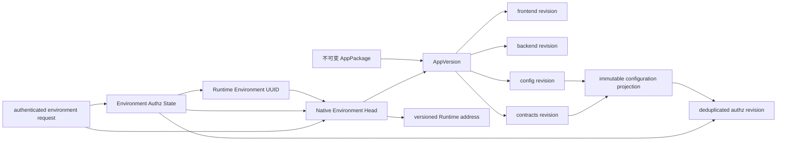

# OpenXiangda 2.0 环境配置内核

> 公开版本已匿名化客户、环境和实例标识。历史验收叙述仅作设计背景，不代表当前线上状态。

状态：方案已确认并按 Native 实施顺序推进。2026-08-15 已完成 E4 运行时闭环：应用身份和预发/生产原生环境成对创建、Native DeploymentRun、按 run 隔离的候选 workload、`pending -> active -> retiring -> revoked` 运行凭据、凭据与 Head CAS 同事务激活、旧 token 随 Head 变化立即失效；App Gateway 使用最长 60 秒 invocation token + 最长 30 秒 Ed25519 请求 assertion，官方 NestJS 全局 transport guard 绑定当前 Native Head 与完整 HTTP 请求，本地平台使用同构协议且拒绝重放。单体 Nest 的后台消费由短租约选出一个活动实例，应用 Secret 只允许当前 Head 身份按声明读取，terminal/cancelled/超时候选由精确 GC 回收，`alpha -> native-2` 切换必须通过全平台实例 release/capability 门禁。Native production 仍须完成后续 E5 和真实预发 E2E 后再开放。

生命周期修订：2026-08-16 已确认新应用默认只创建预发环境，正式环境在首次明确发布时惰性创建。本文中“provision 成对创建预发/生产”的既有实现描述由[按需正式环境](./on-demand-production-environment-v2.md)取代；环境隔离、不可变 AppVersion、Head CAS 和预发/正式运行态分离等不变量保持不变。

## 1. 决策摘要

OpenXiangda 2.0 的运行语义采用三层模型：

1. **不可变定义层**：AppVersion 组合 frontend、backend、config、contracts 等不可变修订；包内角色、能力、数据策略和逻辑数据定义从 config revision 编译，contracts revision 保存跨前后端消费的资源/能力/事件/流程契约摘要，不在部署时覆盖应用级“当前配置”。
2. **环境选择层**：最终的 `app_runtime_environment_heads_v2` 是某个原生环境当前运行哪个 AppVersion/DeploymentRun 的唯一指针。预发和生产可以选择不同修订；晋级仍使用同一个 AppVersion，不重建制品。现有 `app_environment_heads_v2` 的 `environment_id` 外键指向 legacy `app_environments`，只作为 alpha 历史审计事实，不能原地改造成最终 Head。
3. **环境运行态层**：RoleMembership、manual role、业务范围 grant、RelationshipGrant、RoleSession、Workflow 实例、Event receipt、OAuth client 和 Secret 等可变状态绑定远程环境。生产运行态不能被预发部署覆盖。

2.0 只有一套远程环境身份模型：一个稳定 `tenant + appCode` 下恰好包含一个 `preproduction`，并在首次明确晋级时最多创建一个 `production` 原生运行环境；每个已创建环境有稳定 UUID 和不可变 route key。同一个 AppVersion 先部署到预发，再原样晋级生产。`local` 是开发机上的运行模式，不注册环境 UUID、不创建远程 Head/OAuth/Secret/RoleSession，也不能作为 deploy/promote 目标。现有 `app_environment_sets/app_environments` 用“不同 appType 分别代表预发和生产”的模型保留给 1.x 发布治理，不再由 2.0 CLI、AppVersion 或 native runtime 使用。

物理存储和逻辑运行契约必须分开：Data API 的物理表与新增列是应用级、单调扩展的共享基础设施，业务行继续通过 `environment_key` 隔离；当前允许访问哪些字段、capability、字段策略和 data policy，则由请求环境 Head 选择的不可变 config revision 投影决定。contracts revision 用于证明前端、后端与配置引用的是同一组稳定代码，不保存完整字段 schema。

该模型取代当前“每个环境部署都把包配置 UPSERT 到 `tenant + app` 全局活动表”的做法。不能只给旧表增加一个字段：1.x 仍依赖共享 `roles/api_permissions/business_scope_*`，直接改造会让两个内核的所有权、回滚和滚动发布继续互相牵连。2.0 建立原生投影表；1.x 原表保持原语义。

## 2. 源码证据与问题边界

| 证据 | 当前行为 | 后果 |
| --- | --- | --- |
| Deployment executor | alpha 合同仍允许 development、preproduction、production 调用同一个 `configService.activate()` | alpha development 仍能进入配置激活链路；Native v3 必须一次删除该远程通道而不是保留兼容别名 |
| `activateAuthorization()` | 写 `roles`、`api_permissions`、`business_scope_*` 和 `app_authz_states_v2`，唯一范围只有 `tenant + app` | 开发候选可在尚未晋级生产时改变生产授权语义 |
| `AppRoleSessionV2Entity` | 已包含 `environment_key` | 会话被环境隔离，但其引用的 assignment、role 和 authz state 没有隔离，边界不闭合 |
| `app_data_resources_v2` | schema、capability、data policy 和字段策略是 `tenant + app + code` 全局可变记录 | 开发部署可提前改变生产 Data API 的逻辑契约和授权 |
| Data API 物理业务表 | 行含 `environment_key`，RLS 和事务请求也绑定环境 | 数据行隔离基础已经存在，无需按环境复制物理表 |
| AppVersion / alpha Environment Head | AppVersion 已组合 component revision；`app_environment_heads_v2` 同时重复保存组件指针，且 `environment_id` 外键指向 legacy `app_environments` | AppVersion 组合骨架可保留并补数据库不可变约束；alpha Head 不能复用，原生 Head 只保存 AppVersion、DeploymentRun 和 CAS revision，避免两份组件指针漂移 |
| 两套环境实体 | legacy `app_environments` 要求每个环境绑定不同 appType；Application v2 Head 又在同一 appType 下使用环境 key，且 `environment_id` 可空 | 同一“环境”存在两种主键/晋级模型；2.0 必须引入单一原生 registry，并停止调用 legacy set |
| Kubernetes Runtime | workload/Service 名包含 AppVersion，候选 readiness 后才在数据库事务中更新 Head；网关读取 Head 对应 DeploymentRun 的 runtime 地址 | 候选不会在 Head 提交前承接应用网关流量；激活失败保留旧流量，但失败候选需要回收 |
| App API Gateway / Nest Guard | 已签发按当前 Head 和具体 HTTP 请求绑定的短期 invocation/assertion，Nest 全局 guard 先离线验签再实时消费调用身份；健康与签名回调使用各自边界 | 路径证明已闭合；下一步由 runtime lease 关闭同进程 Worker/Scheduler 的副作用激活窗口 |
| 候选运行凭据 | 当前 runtime credential 在候选 readiness 前已经进入可用链路；同一个 Nest 进程可以同时承载 API、Worker 和 Scheduler | 未激活 AppVersion 的启动逻辑、定时任务或 Worker 可能提前访问 Data API 或产生外部副作用，破坏原子晋级 |

问题不是单一权限缓存缺陷，而是“不可变包定义”和“环境活动投影”之间缺少统一边界。授权 A0、Data API D0 和后续 Admin A1 必须建立在同一个环境配置内核上。

## 3. 不变量与能力所有者

1. AppVersion 和所有 component revision 一经创建不可修改；规范化内容摘要由平台重算。
2. 每个原生环境只有一个活动 Head；用户请求只能从认证得到的 `tenant/app/environmentId` 解析 Head，不能接受业务参数覆盖。环境 key 先经 registry 精确解析并与 Principal 中的 id/key 双重核对。
3. 一次环境激活要么同时提交 Head、授权环境状态、Workflow/Event 活动指针和部署成功状态，要么全部不提交。
4. 候选 Kubernetes 工作负载通过 readiness 不代表已激活；只有数据库 Head 提交后才对网关可见。
5. 预发、生产的可变运行态相互独立。显式“复制角色成员/范围”是管理操作，不是环境部署的隐式副作用；本地运行态不进入远程数据库。
6. PostgreSQL 是活动 Head、授权版本和安全状态的事实源；Redis、浏览器缓存和 Kubernetes annotation 都不能替代它。
7. 物理数据 schema 只允许向前兼容、单调扩展。删除字段、改变类型或给有数据的表增加无默认值必填字段必须走独立数据迁移协议，不能混入普通 AppVersion 激活。
8. 1.x 继续由现有角色、权限和业务范围表负责；2.0 原生内核不得双写这些表作为长期运行方式。
9. 同一个 AppVersion 从预发晋级生产时使用相同 component/authz/config-contract revision；环境运行态、Secret 和 OAuth client 不随包复制。
10. 所有环境切换有可观察的 expected Head revision；并发部署不能以“最后提交者覆盖”伪装成两个都成功。
11. `environmentId` 是控制面与授权运行态的持久身份；`environmentKey` 创建后不可改，只承担 URL、日志、Kubernetes label 和现有 Data API 行隔离。需要新 key 时创建新环境并执行显式迁移，不做原地 rename。
12. 业务 App API 请求必须同时通过业务身份授权和平台网关路径证明；静态请求头、NodePort 可达性或集群网络位置都不是路径证明。
13. 候选 runtime 在 Head 提交前只能完成无副作用自检；不能取得正式应用身份，Worker/Scheduler 不能领取任务。Head 回滚或租约丢失后停止领取新任务，在途任务按幂等/lease 协议完成或接管。

能力所有者划分：

| 能力 | 唯一所有者 |
| --- | --- |
| AppVersion 与组件组合 | `ApplicationVersionV2Service` |
| 环境活动选择和 CAS | `ApplicationEnvironmentActivationV2Service`（从 executor 内联事务提取） |
| 不可变配置编译 | `ApplicationConfigurationCompilerV2Service` |
| 原生授权修订与环境授权状态 | `AppAuthorizationKernelV2Service` |
| Data API 物理 schema | `AppDataPhysicalSchemaV2Service` |
| Data API 逻辑契约解析 | `AppDataContractV2Service` |
| 候选 Runtime 创建/readiness/回收 | `ApplicationRuntimeV2Service` |
| 2.0 环境注册、key→id 解析与 side-effect policy | `ApplicationRuntimeEnvironmentV2Service` |
| 活动 runtime 解析、短时调用委托、网关断言签发与密钥轮换 | `ApplicationApiGatewayV2Service` + 平台 `ApplicationInvocationTokenService` / `GatewayAssertionKeyService` |
| 网关断言验证与单进程 API/Worker/Scheduler 激活门控 | 官方 `openxiangda-nest`；应用代码只注册 handler，不自行推断 Head |

Executor 只编排阶段，不直接实现授权版本 SQL、逻辑数据契约写入或 Head 选择规则。

## 4. 版本与运行态模型

### 4.0 原生环境注册

```text
app_runtime_environments_v2
  id uuid,
  tenant_id, app_type,
  environment_key preproduction|production,
  environment_kind preproduction|production,
  display_name, status active|decommissioned,
  side_effect_policy_json,
  revision, created_by, updated_by, created_at, updated_at
  UNIQUE (tenant_id, app_type, environment_key)
  UNIQUE (tenant_id, app_type, environment_kind)

app_runtime_environment_heads_v2
  environment_id uuid PRIMARY KEY -> app_runtime_environments_v2.id
  tenant_id, app_type,
  active_app_version_id uuid NOT NULL,
  active_deployment_run_id uuid NOT NULL,
  revision bigint NOT NULL,
  activated_by, activated_at
```

- 一个 2.0 app 固定两个长期远程环境；不支持 development 远程环境、任意自定义 key、同 kind 多环境或 key rename。
- 新应用 provision 事务只创建 preproduction；首次 promotion 在唯一约束下惰性创建 production。普通部署请求不能隐式补环境，生产环境必须有更严格 side-effect policy 与管理员确认。
- `environmentId` 进入 OAuth client、Secret、RoleSession、Workflow/Event、DeploymentRun 和授权运行态；对外 DTO 同时返回 id/key/kind，但任何写请求中的 id/key 必须与认证 Principal、app 和 registry 相互匹配。
- 旧 `app_environment_sets/app_environments` 的跨 appType swap、attach 和 policy 接口不再出现在 openxiangda-v2 CLI/Skill。旧 CLI 和 1.x 应用保持原行为。
- 原生 Head 不重复保存 frontend/backend/config/contracts revision。AppVersion 是组件组合的唯一事实，`app_version_projection_bindings_v2` 是 AppVersion 到编译后配置闭包的唯一映射；读取方通过它们解析。数据库复合外键必须证明 Head、AppVersion、DeploymentRun 与 environment 属于同一个 tenant/app，不能只靠服务层比较 UUID。
- 现存 alpha Application v2 Head 不迁移、不预分配 native UUID，也不参与 Native Head 初始化。新的 native reference app 使用全新 app code，并通过显式环境创建命令生成 registry UUID；旧 `head.environment_id` 只留在 alpha 历史中。K4 前 alpha Head 与新应用的原生 Head 可以同时存储，但每个请求只按全局 contract generation 读取其中一套；这不是在线双读或双写。K5 保留 alpha 数据库历史，只撤销明确列出的旧 runtime principal 并删除旧 alpha K3s workload。



### 4.1 不可变定义

- `app_component_revisions_v2` 和 `app_versions_v2` 继续保存制品摘要、组合及 provenance，但增加数据库级 UPDATE/DELETE 拒绝触发器；相同 digest 冲突时必须逐字段重读并比较，不能仅按 digest 命中后返回既有行。
- 配置编译器从经过字节摘要校验的 config/contracts artifact 生成只增不改的关系投影。`metadata_json.configurationBundle` 只作为 alpha 历史审计字段，不能成为原生编译输入的事实源。
- 授权子集单独计算 canonical digest，生成 `app_authz_revisions_v2`；相同授权声明跨多个 AppVersion 去重。
- `app_configuration_projections_v2` 聚合 authz、data、event、workflow 和 runtime-requirement 五类不可变领域修订；`app_version_projection_bindings_v2` 为每个原生 AppVersion 固定绑定一个完整投影。即使某领域为空也绑定一个空修订，不用 nullable 表达语义。
- Data API 逻辑资源定义绑定不可变 data-contract revision；contracts revision 保存编译后的 resource/capability/handler closure，而不是覆盖 `app_data_resources_v2` 的活动 JSON。
- Workflow/Event 的定义进入不可变领域修订；环境 Head、delivery/receipt、实例/task、暂停/恢复、轮换等运行态仍按环境保存。新 Native 应用从空状态建立这些运行态；现有 alpha 环境化表只保留历史，既不离线迁移，也不由新 config 激活器原地 UPSERT。

### 4.2 环境选择

`app_runtime_environment_heads_v2` 是新的最小活动指针，以 `environment_id` 唯一定位。它不复制组件 revision 或配置投影字段；这些事实由 AppVersion 和不可变 projection binding 提供。激活命令必须携带部署开始时观察到的 `expectedHeadRevision`：

- 首次激活要求 `expectedHeadRevision = 0`；
- 已有 Head 使用 `UPDATE ... WHERE revision = expectedHeadRevision RETURNING ...`；
- 未命中返回稳定 409，DeploymentRun 标记 conflict，不覆盖另一场已经成功的部署；
- 相同 DeploymentRun + 相同 AppVersion + 相同目标 Head 的超时重试返回既有成功结果，不重复推进 revision。

### 4.3 环境运行态

以下控制面和授权资源必须以 `environment_id` 外键定位，同时保留 tenant/app 复合约束用于防串联和查询计划：

- 授权环境状态、manual role、RoleMembership、delegation ceiling；
- scope grant source 的物化状态、有效 grant、RelationshipGrant；
- RoleSession；
- OAuth client、Secret、Event delivery/receipt、Workflow instance/task/provider binding；
- Data API 幂等事务和业务数据行。

最后一项暂时例外：现有动态 Data API 物理表与幂等记录以 `tenant + app + immutable environment_key` 隔离。Data API Principal 必须同时含 registry `environmentId/environmentKey`，RLS 先校验二者映射，再比较行 key。没有必要为所有大表立即回填 UUID；新控制面表不再复制这种字符串主键。

应用最高管理员是显式的应用级平台授权，可跨该应用所有环境并天然绕过业务数据范围；绕过必须出现在 explain/audit 中。普通业务角色和范围不使用跨环境通配符。

## 5. Data API：物理 schema 与逻辑契约分离

Data API 不为每个环境创建一张表。最终模型为：

| 层 | 范围 | 行为 |
| --- | --- | --- |
| physical resource | `tenant + app + resourceCode` | 稳定 physical table；保存已部署版本所需字段的兼容并集 |
| physical schema generation | 应用级单调整数 | 只新增 nullable 字段、索引和兼容约束；DDL 可在候选准备阶段完成 |
| logical resource definition | `configRevision + resourceCode` | name、可见字段、capability、data policy、field policy、状态 |
| runtime resolution | `tenant + app + environmentId -> native Head -> AppVersion -> projection binding -> data-contract revision` | 每次请求只使用该环境活动逻辑定义；contracts revision 校验消费代码闭合 |
| business row | `tenant + app + environment + id` | 由 RLS 强制环境隔离 |

候选开发版本新增字段时，nullable 物理列可能先存在，但生产活动逻辑契约看不到也不能读写该字段。字段删除或类型改变不能通过“让生产继续用旧修订”掩盖物理兼容问题，必须先通过独立的兼容迁移计划处理。

逻辑 `nullable:false` 永远不映射为业务列物理 `NOT NULL`。只要任一环境 Head 或历史数据早于该字段，物理层就必须允许该值为空；因此：

1. expand 始终添加 nullable 物理列，目标环境的逻辑契约在 create/update 时执行 required 校验；
2. AppPackage 不提供业务字段 `NOT NULL` intent，平台也不生成此类 contract job；
3. required 状态变化只改变逻辑 revision 和表单提示，不扫描、回填或改写历史行；
4. 回滚到旧 AppVersion 不需要修改业务列 nullability。

物理 DDL 不放在最终 Head 激活事务：`AppDataPhysicalSchemaV2Service` 使用每资源 advisory lock、持久 schema-generation ledger、有限 `lock_timeout/statement_timeout` 和幂等步骤。添加索引使用 PostgreSQL 允许的并发构建路径并记录 `building|ready|failed`；失败/无效索引由精确 repair job 处理。单个 AppVersion 默认最多 20 个新增字段、10 个新增索引，超过需独立容量计划；运行中不得扫描全表计算默认值。DDL 成功但后续 runtime/Head 激活失败时，兼容的额外列/索引可以保留，旧环境逻辑契约仍不可见。

授权角色引用的 capability catalog 由 AppVersion 组合时校验：平台保留管理 capability、`authz.capabilities` 显式声明的 backend/UI capability、Data Resource 自动导出的数据/字段 capability 必须闭合；contracts revision 记录闭合后的代码集合供前后端生成类型和验包。Nest `@RequireCapability` 与 Admin route 使用生成常量，构建时校验其属于 contracts。不存在、跨应用或只被角色引用但未声明的 capability 使 AppVersion prepare 失败。

## 6. App API 路径证明与候选执行门控

### 6.1 双重授权边界

平台网关先验证调用者原始用户/OAuth2 access token，按认证上下文解析稳定 `environmentId` 和活动 Head，只能向该 Head 对应的 DeploymentRun 转发。原始 access token 到此终止，不能进入应用容器或应用日志。网关签发两个职责分离的短时工件：

1. `Authorization: Bearer <application-invocation-token>`：最长 60 秒，audience 绑定目标应用、环境和 DeploymentRun；携带最小 Principal/RoleSession 引用、源 token id 摘要和授权版本，用于 Nest 向 Data API/Workflow 等平台接口做 on-behalf-of 调用。平台消费时仍实时验证 RoleSession、membership/grant、环境 authz state 和当前 Head，不能只相信 JWT 中的 allow 结果。
2. `X-OpenXiangda-Gateway-Assertion`：最长 30 秒的 Ed25519 JWS，证明具体 HTTP 请求由平台网关根据当前 Head 转发。断言至少绑定：

```text
issuer, audience=openxiangda-app-backend,
tenantId, appCode, environmentId, environmentKey,
appVersionId, deploymentRunId,
method, normalizedPath, canonicalQueryDigest, bodyDigest,
invocationTokenDigest, roleSessionIdDigest,
jti, iat, nbf, exp, keyId
```

- 私钥只属于平台；runtime 只获得当前/上一把公钥或受控 JWKS，轮换期间两把公钥有界重叠。不能给每个应用复制平台签名私钥。
- Nest 全局 transport guard 先验证断言签名、时间、请求摘要和自身注入的 app/environment/version/run 身份，再由 AuthZ Guard 验证 invocation token、RoleSession/Application Principal 和 `@RequireCapability()`。任一层失败都 fail closed。
- 调用者原始 `Authorization`、RoleSession 原值和业务数据不写入断言，只写 SHA-256 digest；两个工件都不进入浏览器、日志或应用响应。`jti` 用于短窗口重放诊断；有副作用的业务操作仍必须使用应用级 idempotency key，不能把短时签名当 exactly-once。
- invocation token 不能换取 refresh token，不能访问别的应用/环境/run；过期、源登录会话撤销、RoleSession stale、runtime 不再是当前 Head 时拒绝。用户请求结束后应用不得持久化它。对外 OAuth2 client 仍通过平台网关调用，client access token 也不原样转发给应用。
- 只有 `/__platform/health`、`/__platform/ready` 和版本自检允许没有业务身份；Events 使用订阅 HMAC/receipt，Workflow provider 使用平台回调签名。其他自定义 controller 即使没有 `@RequireCapability()` 也不得绕过 transport guard；缺 capability 的服务身份请求继续拒绝。
- 现有 `X-OpenXiangda-Forwarded-By` 降级为诊断字段，不参与授权。NodePort、cluster DNS 或反向代理直连都因缺断言失败。

Kubernetes 仍提供第一层缩小攻击面：共享与独立档位都生成 default-deny ingress；cluster-dns 只允许标记过的平台网关 namespace，node-port 必须配置明确的 gateway source CIDR/主机防火墙规则后才允许部署。NetworkPolicy/安全组配置错误不能扩大授权，因为 Nest 的离线签名验证仍是强制边界。请求体采用流式摘要并沿用 20 MiB 上限，避免为了签名在网关和 Nest 中各无界复制一份。

### 6.2 候选 runtime 状态

runtime credential 采用 `pending -> active -> retiring -> revoked` 状态并绑定 `environmentId + appVersionId + deploymentRunId`：

1. P0 创建 pending credential 和一次可恢复的 secret；pending 只能调用版本化 readiness/activation-status 端点，token 服务不为它签发 Data API、App API、Workflow 或外部调用 scope。
2. P1/P2 启动完整 Nest 进程，但官方 runtime gate 只开放健康/版本自检；API 需要活动 Head 网关断言，Worker/Scheduler 尚无活动租约。应用 `OnModuleInit` 必须无业务副作用，模板测试和静态规则禁止自行启动 cron/queue consumer。
3. P3 在同一个数据库事务中 CAS Head、激活目标 runtime credential、推进活动 generation 并把旧 credential 标记 retiring。数据库提交后，新网关断言、invocation token 和 runtime token 才能引用该 run/version；旧 run 的 runtime token 立即不能发起新平台业务调用，在途任务由 claim lease/idempotency 重新接管。
4. 单体 Nest 中的 Worker/Scheduler 通过平台长轮询获得短时 runtime lease；lease 绑定当前 Head revision/run，只有活动版本可续租。失去租约后停止领取新任务；已领取任务使用既有 claim lease、幂等键和接管协议，不强杀到一半。
5. Event/Workflow 投递目标始终从活动 Head 解析，不向 pending/retiring runtime 派发新命令。旧版本只在有界 draining window 处理在途工作，随后撤销凭据并精确回收。

平台对自身通道提供强保证：pending runtime 无 Data API/App API/Workflow scope、不领取任务、不接收事件，也不获得 active-only Secret。应用作者仍可能在第三方库初始化时直接访问外部系统，这不是 Nest 生命周期能单独证明的边界。2.0 首期信任应用开发者，不建设域名代理、CIDR 审批或通用 egress 策略 DSL；外部系统连接由应用后端正常开发和负责。平台只保证自身发放的业务身份、租约和 Secret 在 Head 激活前不可用，避免把复杂而不完整的网络策略包装成安全保证。

## 7. 环境激活状态机

| 阶段 | 动作 | 失败语义 |
| --- | --- | --- |
| P0 immutable prepare | 校验 AppPackage，创建/复用 component、authz、config-data 投影和 pending runtime credential；校验 contracts closure；执行允许的单调 DDL | 没有活动 Head 变化；pending identity 无业务 scope；可安全重试 |
| P1 runtime candidate | 创建按 AppVersion 命名的 Deployment/Service/Secret | 不覆盖旧 workload；runtime gate 禁止业务入口和后台消费；失败记录可重试 |
| P2 readiness | 验证候选健康、版本/环境自检和受限平台握手 | 不使用正式应用身份、不产生业务副作用；未通过不进入激活事务 |
| P3 activation transaction | advisory lock `environmentId`；复核 tenant/app/key 与 registry；CAS Head；切 authz/data/workflow/event 指针；激活目标 credential/lease generation；记录 DeploymentRun succeeded | 任一项失败整笔回滚，旧 Head/凭据/配置/路由保持不变 |
| P4 post-commit | 网关按新 Head 签发断言；新 runtime 取得 lease；旧 runtime 进入 draining；清理旧缓存 namespace | 协调失败由 reconciler 重试；新请求仍只到 Head，后台未取得 lease 时保持暂停 |
| P5 failed candidate GC | retryable run 保留候选供同版本重试；terminal/cancelled 或超过 TTL 的候选回收 | GC 只按 run/app/version 精确删除，禁止标签宽删活动 Head workload |

当前版本化 Service 不需要替换为稳定 Service selector：应用网关已经从环境 Head 读取活动 DeploymentRun 的 runtime 地址，因此 Head 是现有流量开关。需要补的是 CAS、失败候选回收和“Head 指向的 workload 不可删除”保护。

## 8. 并发、失败与回滚

| 场景 | 必须行为 |
| --- | --- |
| 同一环境两个部署并发 | advisory lock 后用 expected Head revision；恰好一个按其预期激活，另一个 409 或在显式重新计划后重试 |
| Kubernetes 成功、数据库激活失败 | 旧 Head 继续路由；候选进入可重试或 GC 状态，不执行旧 workload retirement |
| 物理 schema expand 成功、候选部署失败 | 兼容列/索引保留并由 ledger 记录；旧逻辑 revision 不暴露它们，不做破坏性回滚 |
| 数据库激活成功、旧 workload 删除失败 | 新 Head 正常服务；记录告警并由幂等 GC 重试 |
| 相同 AppVersion 晋级 | 复用所有不可变修订；只切目标环境 Head 和该环境活动状态 |
| 授权摘要未变 | 环境 authzVersion 不变，旧 RoleSession 可继续；Head revision 仍因应用版本切换而增长 |
| 授权摘要改变 | 仅目标环境 authzVersion +1，并使该环境旧 RoleSession stale；其他环境不受影响 |
| 回滚 AppVersion | 创建新的 rollback DeploymentRun，CAS 切回历史不可变修订；运行态数据不倒退，兼容性 preflight 必须通过 |
| 配置数据定义回滚缺少新字段 | 旧逻辑修订忽略多余物理列；不删除列，不回滚业务数据 |
| PostgreSQL 不可用 | Head、授权和 Data API fail closed；不得从 Redis/Kubernetes 猜活动版本 |
| NodePort 被公网或同集群其他 Pod 直连 | 无有效网关断言时 Nest 在业务代码前拒绝；健康端点不返回配置、凭据或业务数据 |
| 候选容器启动后 Head 激活失败 | pending credential 不能取得业务 token，Worker/Scheduler 没有 lease；候选进入 retry/GC，不产生生产副作用 |
| Head 已切换但 runtime lease 暂时不可得 | 用户 API 仍按网关断言服务；后台停止领取新任务并告警，reconciler 恢复 lease，不让旧版本代领新任务 |

## 9. 2.0 Alpha 合同切换

用户已经明确 2.0 不承担当前 alpha 客户端兼容；稳定 1.x 在独立工具链和旧表上维护。因此这里采用一次明确的 contract cutover，不建设长期 alpha/native 双内核：

1. **K0 preflight evidence**：按显式 allowlist 交叉验证 Application v2 AppVersion/Head 闭包与 K3s managed workload，证明 reference-environment 只有可重建的 alpha reference。只存在 legacy DeliveryRun/Runtime/Event 的应用必须被排除；不读取主体/业务值、不生成迁移计划。
2. **K1 build offline**：增加 runtime environment registry、最小原生 Head、immutable projection、native authz/data resolution 和新 Admin context，并在仓库/本地或隔离测试环境创建全新 app code 的 native reference；所有新路径先由测试/本地新应用验证，但尚不对线上 2.0 路由开放。alpha 路径继续只读旧 Head，native 路径只读新 Head，禁止请求级 fallback；1.x 代码不引用这些表。
3. **K2 capable rollout**：把同一 native-capable Platform Server 镜像部署到全部实例，读取实例 capability 清单；这时旧 2.0 路由仍保持 alpha，但新写入口关闭。readiness 不能代替全实例版本证明。
4. **K3 short write fence**：进入平台级 2.0 maintenance window，只暂停 Application v2 部署、Data API 写、role/scope 管理、Workflow/Event 新动作；1.x 和平台其他能力继续运行。等待在途 2.0 请求/worker lease 有界排空，撤销全部 alpha RoleSession 和 runtime OAuth token。reference-environment 在此阶段只验证 Native artifact/Head 闭包与无业务凭据的 candidate readiness，不为测试建立 generation 旁路。
5. **K4 atomic contract switch**：数据库只做一次带 expected revision 的 `openxiangda_v2_contract_generation=native-2` CAS；新平台路由只读 Native 表，且只有已经绑定 Native Head 的新 reference 可路由，在验收窗口完成真实 Postgres/PostgREST/K3s/浏览器预发 E2E；旧 alpha endpoint 返回稳定 `410 OPENXIANGDA_V2_ALPHA_CONTRACT_REMOVED` 与最低客户端版本，不做 legacy serializer、双读或 alpha 数据导入。
6. **K5 verify and reopen**：新 reference 预发 E2E 通过后开放 Native 常规应用创建/写入，同一 Native AppVersion 晋级生产并再验收。观察期后仅撤销明确列出的旧 alpha runtime OAuth/principal 并删除两个旧 alpha K3s workload；alpha 数据库历史保留，1.x 共享表不删除。

回滚边界：K4 之前可回滚 native-capable 镜像；K4 后只回滚到同样理解 `native-2` schema/route 的修复镜像，不能恢复 alpha 授权语义或重新打开旧 endpoint。若 K4 后验收失败，保持 2.0 maintenance、修复或把 reference app Head 切回 native 历史版本；1.x 始终不进入该栅栏。

多实例门禁由平台进程自动心跳，无需应用开发者参与。每个实例上报 `PLATFORM_RELEASE_VERSION` 和固定 Native capability 集；单实例默认期望数量为 `1`，多实例部署只需把所有实例的 `OPENXIANGDA_PLATFORM_EXPECTED_INSTANCES` 设置为同一个总数。实例必须在短 TTL 内全部存活、release 完全一致且能力无缺失，`switch-native` 才能提交；`status` 同时返回逐实例证据。

## 10. 可证伪验收

1. 同一应用 preproduction 发布不同角色/字段策略后，production 的 RoleSession、capability explain 和 Data API 响应逐字节不变；local 开发不产生任何远程状态。
2. 同一 appCode 的原生 preproduction/production 拥有不同 environment UUID；同一 AppVersion 先预发后生产，两环境引用相同 immutable revision id/digest，但 RoleMembership、Secret、OAuth client 和 scope grant 不共享。
3. 两个并发部署使用同一 expected Head revision，恰好一个成功；失败者不能覆盖成功者。
4. 候选 runtime readiness 成功后强制让 activation SQL 失败，网关仍请求旧 AppVersion，候选随后被精确 GC。
5. 开发 config data resource 增加字段后物理列存在，但生产活动定义查询/写入该字段均拒绝；生产晋级后才可使用。
6. 回滚到旧 config revision 不删除物理列、不损坏新数据，旧逻辑字段集恢复。
7. PostgreSQL/Redis/Kubernetes 分别注入故障，证明 Head 和授权事实不从缓存或 annotation 推断。
8. 代表性 1.x 登录、角色、表单权限和 legacy environment-set 操作不访问任何新 2.0 原生表；2.0 CLI 不再调用 legacy environment-set API。
9. 直接访问活动、旧版和候选 NodePort：缺失、过期、错误 appVersion、错误 body digest 和重放断言全部在 Nest 业务 handler 前拒绝；正常网关请求仍通过 OAuth2/RoleSession/capability 判定，应用容器和访问日志中不存在调用者原始 access token。
10. invocation token 不能跨 app/environment/run、不能刷新；Head 切换、源会话撤销、RoleSession/membership stale 后均拒绝。真实 Nest→Data API 链路证明委托身份与原调用者的授权结果相同，但应用拿不到原始 bearer。
11. 候选 readiness 保持 10 分钟并人为触发 Scheduler tick/Worker 消息，Data API、外部副作用和任务领取计数均为零；Head 提交后只有新 run 获得 lease，回滚后新 run 停止领取。
12. 网关签名密钥轮换覆盖 current/previous 接受窗口、未知 key fail closed、时钟偏差上限和 20 MiB 流式摘要内存上限。

## 11. 实施顺序

1. CP0/CP1：按[Alpha 退役与 Native 切换前置审计](./native-kernel-inventory-v2.md)实现显式 allowlist classifier、Platform Server 镜像 `scripts/` 中的纯 Node 只读入口和根部署 preflight。它不增加 evidence schema/数据库角色/Secret/ServiceAccount/RBAC/通用 importer，不扫描业务表；根脚本复用 backend release Job 构造原语，从权威镜像摘要运行两个无 SA token 的短生命受限资源 Job，用 DB-A/K3s-A/DB-B/K3s-B 语义摘要证明 reference-environment 只有可重建的 alpha reference，不部署候选镜像。`CP*` 不与本文 `P0-P4` 环境激活协议共享编号。
2. E1：按[原生配置投影实施蓝图](./native-configuration-projection-v2.md)建立 config/contracts v3、不可变配置编译器、最小原生 Head、authz/data/event/workflow/runtime-requirement 投影、contracts closure 及 idempotent digest 测试。
3. E2：Data API physical/logical 分离，先离线对照新旧 resolver，再随 native generation 一次按环境切读；不建立在线双读模式。
4. E3：原生环境授权内核，详见 [授权一致性基线](./authorization-consistency-v2.md)。
5. E4：抽取 Environment Activation service，加入 Head CAS、pending runtime credential、网关断言、单进程 runtime lease、失败候选 GC 和多实例 capability gate。
6. E5：执行短时 2.0 contract cutover，开放全新 app identity 的 native reference；不迁移旧 alpha reference，也不建设 alpha/native 长期兼容层。
7. E6：Admin A1/A2 消费 native RoleSession context，随后实现 Shell 产品轨。

每个阶段独立 SQL migration、平台提交和回滚说明；不得把 E1-E6 合成一次不可观察的大发布。
