# OpenXiangda 2.0 实施路线图与证据矩阵（已废弃）

> 公开版本已匿名化客户、环境和实例标识。历史验收叙述仅作设计背景，不代表当前线上状态。

> **SUPERSEDED / 历史证据（2026-08-21）**：本路线图已偏离 CRUD-first 产品重点，不再是当前计划、Skill 或 AI 开发输入。当前唯一优先级见[产品北极星](./product-north-star-v2.md)，默认前端见 [Vite / Refine 决策](./frontend-stack-decision-v2.md)，本地开发见 [Connected Dev 默认合同](./connected-development-default-v2.md)。以下长期 Workflow、Secret、OAuth、RoleSession、Umi/Pro 和环境内核路线仅作旧 alpha 审计材料，不得按其“下一步”继续实施。

历史状态日期：2026-08-16；2026-08-21 废弃

本文只记录可由源码、自动测试、真实 HTTP、新应用黑盒或已发布工件证明的状态。文档存在不等于运行时完成，Mock 通过不等于平台集成完成，npm 已发布也不等于某个应用已经部署。

## 1. 状态定义

| 状态 | 含义 |
| --- | --- |
| 已交付 | 平台/工具链实现、正式门禁和独立应用证据均闭环 |
| 已实现待晋级 | 代码与门禁已通过，但尚未作为目标 AppVersion 晋级指定环境 |
| 已确认待实施 | 架构决策已经确认，运行时尚未按新方案完成，不能对外宣称交付 |
| 已设计待确认 | 所有权、不变量、契约、失败恢复和验收矩阵已形成；根据架构门禁，确认前不修改运行时 |
| 未开始 | 尚无可以进入实现的确认设计 |

## 2. 能力矩阵

| 能力主题 | 唯一事实来源 | 当前状态 | 已有证据 | 尚缺内容与下一道门 |
| --- | --- | --- | --- | --- |
| 按需生产环境与运行启停 | Platform Server Native 环境 registry + Environment Head + DeploymentRun；K3s 只执行平台期望状态 | 已交付 | provision 仅创建预发、promotion 惰性创建唯一生产、`runtime_state` CAS、start/stop durable run、停止网关 503、ReplicaFailure 快速诊断、CLI/MCP/Contracts 与能力协商均已实现；工具链正式包和平台版本已部署 reference-environment；全新应用证明初始只有 preproduction、stop→0/start→1 Ready/stop→0，以及首次 promotion 才创建 production，并且两环境使用完全相同的 AppVersion 与包摘要；reference 与 legacy instrument reference app 入口回归 200 | 后续启停策略、闲置环境自动停止和资源诊断分别按独立运维主题演进；不得让客户端或 `kubectl scale` 成为第二状态源 |
| OAuth2 外部应用身份 | Platform Server OAuth2 服务与数据库；Nest SDK 只消费 token | 已交付 | Client Credentials、租户/应用/环境/scope 绑定、一次性 Secret、轮换宽限、撤销、审计、跨环境拒绝、应用 Principal；平台 unit/持久化/真实 HTTP 和 Nest 测试通过 | 后续只按新 scope 或凭据策略单独设计，不与 Admin 用户会话混合 |
| 平台托管后端运行凭据 | Platform Server credential 状态 + Environment Head/DeploymentRun | 已交付功能基线，E4 激活语义待收敛 | CAS 暂存、同 AppVersion 滚动部署、旧凭据宽限、重试幂等、CLI 不获得明文；真实 HTTP 两轮通过 | 当前候选凭据仍可能在 Head 前进入可用链路。E4 改为 pending→active→retiring→revoked，业务 token/后台 lease 只授予当前 Head 对应 run；配额、告警另做运维主题 |
| 应用 Secret | Platform Server Secret 版本与审计表 + runtime activation policy | 已交付功能基线，active-only 注入待收敛 | 环境级 AAD、只写值、不可变版本、CAS 幂等、required/optional 部署语义、删除和审计测试 | P0 只校验所需版本存在，不向 pending runtime 提前注入 active-only Secret；E4 通过短时 runtime identity 按需读取并受 egress policy 约束。KMS 替换保持同一协议，不在应用端增加第二套存储 |
| Data API / App API | Platform Server 物理 schema + 环境 Head 选择的逻辑 config projection；应用后端承载业务逻辑 | Native 调用委托与请求路径证明已交付；逻辑配置投影继续收敛 | 用户与服务 Principal、PostgREST RLS、字段/行权限、受限事务批处理、最长 60 秒 invocation token、最长 30 秒 Ed25519 assertion、Nest 全局 transport guard 与同构本地平台已通过 | 继续完成 E2 physical/logical 分离和 E4 runtime lease；NodePort/NetworkPolicy 只缩小暴露面，不参与授权正确性 |
| RBAC + 业务关系权限 | Platform Server 原生 authz revision、环境 state、RoleMembership、RelationshipGrant、RoleSession | A0-N0/N1/N2/C1/C2/P 已实现 | N2 新建环境级 manual role/membership/delegation/relationship、应用级 super-admin grant、Native RoleSession 与不可变 mutation receipt；C2 每请求先以 PostgreSQL 校验 session/state/主体，再使用环境、authz/scope 版本与主体 revision 隔离的 Redis summary；P 以 `scopeSources` 将学院管理员、仪器管理员等业务表映射为环境范围 grant，Data API 同事务置 stale/建任务，Worker 提供 lease/retry/DLQ/replay/receipt/closure，strict 投影失败关闭且恢复扫描不依赖 Redis | 下一步 A0-N3/N4 完成全实例 gate、Native generation switch 与真实 PostgreSQL/PostgREST/K3s 验收；Admin A1 只消费 native kernel |
| Events/Automation v2 | Platform Server delivery/receipt 状态；Nest handler 承担业务副作用 | 已交付 | CloudEvents 签名、claim lease、重复投递、进程崩溃接管、stale token 隔离、重试/DLQ/replay、双密钥、重启恢复与持久 receipt 真实链路两轮通过；Native 本地层已由 CLI 新建独立应用，在真实 PostgreSQL 上覆盖 503 + Retry-After、确定性 400 死信、幂等重放和成功回执；Timer 使用严格六段 Cron + IANA 时区，调度、事件、outbox 与下一触发点在同一事务提交，并通过同一计划时间并发 claim、重启恢复与 reset 验收 | 外部副作用仍必须使用 event id 做下游幂等；不承诺跨系统 exactly-once；停机期间的 Timer 采用合并补偿而非历史洪峰补发 |
| Workflow Kernel v2 | Platform Server 持久状态机；Admin 只解释 Surface 协议 | 进行中 | 已完成 Kernel Native RoleSession/RoleSubject 数据模型切换；打包后的 CLI 已创建全新独立应用，并在真实 PostgreSQL、平台、NestJS 与 Chromium 中通过预览令牌单次消费、实例/任务/参与者链/时间线/回执事务提交、跨重启幂等回放、实例与任务版本 CAS、并发审批唯一成功和 reset 清理；转交与任务代理真实切换 Native RoleSubject 待办归属，前/后加签使用有序参与者链，目标身份按 membership 修订、角色和数据 scope 校验；长期代理按半开时间窗和不重叠规则解析，在预览与任务创建间 CAS 校验，把规则、有效期和原/代理 RoleSubject 快照冻结进参与者链，撤销仅影响新任务；8 条浏览器场景覆盖角色切换、代理冻结、完整审批动作和管理员终止 | 下一步执行远端 2.0 Kernel 离线切换、预发/生产冒烟和过期任务管理员重分派验收。1.x 双核运行路径保持不变 |
| Workflow Kernel v2 | Kernel 状态机与平台持久实例；业务字段仍在 Data/App API | 已交付基线 | 同意/拒绝、转交、回退、撤回、加签、代理、两种退回语义、重新提交、长任务委托、Provider 恢复与并发 CAS/lease 真实链路通过 | 可视化编辑器和更多业务协议按独立需求设计；不把业务字段迁入流程库 |
| 独立 NestJS 后端与应用交付 | 应用 Git/AppPackage；Platform Server DeploymentRun/Environment Head | 已交付功能基线，E4 激活边界待实现 | 不可变包摘要、后端 OCI digest、版本化 Kubernetes workload、readiness、重试/取消/回滚/晋级和资源限制已有证据 | 候选当前可能先取得可用 runtime credential，同进程 Worker/Scheduler 缺活动 Head lease，共享 NodePort 缺强路径证明。E4 以 pending credential、短租约、gateway assertion、failed candidate GC 收敛；仍保持每应用独立容器，不拆成多应用 Node 进程或强制三个 Deployment |
| 2.0 CLI/MCP/Skills/模板 | 独立 `openxiangda-v2` 仓库与已发布 npm 工件 | 已交付基线 | 16 包 check/test/build、边界扫描、真实 tarball 新应用、持久 reference app、Chromium、Skills、文档全部通过；2026-08-15 再以 12 个候选 tarball 经临时本地 registry 安装到仓库外参考应用，生成、类型检查、单测、真实 NestJS OAuth2/Native 身份联调与生产构建全部通过；不调用 1.x | 新能力必须同时更新命令/MCP/Skill/模板消费证据，禁止只写 CLI 命令 |
| 确定性工具链发布 | Changesets 版本提交、冻结工件清单、release receipt | 已交付 | `verify:release` 已成为唯一候选验证入口并产出绑定 HEAD/registry/模式/工件摘要的 `validated` receipt；`release:publish` 已以同一冻结工件完成真实候选发布，未重跑正式门禁，并在发布后显式同步 reference lock；工作区单写者、不可变工件、可恢复阶段、Skill 与文档门禁均通过，详见[发布验证凭据](./release-verification-receipt-v2.md) | 后续发布继续只消费机器计划与 Changesets，不新增 AI 临场选包、升版或跳过门禁路径 |
| 环境配置内核 E0-E6 | AppVersion/component revision + native Runtime Environment + minimal Environment Head + 环境运行态 | E1-C0/C1/S0/S1/T0 已完成 | breaking config/contracts v3、平台纯编译器、六领域不可变投影、聚合投影、AppVersion binding、compile receipt、精确 artifact shadow prepare 与真实 PostgreSQL 并发/来源防伪/绑定后不可变已经通过；全新 `openxiangda-v2-native-reference-app` 由候选 tarball 创建并完成 check/test/build，连续构建逐字节一致，config/contract v3 闭包和 artifact/manifest 篡改拒绝已进入发布门禁 | 下一步进入 A0 Native 环境授权；随后实现 Data physical/logical、最小 Head CAS、pending credential、调用委托/网关断言、runtime lease、候选 GC 与 generation cutover。旧 alpha 只留审计历史，不做双读、双写或导入 |
| 授权内核 A0-N/C/P | 不可变 authz revision + 环境 authz state + native role/scope 表 | 已确认实施；N0/N1/N2/C1/C2/P 完成 | N1/C1 建立不可变定义、两环境 state 与原子版本；N2 建立独立 Native 运行表与局部撤权；C2 建立 DB-authoritative evaluator、request cache、环境/版本 cache namespace、边界 TTL 与 RelationshipGrant 直读；P 升级 `native-2` 配置契约并建立 source definition、projection state/job/receipt/value/closure/effective grant、Data API 与 membership 原子失效、冷启动恢复与 strict gate；89 个 SQL migration 校验、35 个 2.0 migration 真实 PostgreSQL 幂等应用、39 个平台套件 / 263 项测试和工具链全 workspace 测试通过 | 当前推进 N3-N5。alpha membership/grant 不复制、不迁移，禁止给 legacy 表补 environmentKey 或建立长期双读/双写 |
| Ant Design Pro v6 Admin 全量切换 | Ant Design Pro v6 承担通用 Admin；`openxiangda-admin` 承担平台集成 | 技术链路已交付，最佳实践模板重建中 | Vite/旧自研 Shell 与仪器示例已从模板删除；React 19、Ant Design 6、Umi Max 4、ProComponents 3、utoopack、ProLayout、ProTable、ProForm、Field Kit 和企业采购参考应用已落地。线上审计发现双菜单高亮、默认标签几何、页面视觉和平台字段交互未达到设计合同，当前应用只作为 lifecycle acceptance app；P1 已完成唯一菜单激活和标签第一轮重建，单测/构建与桌面/移动 Chromium 通过 | 按[最佳实践模板重建计划](./best-practice-template-rebuild-v2.md)继续 P1-P5；完成截图、真实组织和 reference-environment 预发验收前不得宣称最终模板 |
| 独立移动用户端标准页面 | `openxiangda-user` 拥有用户端身份生命周期和页面组合；Field Kit 拥有移动字段值/控件；平台拥有身份、数据、流程和文件事实 | 已实现，待线上验收 | 已新增无 UI Native RoleSession Provider，以及移动工作台、数据列表/表单/详情、流程提交/工作中心/任务/实例页面；同一 AppPackage 内 `/admin` 与 `/m` 是两个独立懒加载 UI 树，根入口只做一次设备选择；流程预览只在业务保存和 prepare 后弹出，字段统一经过 `openxiangda-field-kit/mobile`；模板 check/test/build、桌面/移动 Chromium、创建器快照和 `verify:affected` 通过；14 个候选 tarball 已在仓库外创建全新应用，完成确定性 AppPackage、真实 PostgreSQL/NestJS/本地平台、桌面/移动 Chromium、工作流/事件/定时/并发/重放与资源限制验收 | 发布正式候选并用 reference-environment preproduction 验证真实 OAuth2、RoleSession、Data API、Workflow 和文件链路；不复用 PC Admin DOM 或样式树 |
| 前端动态挂载路径 | Platform Server 注入 runtime base；`openxiangda-admin` 适配 Umi basename | 已交付 | `openxiangda-admin@2.0.0-alpha.26` 与 `create-openxiangda@2.0.0-alpha.27` 已发布；参考应用的同一前端 digest 先部署 preproduction 再晋级 production。正式根入口和业务深链均返回 200、`application-v2`、production 环境修订和正确 runtime base，全部 JS/CSS 资源 200；Chrome 保持 `/view/openxiangda-v2-reference-app/` 并显示应用标题 | 后续路由能力只按独立需求增加；不改 hash history，不增加环境专用构建或第二套路由状态 |
| 稳定字段值合同与服务端 UI 依赖边界 | `openxiangda-contracts` 拥有值形状；Field Kit 拥有 codec/平台控制器/renderer | 已交付 | 稳定值类型已移到无依赖 contracts，Field Kit 保留前端重导出，模板 domain 删除 Field Kit；13 个对应 npm 候选已发布并打 Git tag。参考应用 amd64 镜像约 63.8MB、生产依赖 85 包且不含 Field Kit/React/Ant Design；同一 AppPackage 已完成 reference-environment preproduction→production 晋级，正式根路由、深链和六个首屏资源均返回 200，详见[稳定字段值合同与 UI 依赖边界](./field-value-contract-boundary.md) | 后续只按新字段合同或后端制品边界独立演进，不把 UI 运行时重新引入 Nest 镜像 |
| Admin A1 RoleSession 上下文 | Native RoleSession context/switch 是唯一身份资料、RoleSubject 与 scope 来源 | 已实现，待 Native K4 线上激活验收 | Platform Server 已提供有界 RoleSubject 分页、稳定身份资料、非 active scope=null、切换 expected RoleSession CAS 与 identityScope；桌面 Admin 和 `openxiangda-user` 均只消费该 Native 合同，并以 identity epoch 清理页面生命周期 | 不再实现第二套身份接口；待同一切换窗口机器验证 DB/K3s/drain 证据后再执行 K4，随后完成 preproduction/production 真实角色切换验收 |
| Admin B0-O 租户公共 Origin | Platform Server Origin module + 版本/head/hostname claim registry | 已设计待确认 | 全仓确认多套模糊解析和广泛 URL 调用者；reference-environment 证实 HTTPS/HTTP 配置差异、未登记 vhost 别名，且生产 `default_configs` 没有源码宣称的复合唯一约束；稳定租户 UUID、不可变 staged→challenge→verified→active、head revision CAS、hostname claim、事务审计、全局兼容阶段+单租户事实源状态、无长期双写和[逐文件实施蓝图](./tenant-public-origin-implementation-blueprint.md)已定义 | 确认后先做 O0 只读 inventory/digest 与 plan validator；操作者显式决定 migrate/decommission，所有服务实例同版后进入 migrating，再逐租户冻结/验证/切换，单租户失败不阻塞全平台；B0-R 不得绕过该阶段 |
| Admin B0-C Cookie 安全 | Platform Server `AuthCookieService` + 无状态 policy resolver | 已设计待确认 | 已确认当前 DOMAIN JSON 同时决定 Cookie Domain 且 `secure:false`；共享会话/协议 Cookie 所有权、HTTPS Secure/`__Host-`/host-only、版本化名称、legacy scope manifest、C0/C1/C2 状态机和旧 host retirement 已定义 | B0-O registry 稳定后独立实现；首期不支持跨子域共享；C1 后只能回滚到理解 v2 Cookie 的兼容镜像，不和 Origin 数据迁移、return target 或 OAuth state 混发 |
| Admin B0-R 登录 return target 安全 | 平台通用登录代理和服务端 CAS 校验 | 已设计待确认 | 全仓审计确认平台、1.x View、流程、旧编辑器和 CLI 合法生产者均可归入同源；一次解析、8 KiB 上限、精确 origin、CAS 双阶段规范化、错误链路 fail closed 及回归向量已定义 | 明确确认后作为独立平台安全提交，不和 Shell 改造、OAuth state 或身份协议混发 |
| 旧平台第三方认证 S0 | Platform Server 一次性 OAuth state 与 purpose 绑定 | 未开始 | 已证明旧登录 state 仅为 tenantId、回调未消费 state，账号绑定指向未注册 `/bind-callback` 且 tenantId 为空 | 先单独形成登录/绑定事务、TTL、一次性消费和迁移设计；不得把它混入 B0-R，也不重做 2.0 Client Credentials/App Auth |
| Admin 既有协议迁移输入 | `openxiangda-admin` 平台适配层与显式可选 contribution | 已实现，待迁入 Pro v6 | anyOf/allOf、manifest 闭包、直接 URL 403、独立数据表单/详情、资源级失效、工作中心服务端分页、DirtyStateRegistry、12 标签/6 keepAlive LRU、identityScope/epoch 隔离、个人中心贡献化和 Core-only Workflow 负向证明已有测试证据 | 保留协议和并发不变量，删除旧 UI 与重复通用组件；不得为旧组件 API 建兼容层，也不得引入临时全局状态、角色名判断、未绑定环境的缓存键或第二套查询 DSL |

## 3. 当前关键路径

```mermaid
flowchart LR
  Audit["B0-R 全仓生产者审计（已完成）"] --> Confirm["确认 Admin 平台边界"]
  Confirm --> CP["CP0/CP1 alpha 退役 preflight"]
  CP --> E1["E1 Native config/contracts v3"]
  E1 --> T0["E1-T0 全新 Native reference（已完成）"]
  T0 --> E2["E2 Data API physical/logical 分离"]
  T0 --> A0["A0 native environment authz"]
  E2 --> E4["E4 Head CAS / 调用委托 / runtime gate"]
  A0 --> E4
  E4 --> Cutover["E5 native generation 与 reference app cutover"]
  Confirm --> B0O["B0-O 租户 canonical origin 收敛"]
  Cutover --> A1["A1 平台 RoleSession 上下文"]
  B0O --> B0["B0-R 平台 return target 收敛"]
  B0O --> B0C["B0-C Cookie 安全迁移"]
  A1 --> A2["A2 identityScope / epoch"]
  A2 --> Pro6["Ant Design Pro v6 全量切换"]
  B0 --> Pro6
  Pro6 --> Pages["ProTable / ProForm / Workflow Surface"]
  Pro6 --> Life["标签 / 有界 keepAlive / 个人中心"]
  B0C --> Fresh["完整新应用 Chromium 验收"]
  Pages --> Fresh
  Life --> Fresh
  Fresh --> Release["Changesets 物化与单次正式发布"]
  Release --> Promote["同一 AppVersion 预发/正式晋级"]
```

当前产品缺陷与上游兼容性已经构成重写 Admin 表现层的证据，因此采用 [Ant Design Pro v6 全量切换](./ant-design-pro-v6-admin-foundation.md)；这不等于重写 OAuth2、Secret、Events、Workflow、RoleSession、DataQuery 或环境内核。平台数据/授权轨仍按 CP0/CP1、E1/A0/E4 与 Native generation 边界推进；具体隔离与退役合同见[Alpha 退役与 Native 切换前置审计](./native-kernel-inventory-v2.md)，bundle v3、最小 Head、不可变投影和激活事务边界见[原生配置投影蓝图](./native-configuration-projection-v2.md)。安全轨从 B0-O0/O1 开始；新 Pro Shell 的安全退出仍等待 B0-R，完整生产晋级同时通过 B0-C。不能为了页面迁移先改缓存、角色判断、登录跳转或给 legacy 表临时加环境分支。

## 4. 每轮执行记录要求

后续每轮在修改前必须给出：问题证据、能力所有者、不变量、上下游契约、并发与失败语义、安全/资源上限、回滚单元、可证伪验收。修改后把实际证据回填到本矩阵；若证据与设计冲突，先更新设计并重新确认，不用局部兼容分支掩盖冲突。
