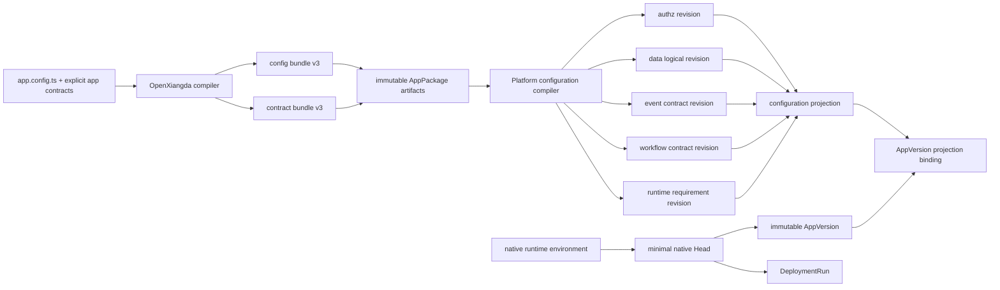

# OpenXiangda 2.0 原生配置投影与最小 Head 实施蓝图

> 公开版本已匿名化客户、环境和实例标识。历史验收叙述仅作设计背景，不代表当前线上状态。

状态：E1-C0 工具链契约、E1-C1 平台纯编译器、E1-S0 additive 投影持久化、E1-S1 AppVersion shadow prepare 和 E1-T0 全新 Native reference 已完成；平台运行时与 generation 尚未切换
前置设计：[环境配置内核](./environment-configuration-kernel-v2.md)、[Alpha 退役与 Native 切换前置审计](./native-kernel-inventory-v2.md)、[授权一致性内核](./authorization-consistency-v2.md)

本文把 E1 收敛为可实施的数据模型、编译合同、迁移边界和文件计划。E1 的目标不是把现有 `activate()` 拆成更多 UPSERT，而是建立一个环境中立、不可变、可由 Environment Head 原子选择的完整应用配置闭包。

本文仍受逐阶段架构门禁约束。用户已确认 Native 绿地路线和仅保留 `preproduction`、`production` 两个远程环境；每个 E1 子阶段仍须独立验证，不迁移 alpha 数据、不做请求级 fallback，也不自动切换 contract generation。

### 1.1 E1-C0 已确认实施边界

- 应用源配置使用 `openxiangda.app-config/v3`，只服务 OpenXiangda 2.0 Native，不提供 v2 自动转换。
- Config/Contract artifact 分别使用 `openxiangda.config-bundle/v3`、`openxiangda.contract-bundle/v3`，共同声明 `compilerContractVersion: native-2`；contract 必须绑定 config digest。
- `authz.capabilities` 只允许应用显式声明 `backend`、`ui` capability；Data capability 由资源自动导出，平台 capability 由保留 catalog 提供。role、App API operation 和 frontend route 的 capability 引用必须闭合并属于当前应用。
- App API operation 显式声明稳定 code、静态 method/path、request/response JSON Schema 和 capability；生成 contract 只保存 schema digest，官方 Nest `@OpenXiangdaOperation()` 消费同一个生成对象。
- frontend route 显式声明稳定 code/path、`admin|user` surface、导航关系和 capability；页面组件与路由实现消费生成常量，禁止再散写保护性 capability 字符串。
- Workflow contract 显式编译允许的用户操作及 operator-editable approver/role/provider 参数；模板只开放绑定 key、候选角色/Provider 等有限参数，不把任意业务逻辑暴露成运行态编辑。
- 所有 bundle 都是环境中立不可变输入。递归检测并拒绝 environment identity、Secret/OAuth 值、签名密钥和 Kubernetes 路由状态；应用最高管理员由平台 grant 表达，不再允许 package role 上的 `isAppSuperAdmin`。
- C0 只改共享合同、纯编译器、Nest metadata 与测试，不写数据库、不改变 alpha resolver、不发布 npm/OCI。回滚点是 C0 提交；失败时 current alpha 工具链和生产平台不受影响。

### 1.2 E1-C1 已确认实施边界

- Platform Server 新增无依赖的 `ApplicationConfigurationCompilerV2Service`：唯一输入是 AppPackage 中 config/contract artifact 的原始 bytes、声明摘要和稳定 appCode；不读取数据库、Redis、Kubernetes、Secret、当前 Head 或 alpha metadata。
- 两类 artifact 必须是 canonical JSON，分别限制为 4 MiB、8 MiB；平台复算原始 bytes 摘要、递归资源预算、环境运行态禁止字段、角色/能力/Data Policy、Data Resource、App API、路由、事件和 Workflow 引用闭包。
- 平台从 config bundle 独立重建完整 contract bundle，并与上传 contract 逐字段比较；错误仅暴露稳定 code、JSON pointer 和有界标识，不回显配置值或 Secret。
- 编译结果是深冻结的 authz/data/events/workflows/runtime/contracts 六类投影，每类有 canonical digest，aggregate digest 只绑定 source digests、compiler contract、appCode 与六个投影摘要，不包含数据库 UUID、时间或操作者。
- 真实 v2 CLI AppPackage 已作为跨仓黑盒输入通过平台纯编译；验证同时发现并修正 Data Resource contract digest 曾基于规范化前源码的问题，现在摘要严格绑定 config artifact 中的规范化 schema。
- C1 不接 delivery executor、不写 migration、不产生数据库 revision，也不改变生产激活路径。下一阶段 C2 才建立 additive 不可变表和 repository；失败时删除未引用纯编译器代码即可回滚。

### 1.3 E1-S0 已完成实施边界

- Platform Server 已增加 authz、data logical、event、workflow、runtime requirement、contracts 六类领域修订、聚合投影、AppVersion binding 和 compile receipt；领域修订只由自身 canonical digest 标识，改变前端路由不会复制未变化的授权投影。
- Repository 只执行 `INSERT`/`SELECT`，在一个调用方事务内用唯一键收敛并逐字段比较冲突；它不读 Environment Head，不执行 DDL、Kubernetes、Redis、Secret 解密或外部网络。
- config/data-contract 来源由 tenant/app 复合外键和数据库触发器同时校验 kind、artifact digest；已绑定 Native 投影的 Alpha component/AppVersion 才变为不可修改，未绑定 Alpha 行在 expand 阶段仍保持原生命周期，避免 additive migration 静默改变旧路径。
- 一次性 PostgreSQL 已验证 12 路并发重复持久化只生成一组领域修订、聚合、binding 与 receipt，并验证来源防伪、绑定后不可变、未绑定 Alpha 更新、历史迁移和 migration 幂等复跑。
- S0 仍不接 delivery executor、不创建 Environment Head、不切 generation。下一阶段 E1-S1 负责从精确 AppPackage artifact bytes 执行 shadow compile/persist，并把 receipt 作为 AppVersion prepare 的可验证结果。

### 1.4 E1-S1 已完成实施边界

- Shadow prepare 只接受已持久化 AppVersion identity；它从 config/data-contract component 和内容寻址 artifact 定位精确字节，验证 canonical package digest、manifest 唯一 artifact 闭包、`application-native-2` capability、component/artifact digest、对象大小与实际字节摘要，再调用 C1 纯编译器和 S0 Repository。
- artifact 下载和纯编译在事务外执行；写入事务对 AppVersion、两条 component 和两条 artifact locator 取得共享锁并复核完整快照，再原子写入六领域投影、聚合、binding 与 receipt，避免把对象存储 I/O 放入长事务，也封住下载后换源竞态。
- 只有已经参与 Native projection 的 config/contract component、AppVersion 和 artifact locator 会被数据库触发器保护；未绑定 Alpha 行与制品在 expand 阶段保持旧生命周期。Shadow prepare 不读取或更新 Environment Head，也不调用 Alpha config/deployment/runtime service。
- 单元测试、31 个 2.0/共享安全套件共 216 个测试、构建和一次性 PostgreSQL 真实服务调用通过；真实验收覆盖 shadow prepare、并发重复绑定、artifact/component/AppVersion 不可变、未绑定 Alpha 兼容与 migration 幂等复跑。
- S1 没有 controller，也没有接入 Alpha executor。下一阶段 E1-T0 先由全新本地应用验证 v3 AppPackage 生成；平台侧后续显式 Native prepare 命令必须受 generation/capability gate 控制，不能把本服务偷偷插入旧部署链路。

### 1.5 E1-T0 已完成实施边界

- 全新、独立 Git identity `openxiangda-v2-native-reference-app` 由当前候选 tarball 生成，不复制旧 reference、不依赖全局安装或源码 workspace link；应用源码基线 commit 为 `11062a6`。
- 新应用通过生成合同、类型检查、15 项应用测试和生产构建；相同源码及固定 backend OCI digest 连续构建得到逐字节一致的 AppPackage 和 artifact，config/contract 使用 v3 且 contract metadata 精确绑定 config digest。
- artifact bytes 被替换后稳定返回 `OPENXIANGDA_ARTIFACT_DIGEST_MISMATCH`；保留原 digest 伪造 manifest 后稳定返回 `OPENXIANGDA_PACKAGE_DIGEST_MISMATCH`。这两类失败已并入 `verify-packed-distribution`，不是一次性手工证据。
- 测试同时发现并修复生成器的版本闭包：repository template 只写 `workspace:*`，打包快照将所有 OpenXiangda 依赖绑定到同一发行候选的精确版本，tarball 门禁遍历新应用的全部 manifest 拒绝缺失或陈旧依赖。
- 参考仓库不提交候选 tarball 的机器绝对路径或本地 override；候选包继续由隔离的 tarball smoke 安装。当前 `openxiangda-local-platform` 尚未发布，因此参考仓库的 registry lockfile 在正式发行物可用前不作为证据或提交物。

## 1. 本轮架构门禁

| 维度 | 决定 |
| --- | --- |
| 问题证据 | 现有 `app_environment_heads_v2.environment_id` 外键指向 legacy `app_environments`，Head 还重复保存 AppVersion 中已有的组件指针；`ApplicationConfigV2Service.activate()` 会把 authz、Data Resource、Event/Timer 和 Workflow Provider 直接写成活动状态；Data Resource DDL 也在激活路径中执行。开发候选因此仍可能覆盖应用级逻辑定义。 |
| 能力所有者 | Platform Server 的 `ApplicationConfigurationCompilerV2Service` 是原生配置编译唯一所有者；`ApplicationVersionV2Service` 组合不可变制品；`ApplicationRuntimeEnvironmentV2Service` 拥有环境注册；未来 `ApplicationEnvironmentActivationV2Service` 只切活动指针。CLI 只生成规范化 JSON 和摘要，不决定数据库投影或激活顺序。 |
| 稳定不变量 | AppVersion、组件修订、领域修订、聚合投影和版本绑定只增不改；原生 Head 只保存 AppVersion、DeploymentRun 和 CAS revision；包不含环境 key、Secret 值、成员关系或运行状态；同一 AppVersion 在 preproduction/production 使用完全相同投影，local 只消费同一投影合同而不建立远程 Head。 |
| 上下游合同 | 工具链输出 breaking 的 config/contract bundle v3；平台从已校验 artifact bytes 独立解析、规范化和计算摘要，生成 authz/data/event/workflow/runtime-requirement 五个领域修订以及一个聚合投影；AppVersion 通过不可变 binding 指向该投影。 |
| 并发与失败 | 相同输入由唯一键去重，冲突后逐字段比较；任何不一致返回 digest conflict，不能“复用最新记录”。五个领域修订、聚合投影和 binding 在一个数据库事务中提交；失败不产生可见 Head 变化。物理 DDL、Kubernetes、随机凭据和 Secret 解密不进入该事务。 |
| 安全与资源 | 平台只解析 JSON，不加载或执行应用 JavaScript；config 最大 4 MiB、contract 最大 8 MiB，并限制角色、能力、资源、字段、事件、流程和 Secret 声明数量；错误不回显配置全文、业务条件值或 Secret。所有跨表引用由 tenant/app 复合外键约束。 |
| 回滚单元 | E1 schema 是 additive 且在 K4 前没有线上读取者；工具链 v3、平台纯编译器、schema、shadow prepare 分成独立提交。K4 前可回滚代码并保留未引用的不可变行；K4 后只能回滚 native-aware 修复版本，不能恢复 alpha 配置激活。 |
| 可证伪验收 | artifact/metadata 篡改、并发去重、跨应用 UUID、旧 v2 bundle、缺 capability/handler、逻辑删字段、物理类型冲突、环境污染、不可变 UPDATE/DELETE、部分事务、超限输入和 alpha/native 路由 fallback 都有自动化拒绝测试。 |

## 2. 当前实现中可保留与必须淘汰的部分

| 当前能力 | E1 决定 | 原因 |
| --- | --- | --- |
| `app_component_revisions_v2` | 保留；Native projection 绑定后由数据库拒绝更新/删除，未绑定 Alpha 行暂不改变语义 | 组件摘要、provenance、SBOM 的模型正确；expand 阶段不能用全表触发器反向锁死旧路径 |
| `app_versions_v2` | 保留并增加 projection binding；绑定后由数据库拒绝更新/删除 | AppVersion 是正确的制品组合；不应为了新投影再造一套版本号，也不能在 additive 阶段无条件改变历史 Alpha 行 |
| `app_environment_heads_v2` | 仅保留为 alpha 历史审计事实，K4 后停止读取 | 它引用 legacy environment，并重复保存组件指针；原地改造会同时保留两个环境模型和两份组合真相 |
| `app_data_resources_v2` | 旧 alpha reference 留存；Native 新应用从 bundle v3 建立新的物理目录 | 当前一行混合物理表、逻辑 schema、capability、policy 和活动状态；迁移它会把 alpha 语义带入 Native |
| `roles/api_permissions/app_authz_declarations_v2` | 继续只服务 1.x/alpha；原生使用独立 authz revision | 共享写入口和应用全局唯一范围无法表达环境活动定义 |
| Event/Timer 环境唯一约束 | 保留已有 environment-key 修复作为 alpha 事实 | 后续 migration 已修正跨环境 code 唯一；真正缺口是声明可变、凭据环境绑定和 Head 原子选择，不重复修已解决问题 |
| Workflow v2 definition/binding version | 保留并补不可变约束，聚合投影引用精确版本 | 已有版本模型可复用；环境 Head、provider 状态和实例身份在 E4/K4 改为原生环境 |
| Secret/OAuth2 版本 | 保留功能基线，E4 增加原生 environmentId 外键和 active-only gate | 值属于环境运行态，不能编译到配置投影；现有 AAD 已包含不可变 environment key，可在 registry 精确校验下保留，不做无收益的批量重加密 |

`metadata_json.configurationBundle` 不再作为原生编译的权威输入。现有上传链路已经把 frontend/backend/config/contracts 的精确字节按 digest 保存到 `app_delivery_artifacts` 指向的内容寻址对象，并在客户端 seal 与平台上传时复算摘要；E1 直接复用该仓库，不增加第二套 artifact 存储。历史 alpha AppVersion 不绑定 Native 投影；全新的 native reference 必须用 v3 工具链重新构建 AppVersion，不能信任或转换历史 metadata。

## 3. 最终所有权与依赖方向



强制依赖规则：

1. 工具链可以提前发现错误，但平台必须独立验证，不能信任客户端提交的 digest 或闭包。
2. 平台编译器只接受经过 AppPackage/制品摘要校验的 JSON bytes，不执行上传包中的 JavaScript、Nest bootstrap、Vite 插件或任意构建脚本。
3. 领域 compiler 是纯函数；repository 只保存规范化输出。它们不能访问 Kubernetes、Redis、Secret 值或当前 Environment Head。
4. Head resolver 只能从 AppVersion binding 得到配置闭包，不从“最新 revision”、alpha 活动表或另一个环境 fallback。
5. 环境运行态只引用稳定 definition code/revision；暂停、角色成员、Secret 值、OAuth client、receipt、Workflow instance 和可编辑审批参数不进入不可变包。

## 4. Bundle v3：明确结束 alpha 语义

产品版本仍是 OpenXiangda 2.0；这里的 `v3` 是内部制品合同 generation，用来明确切断已经暴露错误环境语义的 alpha bundle v2。

```text
openxiangda.config-bundle/v3
openxiangda.contract-bundle/v3
compilerContractVersion: native-2
```

### 4.1 Config bundle v3

Config bundle 至少包含：

```text
schemaVersion, appCode
authz:
  explicit capability catalog
  package roles and role-capability edges
  scope dimensions/sources and data policies
  bounded authorization transitions keyed by source authz digest
backend:
  active-only/optional Secret declarations
data:
  logical resource schemas, operation capabilities and field policies
events:
  immutable subscription/timer definitions
workflows:
  immutable definitions/bindings/activation set/provider definitions
  schema for operator-editable approver/role parameters
runtime:
  protocol capability requirements and health contract
```

禁止字段：`environmentKey`、`environmentId`、Secret value/ciphertext、OAuth client、用户/部门/角色成员、RelationshipGrant、当前审批人值、当前定时器 nextDueAt、Kubernetes namespace/NodePort 和生产 URL。

### 4.2 Contract bundle v3

Contract bundle 是前端、NestJS 和平台可以共同校验的闭包，不是第二份配置。它至少记录：

- 所有 resource code、字段 code/type 和逻辑 schema digest；
- 闭合后的 platform/backend/ui/data capability catalog；
- 每个 App API operation 的稳定 code、method、规范路径、请求/响应 schema digest 和 required capability；
- Event consumer/producer code 与 CloudEvent type；
- Workflow code/version、provider code 和允许的用户操作 code；
- 前端 route/menu 所引用 capability；
- config digest、compiler contract version 和生成器版本。

App API 不依赖脆弱的运行时反射或执行 Nest 应用来生成合同。应用源码显式声明 operation contract，官方 `@OpenXiangdaOperation(contract.operation)` decorator 消费同一个对象；release verifier 拒绝除健康/就绪端点外未绑定 operation contract 的 controller route，也拒绝散写 capability 字符串。动态生成路径首期不支持，避免运行时路由与不可变合同漂移。

### 4.3 关闭 v2 的方式

- K4 前，alpha repository 只接受 bundle v2，native shadow compiler 只接受 v3；两者由全局 generation/phase 选择，不在同一次请求中 fallback。
- K4 后，所有 2.0 prepare/promotion 只接受 v3；v2 返回稳定 `410 OPENXIANGDA_V2_ALPHA_CONTRACT_REMOVED`。
- 不提供自动 v2→v3 转换。v2 缺少显式 capability catalog、operation closure 和原生环境语义，猜测转换会制造伪闭包。
- 1.x 工具链与应用不读取这两个 schema。

## 5. 原生核心表

### 5.1 Contract generation control

```text
openxiangda_v2_kernel_control
  singleton_key = 'openxiangda-v2'
  phase alpha|native_capable|draining|native
  contract_generation alpha|native-2
  revision bigint >= 1
  cutover_evidence_digest, required_platform_release
  updated_by, updated_at
```

PostgreSQL 是 generation 唯一事实源。服务可以短缓存，但每次写和安全入口必须用数据库 revision 证明当前 generation；Redis/环境变量/Pod annotation 不能切 generation。只有受控 ops CLI 能 CAS 更新该行，普通 HTTP、应用 CLI 和 Admin UI 没有切换权限。

### 5.2 Native environment registry

```text
app_runtime_environments_v2
  id uuid primary key
  tenant_id, app_type
  environment_key preproduction|production
  environment_kind preproduction|production
  display_name, status active|decommissioned
  side_effect_policy_json, revision bigint
  created_by, updated_by, created_at, updated_at
  UNIQUE (tenant_id, app_type, environment_key)
  UNIQUE (tenant_id, app_type, environment_kind)
  UNIQUE (tenant_id, app_type, id)
```

- key/kind/tenant/app 创建后不可修改；环境不物理删除，只能在满足无活动 Head、runtime、数据和安全状态引用的独立计划中 decommission。
- native UUID 只由新应用的显式环境创建事务生成；旧 alpha Head/environment UUID 不复用、不映射。
- 新应用 provision 事务只创建 preproduction；首次 promotion 在唯一约束下惰性创建 production。普通部署请求不能隐式补环境，local 不进入 registry。

### 5.3 Minimal native Head

```text
app_runtime_environment_heads_v2
  environment_id uuid primary key
  tenant_id, app_type
  active_app_version_id uuid not null
  active_deployment_run_id uuid not null
  revision bigint not null
  activated_by, activated_at
```

Head 不保存 frontend/backend/config/contracts/projection id，因为这些均可从 AppVersion 与 binding 唯一得到。必须增加复合唯一键/外键，数据库直接证明：

- Head 的 environment 属于相同 tenant/app；
- AppVersion 属于相同 tenant/app；
- DeploymentRun 的 `runtime_environment_id + application_version_id + tenant/app` 与 Head 完全一致。

DeploymentRun 的 contract generation 和可激活状态是可变事实，不能伪装成普通外键约束。激活事务必须在同一锁内重读 run，校验 `contract_generation=native-2`、目标 environment/version、阶段、取消状态和 expected revision，再写 Head；run 自身用 check constraint 限制 generation 与新旧 environment id 的合法组合。

`app_delivery_runs` 保留为统一发布记录，但新增 `runtime_environment_id`、`contract_generation` 和 `expected_head_revision`。旧 `environment_id` 继续表示 legacy environment，只供旧发布；native run 的数据库 check 要求新列非空，不能在代码里猜两个 id 哪个有效。

现有 `app_delivery_runs` 的 `tenant + app + idempotency_key` 是应用全局唯一，不能承载原生多环境客户端幂等。最终增加 `app_runtime_delivery_request_receipts_v2(environment_id, client_idempotency_key, request_digest, delivery_run_id, status, result_digest)`，以环境为唯一范围并对 digest 做冲突校验；DeliveryRun 的旧 `idempotency_key` 对 native run 只保存平台生成的全局 operation key。这样不需要在 K4 前删除旧约束，也不通过字符串拼接环境 UUID 伪造客户端 key。

## 6. 不可变配置投影

### 6.1 Aggregate projection and binding

```text
app_configuration_projections_v2
  id uuid primary key
  tenant_id, app_type
  source_config_revision_id
  source_contract_revision_id
  config_schema_version, contract_schema_version
  compiler_contract_version
  config_digest, contract_digest, projection_digest
  authz_revision_id
  data_logical_revision_id
  event_contract_revision_id
  workflow_contract_revision_id
  runtime_requirement_revision_id
  created_by, created_at
  UNIQUE source tuple
  UNIQUE (tenant_id, app_type, projection_digest)

app_version_projection_bindings_v2
  app_version_id primary key
  tenant_id, app_type
  projection_id
  binding_digest, created_by, created_at
```

`projection_digest` 由五个领域 canonical digest、两个 source artifact digest 和 compiler contract version 计算，不包含数据库 UUID、创建时间或操作者。每个领域即使为空也生成稳定空 revision，因此 resolver 不需要 nullable fallback。

一个 AppVersion 只能绑定一次。compiler 升级若改变语义，package manifest 必须包含新的 compiler contract version 并形成新的 package digest/AppVersion；不能悄悄重编译已经绑定的历史 AppVersion。历史 alpha AppVersion 永不绑定 Native；Native reference 与后续应用全部重新构建 v3 AppVersion。

### 6.2 Domain revisions

授权表沿用[授权一致性内核](./authorization-consistency-v2.md)定义的 `app_authz_revisions_v2`、capability/role/scope/policy child tables。

Data 逻辑层：

```text
app_data_logical_revisions_v2
app_data_resource_definitions_v2
app_data_field_definitions_v2
app_data_operation_capabilities_v2
app_data_field_policies_v2
```

Event 定义层：

```text
app_event_contract_revisions_v2
app_event_subscription_definitions_v2
app_timer_definitions_v2
```

Workflow 聚合层：

```text
app_workflow_contract_revisions_v2
app_workflow_contract_definitions_v2
app_workflow_contract_bindings_v2
app_workflow_provider_definitions_v2
app_workflow_editable_parameter_definitions_v2
```

既有 Workflow definition/binding version 可以作为 child FK 目标，但必须先增加不可变保护并校验内容 digest。审批人、角色等允许管理员修改的值属于环境 override state；包只声明参数 code、类型、校验和允许修改的范围，不把当前值写回 definition。

Runtime requirement 层：

```text
app_runtime_requirement_revisions_v2
app_runtime_secret_declarations_v2
app_runtime_protocol_capabilities_v2
```

这里只保存 Secret 名称、required/optional、使用方和 active-only policy，不保存任何值、版本或密文。

### 6.3 Database immutability

以下记录创建后拒绝普通 UPDATE/DELETE：component revision、AppVersion、五类领域 revision 及 child、aggregate projection、version binding、Workflow definition/binding version。保护由 SQL trigger 提供，不只依赖 TypeORM 没有 update 方法。

K5 不删除这些审计事实，也不清理 alpha Head 或数据库可变状态；它只撤销 allowlist 明确列出的 alpha runtime principal/OAuth 并删除旧 K3s workload。失败的 Native candidate 由新 runtime GC 按 run identity 单独回收。若法规要求物理销毁某些 provenance，必须设计独立 retention/crypto-erasure 协议，不能给业务服务增加通用“绕过不可变”开关。

## 7. Data API 的物理与逻辑闭包

E1 编译逻辑定义；E2 执行物理 schema 计划。最终物理目录为：

```text
app_data_physical_resources_v2
  tenant_id, app_type, resource_code, physical_table_name
  physical_schema_generation, status

app_data_physical_fields_v2
  physical_resource_id, field_code, physical_type, introduced_generation

app_data_schema_generations_v2
app_data_schema_steps_v2
```

规则：

1. 新 Native 应用首次 prepare 时从 v3 Data logical revision 分配物理 resource identity/table；不映射旧 alpha `app_data_resources_v2`。旧表继续由 alpha 历史拥有。
2. 逻辑 revision 可以删除字段，但物理列保留；旧/新环境分别只看到自己 Head 的字段集合。
3. 相同 field code 重新出现时必须保持兼容 physical type；类型改变需要单独 expand/backfill/contract 计划。
4. 逻辑 required 由 Data API 按 revision 校验；应用业务列始终物理可空，不生成或收紧 `NOT NULL`。
5. 新物理资源 identity/table name 在 prepare 中通过受控规则和 advisory lock 创建；失败候选留下未引用目录行是安全的。DDL 使用独立 schema ledger，不进入 projection 或 Head 事务。
6. native Data API 使用新的环境级事务 receipt，唯一键至少是 `environment_id + idempotency_key`。现有 `app_data_transaction_requests_v2` 的唯一键只有 tenant/app/idempotency key，作为 alpha 表退出 native 读写，避免跨环境相同 key 冲突和旧 RoleSession FK 混用。

RLS 在 native generation 通过 `environmentId -> Head -> AppVersion binding -> data logical revision` 解析 policy，再校验 native RoleSession/membership/grant。物理表中的不可变 `environment_key` 继续用于大表行隔离，但请求 Principal 必须同时给出 environmentId/key，并由 registry 精确核对；客户端参数不能覆盖。

## 8. Event、Workflow 与凭据边界

- Event/Timer/Workflow Provider 的 code、endpoint contract、事件类型、重试上限和参数 schema 属于不可变 definition revision。
- pause/resume、next due time、delivery lease、receipt、DLQ/replay、provider health、editable override 值和 credential rotation 属于环境运行态。
- 新的 Event/Workflow signing credential version 必须绑定 `environmentId + kind + definitionCode + version`；加密 AAD 包含这些稳定字段。所有 alpha Event/Workflow、应用 Secret 与 OAuth credential 都不提升为 Native，新应用按环境重新签发。
- 切换前审计只报告是否存在活动凭据/lease，不输出名称、值、hash 或密文。K3/K4 不运行 credential importer；明文不进入报告、CLI、AppPackage、日志或 AI 上下文。
- E1 不创建、解密或激活凭据；它只编译 definition。E4 在候选 prepare 创建 pending credential，Head 事务只切 credential version/status 指针。
- Workflow 实例、task、provider invocation 和 Event delivery/receipt 可通过 expand migration 增加 `environment_id + contract_generation`，K4 native service 只读取 native 行；K5 再移除 alpha-only FK/列。schema 短期同时容纳两代数据不等于请求级双读。

## 9. 编译算法与事务边界

### 9.1 Pure validation

1. 从 `app_delivery_artifacts` 指向的内容寻址对象流式读取 config/contracts artifact bytes，分别复算 SHA-256、size、media type 和 package manifest 引用；对象缺失、数据库 descriptor 不一致或读取超限均拒绝，不能改读 component metadata。
2. 严格解析 JSON，拒绝重复 key、未知 schema、非规范数字、非法 Unicode/路径、环境字段和超限集合。
3. 规范化排序并重新计算 config/contract digest；客户端摘要只用于发现传输错误。
4. 校验闭包：角色 capability、Nest operation、Admin route、Data field policy、Event handler、Workflow provider/操作、scope dimension/source 和 Secret declaration 必须存在且属于同一应用。
5. 生成五个领域 canonical model/digest、aggregate projection model/digest 和物理 schema intent；全过程不读当前 Head。

### 9.2 Persistence transaction

一个短事务完成：

1. 按 domain digest insert-or-compare 五个不可变 revision；
2. insert-or-compare aggregate projection；
3. insert-once AppVersion binding；
4. 写不可变 compile receipt，包含 source digest、compiler release、耗时和结果摘要。

唯一冲突后必须重读 canonical columns 并逐项比较；任何不同返回 `OPENXIANGDA_CONFIGURATION_DIGEST_CONFLICT` 并告警，不能覆盖。事务内禁止 DDL、HTTP、Kubernetes、Redis、随机数生成、Secret 解密和大表扫描。

### 9.3 Physical preparation and activation

projection 事务提交后，E2 才根据物理 intent 执行有界 expand。E4 候选 readiness 完成后，最终激活事务只允许：

- 核对 kernel generation、environment/run/AppVersion/projection/schema readiness；
- 对目标 environment 加 advisory lock，并锁定 run/Head/authz/event/workflow state；
- 使用 `expectedHeadRevision` 做 CAS；
- 执行有界且已摘要确认的 authorization transition；
- 切 authz/event/workflow/credential 活动指针；
- 写最小 Head、DeploymentRun succeeded 和 activation receipt。

激活事务不读取 artifact、不编译配置、不执行 DDL、不生成或解密 Secret、不调用 Kubernetes/Redis/HTTP。提交后网关和 runtime 通过 Head 自发现；通知失败由 reconciler 重试，不回滚数据库事实。

## 10. 并发、失败和恢复

| 场景 | 必须行为 |
| --- | --- |
| 两个 worker 编译相同输入 | 一个插入，另一个唯一冲突后精确比较并复用；只产生一个 projection/binding |
| 相同 digest 内容不同 | 视为完整性事故，拒绝并告警；禁止以 SHA-256 碰撞“不可能”为由跳过字段比较 |
| 五个领域中途失败 | 整个事务回滚，不产生部分 projection 或 binding |
| artifact 缺失但 metadata 有 bundle | 拒绝 native bind；要求重新上传/重建，不使用 metadata 恢复 |
| compiler contract 升级 | 已绑定 AppVersion 不重编译；新 manifest/package digest 生成新 AppVersion |
| 逻辑删字段 | 新 revision 不暴露该字段，物理列保留；其他环境 Head 不变 |
| 物理 expand 成功、runtime 失败 | schema ledger 保留兼容列/索引；没有 Head 切换，旧逻辑不可见 |
| Head 指向 run/version 不一致 | 复合 FK 或 activation preflight 拒绝；不能服务层修正后继续 |
| projection cache/Redis 丢失 | 从 PostgreSQL 按 immutable id 重建；安全结果不能依赖缓存可用 |
| K4 前 native 编译异常 | alpha 路由仍由 generation 选择且不读取 native 表；回滚 native-capable 镜像 |
| K4 后异常 | 保持 2.0 maintenance，发布 native-aware 修复；不 fallback alpha 活动表 |

## 11. 安全和资源上限

默认硬上限：

| 项目 | 上限 |
| --- | ---: |
| config canonical bytes | 4 MiB |
| contract canonical bytes | 8 MiB |
| package roles | 200 |
| closed capabilities | 2,000 |
| data resources | 200 |
| total data fields | 5,000 |
| event subscriptions + timers | 500 |
| workflow definitions/bindings/providers | 各 200 |
| Secret declarations | 200 |
| physical fields added by one ordinary version | 20 |
| physical indexes added by one ordinary version | 10 |

超过定义数量不提高内存后继续运行，而是返回稳定 capacity error，要求独立容量设计。编译在持久 DeploymentRun worker 中执行，单任务设置时限和内存预算；HTTP 请求只创建/查询 run。错误响应只返回 JSON pointer、错误 code、受限 resource code 和 digest，不返回整个 bundle、policy 条件值或 artifact URL。

## 12. 文件级实施计划

### 12.1 OpenXiangda v2 工具链

| 文件/目录 | 变化 |
| --- | --- |
| `packages/contracts/src/**` | bundle v3、显式 capability/App API/Event/Workflow contract 类型与 canonical schema |
| `packages/compiler/src/config.ts` | 显式 `authz.capabilities`、operation contracts、环境字段拒绝 |
| `packages/compiler/src/bundle.ts` | v3 规范化、闭包、稳定 digest、生成 TypeScript 常量 |
| `packages/nest/src/**` | `@OpenXiangdaOperation()` contract 引用和非健康 route 绑定规则 |
| `packages/cli/src/**` | build/check 输出 v3；不提供 v2 自动转换或环境特化 bundle |
| official template/reference app | 使用显式 operation contract 和生成常量，证明普通 React/Nest 工程体验 |
| `.changeset/*.md` | 所有受影响公开包的 breaking prerelease Changeset |

### 12.2 Platform Server

| 文件/目录 | 变化 |
| --- | --- |
| `src/migrations/*AddOpenXiangdaNativeConfigurationKernel.sql` | control、environment、minimal Head、projection/binding、领域 revision、复合 FK 和不可变触发器 |
| `src/domain/openxiangda-native-configuration/**` | v3 parser、canonical model、closure、digest、limits；纯函数 |
| `src/repository/openxiangda-native-configuration.repository.ts` | insert-or-compare 和 compile receipt；无 Head/runtime 写方法 |
| `src/service/openxiangda-application-configuration-compiler-v2.service.ts` | artifact 验证、纯编译与短持久化事务 |
| `src/service/openxiangda-runtime-environment-v2.service.ts` | registry 的显式 create/read/decommission preflight |
| `src/service/openxiangda-kernel-generation-v2.service.ts` | global phase/generation CAS、请求边界 repository 选择 |
| `src/service/openxiangda-application-version-v2.service.ts` | 创建版本时要求 v3 projection binding；既有行逐字段比较 |
| release verifier/tests | 禁止 native resolver 引用 alpha active 表、metadata fallback、请求级 dual-read 或无合同 Nest route |

SQL 按 expand、capable、contract 三个提交拆分；E1 只做 expand 和 shadow prepare，E4 才接入 Head 激活，K5 才执行 alpha contraction。不得为了减少 migration 数把所有阶段塞进一个不可回滚 SQL。

### 12.3 根部署仓库与 Admin

- 根仓只增加 native-capable release capability、显式 allowlist preflight 和 cutover evidence digest 校验；普通 `server-deploy.sh update` 不自动切 generation。
- Admin 在 A1 之前不消费 native Head 管理 API，也不提供编辑 package-owned role/data/event/workflow definition 的表单。
- 后续 Admin 只能管理环境创建/停用、Secret 值、OAuth client、role membership、RelationshipGrant、Event pause/replay 和 workflow editable override 等运行态。

## 13. 可证伪验收矩阵

1. 修改 `metadata_json.configurationBundle` 但不改 artifact bytes，native 编译结果不变；篡改 artifact bytes 与摘要不符时拒绝。
2. 相同 v3 artifact 并发准备 50 次，只产生一个领域 revision/aggregate projection/version binding，结果 digest 完全一致。
3. 人为构造同唯一 digest 但不同 canonical 列，返回 digest conflict，不覆盖、不复用。
4. 对 component/AppVersion/domain/projection/binding 执行 UPDATE/DELETE，由 PostgreSQL 拒绝；1.x 表写入不受影响。
5. config 含 environmentKey/environmentId、Secret value、未知字段、超限列表或 bundle v2，native compiler 稳定拒绝。
6. role 引用未声明 capability、Admin route/Nest operation 散写 capability、Data field policy 引用缺失字段、Event/Workflow handler 缺失，AppVersion 无法绑定。
7. 同一 AppVersion 绑定一次后升级 compiler，旧 binding 不变；只有新 package digest 能形成新投影。
8. preproduction/production Head 指向不同 AppVersion 时，各自解析自己的 logical revision；编译或激活 preproduction 候选不改变 production 查询结果，本地编译不产生远程 Head。
9. 新 revision 删除逻辑字段后物理列仍在；旧环境仍可访问，新环境拒绝；重新使用不同 physical type 时 prepare 阻断。
10. Data API 两个环境使用相同 idempotency key，分别得到独立 receipt；同一环境不同请求摘要返回冲突。
11. Event/Workflow native credential 的 ciphertext 在错误 environmentId/code/version AAD 下无法解密；报告、日志和编译 receipt 不含明文。
12. projection transaction 任意 statement 注入失败后，五个 domain、aggregate 和 binding 均无部分行。
13. shadow native resolver 与 alpha resolver 离线对照时可报告差异，但每个真实请求只走 generation 指定的一套 repository；源码门禁拒绝 catch 后 fallback。
14. 代表性 1.x 登录、角色、表单、Workflow 和环境集不查询任何 native 表；K4 前线上 alpha 路径不读取新 Head。
15. activation transaction 的数据库 tracing/source test 证明没有 DDL、网络、Redis、Secret 解密或 artifact 读取；并发 expected revision 只有一个成功。

## 14. 确认后的实施顺序

1. 先实现 CP0/CP1 最小切换前审计，用 reference-environment 只读报告证明只有可重建 alpha reference，并证明 legacy DeliveryRun/Runtime/Event app 被排除；不建设 inventory schema 或 importer。
2. E1-C0：工具链和平台共享的 v3 JSON schema、canonical/digest/closure 测试；不写数据库。
3. E1-C1：Platform Server 纯 compiler 与恶意/超限 fixture；不接 delivery executor。
4. E1-S0（已完成）：additive projection schema、复合 FK、绑定后不可变触发器、事务 repository 和真实 PostgreSQL 并发/migration 测试；不读取 Head。
5. E1-S1（已完成）：AppVersion 精确制品 shadow prepare、共享锁复核、compile receipt 与绑定后 artifact guard；Alpha executor 仍不读 native 表。
6. E1-T0：更新 official template，并以新 app code 创建全新的 native reference repo，完成普通 React/Nest、v3 build、重复 prepare和失败恢复。
7. E2/E3 分别接 Data physical/logical resolver 和原生授权运行态；仍不切线上 generation。
8. E4 接最小 Head CAS、pending credential、invocation assertion 和 runtime lease。
9. K2/K3/K4 经全实例 capability、写栅栏和新 native reference 验收后一次切到 `native-2`；K5 只撤销旧 alpha runtime principal、删除旧 workload，数据库 alpha 历史保留。

每一步都必须重新填写架构门禁。若 preflight 发现 allowlist 外的有效 Application v2 AppVersion/Head/workload，必须停止并重新确认产品范围；不能临时扩展 importer、使用 metadata fallback、默认 production 或双写绕过。
