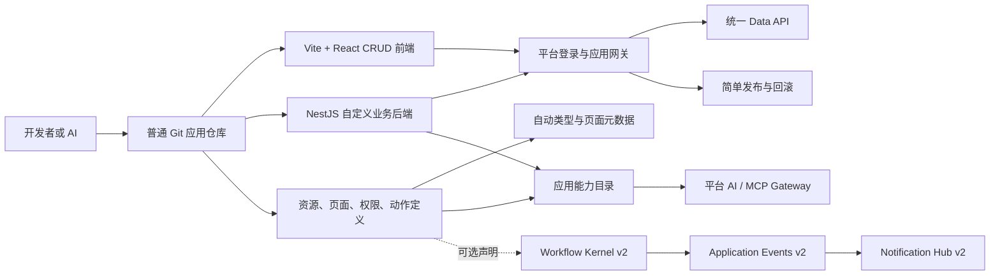
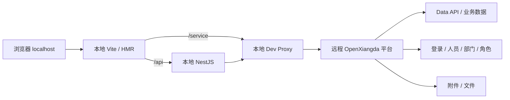

# OpenXiangda 2.0 产品北极星与重启路线

> 公开版本已匿名化客户、环境和实例标识。历史验收叙述仅作设计背景，不代表当前线上状态。

状态：2026-09-05 用户已确认平台基础架构重构，以下新方向取代历史路线中的冲突要求。

## 当前权威实施方向

OpenXiangda 2.0 面向公司内部开发、产品与销售，允许非技术人员在 AI 引导下
描述业务并通过平台标准能力交付稳定应用。默认先设计业务任务和权限，再选择
页面；数据表可以没有页面，一个页面可以组合多个模型。简单应用显式选择
标准 CRUD 即可快速开发，标准流程、待办和通知无需应用自行重建。

2026-09-07 用户进一步确认：新应用先经专业对话发现模块，形成完整首发范围的详细 PRD、旅程、逐页交互、视觉/原型、权限与架构设计及实际确认基线，再制定实施计划和实现业务。既有应用按受影响范围修订，文案和无行为变化沿用有效设计；这取代历史“简单新应用只需总纲与短变更”的冲突要求。实施决定见 [对话设计基线](./2026-09-07-conversational-product-design.md)。

平台负责清晰的数据结构与迁移、直接 Data API、事务、字段协议、权限、流程、
待办、通知、文件和聚合。Nest 是复杂业务、集成与后台任务的可选扩展。管理端、
用户 PC、用户 Mobile 具有合适的外壳，统一使用组件库默认外观；数据录入优先使用平台
组件，PC 使用 AntD，移动使用平台 Mobile/AntD Mobile，不生成原生业务输入。

2026-09-10 用户确认：所有管理后台默认只在 PC 操作，不要求手机适配或移动验收。自定义后台报表和工具复用平台外壳与显式菜单，独立用户布局及手机页面按实际用户任务选择。实现专业交互时主动评估成熟组件与开源库；本轮决定见[管理后台入口与组件选型](./2026-09-10-admin-entry-and-component-selection.md)。

需求、权限矩阵与验收条件由用户确认，复杂度按应用需要展开；技术协议由平台
推导。应用只读权限不隐式扩大成写权限，展示设置不代替服务端授权。测试以真实
关键操作完成为验收依据，不以编译、接口 200 或跳过浏览器测试代替交付。

平台基础能力通过无客户业务含义的验证工程证明。任何客户 Demo、仪器、委员会
或学校实体都不是平台核心定义，也不是固定的业务模板。

实施按数据/视图与 CRUD、双端组件、权限与流程协作、Nest 扩展、报表和交付
体验分批推进；每批同时交付契约、实现、SDK/组件、文档和验收。
第一批决定见 [Platform foundation A](./2026-09-05-platform-foundation-a.md)。
标准管理界面沿用用户确认的 1.x 简洁交互，实施范围及验收见
[Standard admin interaction](./2026-09-05-standard-admin-interaction.md)。

---

以下为 2026-08-25 历史路线。涉及单一客户黄金模块、资源自动产生页面、读取
自动授予写入、移动端使用 PC 表单组件等冲突内容不再具有实施优先级。

这不是对现有 2.0 架构文档的补丁，也不假定现有 Skill、CLI、包、协议或发布状态机必须保留。它从真实使用目标重新定义产品，并允许在 alpha 阶段进行破坏性删除和重写。

本轮已经确认四项产品决定：

- 用 instrument reference app“仪器资源管理”作为唯一黄金模块，对比前端方案并验证 2.0；
- 普通 CRUD 必须直接使用平台 Data API，不再为列表和表单写重复 API Function；
- 仪器模块按“核心资源 + 关联配置 + 少量自定义动作”分层抽象，不照搬现有大页面和函数结构。
- CRUD 黄金路径保持最小；在它之外重新开放纯 2.0 的标准 Workflow 与 Notification Hub 可选模块，二者不进入默认模板，也不复用任何 1.x 实现。

## 1. 一句话定义

OpenXiangda 2.0 是公司内部小型应用的标准工程脚手架与托管运行平台：开发者用固定的 React 前端、NestJS 后端、统一 Data API 和少量声明，快速完成 CRUD、表单、页面权限、数据权限、本地开发、构建、部署和 AI 调用。

它首先解决工程化和交付效率问题；在 CRUD 黄金路径稳定后，提供标准人工审批和统一消息通知两个可选平台模块。它不把任意 BPMN、脚本编排、零信任安全、多环境治理、高并发或通用低代码编辑器作为默认目标。

## 2. 目标用户和主场景

主要用户是公司内部的初中级开发者、懂技术的产品人员和 AI 编码代理。他们开发的通常是：

- 学校内部的后台管理系统；
- 教师、家长或学生使用的轻量业务应用；
- 数据录入、查询、修改、统计和导入导出工具；
- 带少量业务校验、状态变化和第三方接口调用的应用；
- 一个学校内几十个相互独立、但共享登录和平台数据能力的小应用。

典型应用不要求极高并发，不要求复杂租户隔离协议，不要求每次修改都经过重型设计审批，也不默认需要完整审批流引擎。

## 3. 优先级

产品优先级固定为：

1. 创建、启动、修改、调试、构建、部署和回滚的黄金路径；
2. 数据资源、标准 CRUD 页面、表单字段和业务校验；
3. 页面权限、操作权限、数据行权限和必要的字段权限；
4. 自定义 React 页面和 NestJS 业务接口；
5. 文件、关联数据、导入导出、统计和简单状态机；
6. AI 能力目录、平台 AI 和 MCP；
7. 标准 Workflow 可选模块：提交、同意、拒绝、退回、转交、委托、加签、撤回、终止和标准 Surface；
8. Notification Hub 可选模块：模板、规则、详情跳转、钉钉卡片、第三方渠道、回调和消息运维；
9. 定时任务、复杂事件编排、任意流程节点和高级安全治理。

如果后续实现与这个顺序冲突，默认 CRUD 模板和前六项用户闭环不能被可选模块污染；Workflow/Notification 的实现与发布必须保持独立能力和独立复杂度预算。

## 4. 明确不做

首个可用版本不做以下事情：

- 不把 Workflow Kernel 或 Notification Hub 当作默认 CRUD 参考应用主路径；
- 不提供任意 BPMN、任意 JavaScript/Service Task、通用长事务编排、无边界候选人池或未经 Surface 授权的消息动作；
- 不要求开发者理解身份委托、Environment Head、DeploymentRun、generation、lease 或 credential revision；
- 不要求开发者创建、轮换和审计应用 OAuth client；
- 不要求应用声明事件签名密钥、双密钥轮换或持久回执；
- 不要求重型 SDD、OpenSpec、Changeset 或多份设计文档才能修改一个应用；默认轻量 AppSpec
  保存当前业务意图与必要变更；dev/check 可继续发现缺口，测试发布核对设计与计划，生产晋级核对绑定版本的实际验收；
- 不强制预发和生产双环境；
- 不让应用开发者手工提供 OCI digest、配置摘要或 AppPackage 清单；
- 不为尚未出现的高并发、跨区域容灾和外部攻击模型提前建设复杂基础设施；
- 不兼容尚未正式使用的 2.0 alpha API。

必要的登录校验、基本权限和发布回滚仍然保留，但必须被框架隐藏，不能成为应用开发者的日常负担。

## 5. 当前方向偏差

当前工具仓已经达到约 14 个公开包、63 个 CLI 命令、7 个 Skill、27 份架构文档；标准模板包含约 73 个 TypeScript/TSX 文件和 186 行应用配置。一次全新初始化实测约 108 秒、占用约 1.2 GB，并复制了陈旧 `dist`、报告和本地状态。

instrument reference app 类型的真实 1.x 工作区更能说明历史问题：排除 `dist` 和 `node_modules` 后仍有约 5061 个文件，其中 `openspec` 约 3369 个文件。业务源码、页面、表单、函数、自动化、资源清单、设计记录和发布状态被拆散到太多地方。

这些数字不是质量指标。它们说明产品必须建立复杂度预算，并优先删除开发者不需要理解的概念。

## 6. 成功标准

### 6.1 开发者体验

从空目录开始，一个开发者应该能够：

1. 在一次命令后得到可运行应用；
2. 在一份资源定义中增加字段；
3. 自动得到列表、新建、编辑、详情和删除页面；
4. 用三到五行配置声明页面和数据权限；
5. 在 NestJS 中增加一个普通业务接口；
6. 一次命令构建，一次命令部署；
7. 部署失败时保持旧版本，必要时一次命令回滚；
8. 不写额外 MCP 代码即可被平台 AI 发现和操作。

### 6.2 可量化预算

首个最小闭环以以下目标作为验收预算，实际值可在原型测试后调整：

| 指标 | 目标 |
| --- | --- |
| 冷启动创建应用 | 5 分钟内，包括安装 |
| 有缓存创建应用 | 60 秒内 |
| `dev` 暖启动 | 15 秒内可打开首个页面 |
| 从资源定义到可用 CRUD | 10 分钟内 |
| 应用模板源码文件 | 50 个以内 |
| 开发者常用 CLI 命令 | 8 个以内 |
| 公开 npm 安装包 | 1 个根包 `openxiangda`；5 个左右稳定 subpath 入口，硬上限 7 个 |
| 面向 AI 的 Skill | 1 个无 scope 入口 `openxiangda-v2`；按需 reference 不计为独立 Skill |
| 应用配置主文件 | 常见应用 150 行以内，可按领域拆分 |
| 首次业务提交 | 新人开始后 30 分钟内 |
| 标准应用部署 | 一条命令，失败不影响当前版本 |

不能通过新增概念或新增命令来规避这些预算。

## 7. 目标架构



### 7.1 平台负责

- 登录和当前用户；
- 应用访问入口；
- Data API 与数据存储；
- 角色和简单权限计算；
- 前端静态文件和 NestJS 容器部署；
- 当前版本、上一版本、日志和回滚；
- 跨应用 AI 能力目录和 MCP 入口。
- 可选 Workflow 的定义、实例、任务、参与人、命令和审计事实；
- 可选 Notification Hub 的逻辑消息、模板、渠道投递、回调和运维事实。

### 7.2 应用仓库负责

- 数据资源和字段；
- 标准页面声明及自定义 React 页面；
- 业务表单规则；
- NestJS 自定义接口和业务规则；
- 角色到页面、操作和数据范围的映射；
- 允许 AI 调用的资源与动作描述；
- 启用可选模块时的 Workflow 定义、审批人 Provider、消息模板引用和安全字段投影；
- 单元测试和少量关键 E2E。

### 7.3 不再建立第二事实源

- 资源字段只定义一次，同时生成前端类型、表单元数据、Data API 合同和 AI Schema；
- 页面权限只定义一次，同时作用于菜单、路由和操作按钮；
- 数据权限只定义一次，同时作用于 Data API 查询和写入；
- 自定义动作的输入输出只定义一次，同时作用于 Nest 校验、前端客户端和 AI 工具；
- Workflow 状态只由 Workflow Kernel 提交，消息状态只由 Notification Hub 投影，二者不复制业务记录；
- 构建产物由 CLI 自动收集，开发者不维护第二份发布清单。

## 8. 推荐应用结构

```text
my-app/
  apps/
    web/                 # Vite + React
    server/              # 标准 NestJS
  src/
    resources/           # 数据资源，可按业务域拆分
    pages/               # 少量自定义页面
    actions/             # 共享动作 Schema，可选
    workflows/           # 启用 Workflow 时的流程声明，可选
    notifications/       # 启用 Notification 时的模板引用/规则，可选
  openxiangda.app.ts     # 应用、页面、角色和资源入口
  package.json
  pnpm-lock.yaml
  Dockerfile             # 官方模板提供，通常不修改
```

不默认创建 `packages/domain`、`packages/contracts`、`platform/`、多份环境声明或生成源码包。规模增长后允许拆包，但不能让空应用一开始就承担大型 monorepo 结构。

生成文件放在一个明确目录，由 `dev/check/build` 自动更新。日常开发不要求先手工执行 `generate`。

## 9. 前端建议

### 9.1 候选基线

建议用一个短原型对比后确定：

- 方案 A：当前 Umi Max + Ant Design Pro/ProComponents；
- 方案 B：Vite + React Router + Refine Core + Ant Design，按需使用 ProComponents。

初步更倾向方案 B。Refine 本身面向 CRUD-heavy 内部应用，已经抽象 Data Provider、Access Control Provider、资源、列表、表单和路由；Vite 的开发和生产构建路径更直接。OpenXiangda 应该编写薄适配器，而不是再自行实现列表、表单、详情、路由生命周期和权限组件。

最终选择不凭偏好决定。用同一个 instrument reference app“仪器资源管理”模块分别实现，比较：

- 首次安装和启动时间；
- 模板文件数和依赖体积；
- 完成列表、搜索、分页、新建、编辑、详情、删除所需业务代码；
- 页面权限和数据权限接入代码；
- 自定义页面自由度；
- 生产构建时间和产物体积；
- AI 修改页面时的稳定性。

输掉原型的方案直接删除，不保留双轨兼容。

### 9.2 标准 CRUD 页面

资源声明默认产生：

- 服务端分页列表；
- 搜索、筛选和排序；
- 新建和编辑表单；
- 详情页；
- 删除和批量操作；
- 加载、空数据、校验错误和接口错误状态；
- 根据权限自动隐藏页面和按钮。

字段首先覆盖 instrument reference app 实际高频类型：文本、长文本、数值、金额、布尔、枚举、日期、人员、部门、附件、图片、关联和子表。不要先追求所有历史字段兼容。

页面允许三档扩展：

1. 零代码使用默认 CRUD；
2. 通过 props/配置调整字段、布局、搜索和动作；
3. 完全自定义 React 页面，但继续使用同一个 Data Provider 和权限 Provider。

## 10. 后端建议

每个应用保留一个标准 NestJS 后端，但它不是所有 CRUD 的强制中转层。

- 普通 CRUD：前端直接调用平台 Data API；
- 业务校验、跨资源事务、第三方接口和复杂动作：调用 NestJS；
- NestJS 使用一个薄 SDK 获得 `currentUser`、Data Client 和日志；
- 平台网关验证登录并向 Nest 传递标准短期用户上下文；
- 应用容器不直接暴露公网，不要求开发者理解自定义网关断言协议；
- 后台任务、应用 OAuth、Secret 轮换和单活 lease 在真实需求出现前不进入默认模板。

目标 Nest 开发体验应接近普通 Nest：

```ts
@Post('appointments/book')
async book(@CurrentUser() user: AppUser, @Body() input: BookInput) {
  return this.appointments.book(user, input);
}
```

框架不应该要求业务开发者处理 assertion、身份委托凭据、credentialVersion、environmentHeadRevision 或 deploymentRunId。

## 11. 数据与权限

### 11.1 数据资源

最小 Data API 提供：

- `list/get/create/update/delete`；
- 服务端分页、排序和常见过滤；
- 关联查询；
- 附件上传；
- 简单聚合；
- 批量写入和事务；
- `createdBy/updatedBy/createdAt/updatedAt`；
- 可选 revision，防止编辑页覆盖他人修改。

复杂审计时间线、事件溯源和全局 exactly-once 不作为首期门槛。

### 11.2 权限模型

第一版只保留开发者能直接理解的四层：

1. 页面权限：谁能打开一个页面；
2. 操作权限：谁能 list/read/create/update/delete 或调用自定义动作；
3. 数据权限：查询和修改哪些行；
4. 字段权限：哪些字段可见或可编辑；首期至少支持只读字段和禁止修改归属字段。

角色仍是开发者可理解的简单角色数组。每个应用请求使用当前登录用户全部有效应用角色的
并集；平台按同一批 membership、应用最高管理员 grant、环境 Head 和授权修订计算 capability、
字段与行权限。应用不提供身份切换，业务代码只读取当前用户、`roleCodes` 和
`capabilityCodes`。

应用可以声明可选 `perspectives`。Perspective 是角色并集之上的只读投影：标准 Shell
据此聚焦导航与只读字段，Native Data API 据此再次收窄 read capability、字段、行策略与
RLS；新增、编辑、删除、流程和自定义动作始终按完整角色并集授权。未选择 Perspective
等价于完整并集。自定义 Nest 页面通过请求作用域 Data API 自动继承；只有绕过标准 Data
API 的读取才使用 `@CurrentPerspective()` 显式实现同等投影。

数据权限不是角色本身，而是角色在某个资源和操作上的“行过滤规则”。第一版只提供五种可解释、可组合的规则：

| 规则 | 含义 | instrument reference app 示例 |
| --- | --- | --- |
| `all()` | 当前操作可作用于全部行 | 校级管理员查看和管理全部仪器 |
| `self(field, mode)` | 业务字段等于或包含当前用户 | `instrumentAdmins` 包含当前用户，因此仪器管理员可管理这台仪器；`createdBy` 等于当前用户则是本人数据 |
| `scope(recordField, roleScope)` | 记录的业务归属值位于当前角色被授予的范围集合 | 仪器的 `businessDepartment.id` 位于学院管理员的 `college` 授权集合 |
| `through(relation, targetPolicy)` | 通过真实关联资源继承目标资源的权限 | 预约单通过 `instrumentId` 继承对应仪器的学院/管理员权限 |
| `custom(handler)` | 仅用于前四类无法表达的少数规则，由 NestJS 策略返回受限查询或判定 | 临时时间窗、跨外部系统资格等真实特殊需求 |

`department` 不应成为框架硬编码的第六种权限。学院、年级、校区、课题组都只是不同的业务范围类型，统一使用 `scope`。`IN/AND/OR` 是内部组合算子，不是开发者需要学习的权限类别。没有任何允许规则时就是 `none`，也不需要单独声明。

页面隐藏只改善体验，Data API 必须在服务端把同一规则编译到 list/get/export/aggregate/create/update/delete。NestJS 自定义动作默认拿到的也应是带当前用户范围的 Data Client，AI 更不能绕过这层。

### 11.3 instrument reference app 仪器权限如何表达

应用仍然可以声明 `school_admin`、`college_admin`、`instrument_admin` 等业务角色，但范围来源只保留真实事实：

- 校级管理员：普通应用角色，不带范围；
- 学院管理员：一条或多条应用角色授权，结构类似 `{ userId, roleCode: 'college_admin', scopeType: 'college', scopeId }`；
- 仪器管理员：以仪器资源上的 `instrumentAdmins` 人员关系为准；不再同步一份 `adminUserIds` 授权文本；
- 仪器归属：以 `businessDepartment` 或未来明确命名的 `collegeId` 关系为准；不再同步 `departmentScopeKey`；
- 仪器标识：以资源主键或 `instrumentCode` 为准；不再同步 `instrumentScopeKey`。

建议权限矩阵为：

| 角色 | 页面/操作 | 行范围 | 字段边界 |
| --- | --- | --- | --- |
| `school_admin` | list/get/create/update/delete/reassign | `all()` | 全部可维护 |
| `college_admin` | list/get/create/update/delete | `scope('businessDepartment.id', roleScope('college_admin', 'college'))` | 不能把记录改到未授权学院；跨学院调拨单独授予 `reassign` |
| `instrument_admin` | list/get/update | `self('instrumentAdmins.id', 'contains')` | 默认不能改所属学院、仪器管理员和资产价值；不默认 create/delete |
| 普通用户 | 不进入管理页 | 由面向用户端的独立资源策略决定 | 不复用后台管理员能力 |

对应的目标声明可以保持在这个量级：

```ts
const schoolRows = whenRole('school_admin', all());
const collegeRows = whenRole('college_admin', scope({
  record: 'businessDepartment.id',
  grants: roleScope('college_admin', 'college'),
}));
const managedInstrumentRows = whenRole('instrument_admin', self({
  record: 'instrumentAdmins.id',
  mode: 'contains',
}));

const instrumentRows = anyOf(schoolRows, collegeRows, managedInstrumentRows);
const instrumentOwnerRows = anyOf(schoolRows, collegeRows);

export const instruments = resource({
  code: 'instruments',
  permissions: {
    read: instrumentRows,
    create: instrumentOwnerRows,
    update: instrumentRows,
    delete: instrumentOwnerRows,
    reassign: roles('school_admin'),
  },
});
```

这只是目标心智模型，不要求第一版先发明一套通用表达式语言。原型可以先用类型安全的 TypeScript helpers，只有 instrument reference app 第二个模块也需要时再抽象。

### 11.4 读写语义必须一次定义完整

数据权限不能只给列表追加筛选，否则最容易出现“列表看不到，但知道 ID 可以修改”或“原记录有权，改完被移出权限范围”的问题。统一语义如下：

- `list/get/export/aggregate`：自动追加同一个行谓词；客户端传入的 filter 只能进一步缩小，不能放大范围；
- `create`：校验待创建的新记录。如果学院管理员只有一个学院，自动预设归属；有多个学院时只能从授权范围选择；
- `update`：旧记录必须有权，修改后的新记录也必须仍有权；所属学院、仪器管理员等边界字段还要检查 `reassign` 操作；
- `delete`：根据删除前记录检查行范围；
- 关联写入：先检查关联目标是否可见/可用，例如创建仪器收费规则时必须有权管理其 `instrumentId`；
- 批量、导入和 NestJS 动作：复用完全相同的规则，不能另写一套“近似权限”；
- AI/MCP：使用当前登录用户身份调用同一 Data API，权限结果与页面一致。

### 11.5 为什么要替换 instrument reference app 当前做法

instrument reference app 仪器资源当前有 70 个 Schema 字段、8 个编辑区块，列表页约 602 行、编辑页约 1938 行。复杂业务本身不是问题，真正的问题是同一事实被复制和分散：

- `businessDepartment` 再同步成隐藏 `departmentScopeKey`；
- `instrumentAdmins` 再同步成隐藏 `adminUserIds`；
- `instrumentCode` 再同步成隐藏 `instrumentScopeKey`；
- `instrument_query` 先查询角色授权和管理员仪器，再手写 OR 过滤；
- `instrument_save` 再手写查询旧记录、权限判断、字段归一化和平台表单更新；
- 收费、预约、名单、培训等资源继续复制仪器和部门范围键，并在各自 Function 中重复解析。

从当前保存路径看，更新时会检查旧记录是否可访问，但没有在同一权限层明确保证修改后的所属学院仍在授权范围；创建路径也没有统一的新记录范围校验。这正是权限分散后容易产生的怪异漏洞和 Bug 类型。

2.0 的目标不是把这些 Function 搬进 NestJS，而是让 Data API 直接完成普通 CRUD、校验和权限。NestJS 只保留真正的业务动作，例如资产认领事务、对接硬件或第三方系统。

### 11.6 仪器资源黄金模块的抽象边界

首个黄金闭环不一次迁移全部预约和硬件业务，而是分层：

1. `instrument` 核心资源：编码、名称、图片、规格型号、分类、资产编码/价值、启用日期、状态、开放标记、所属学院、管理/使用部门、仪器管理员、联系人、地址、资料附件；
2. 标准管理页：列表、组合搜索、筛选、排序、分页、新增、编辑、详情、删除、导入、导出；
3. 权限样板：校级全部、学院范围、仪器管理员本人关系、关键字段只读和跨学院调拨；
4. 关联资源：第二小步增加 `instrument_fee_rule`、`instrument_reservation_rule` 和 `instrument_access_list`，全部通过 `instrumentId` 继承权限；
5. 自定义动作：只有资产认领、外部设备控制等跨资源或外部副作用进入 NestJS。

预约规则、自动审批、锁屏/电源设备、复杂消息策略不能挤进第一个闭环。它们应在核心 CRUD 和部署已经稳定后，作为独立增量验证“关联资源”和“自定义动作”。

## 12. 本地开发

公开日常命令收敛为：

```bash
openxiangda create my-app --base-url <平台地址>
openxiangda dev
openxiangda check
openxiangda deploy
openxiangda status
openxiangda logs
openxiangda cancel <deployment-id>
openxiangda retry <deployment-id>
openxiangda stop
openxiangda start
openxiangda rollback
openxiangda login
```

### 12.1 默认采用“本地代码 + 远程平台”

2.0 默认开发模式不是在电脑上复制一套平台，而是：

- React/Vite 在本地启动并热更新；
- NestJS 在本地启动并热更新；
- 登录、当前用户、人员、部门、附件、角色、Data API 和真实业务数据连接已绑定的平台；
- 页面使用本地 URL，但请求行为尽量与发布后的应用一致；
- 修改前端或 Nest 后立即看到结果，不需要构建、上传或发布。



浏览器始终请求 localhost 的相对路径。Dev Proxy 使用 `openxiangda login` 已取得的开发会话转发请求，因此不要求开发者处理 CORS、Cookie domain、token 或平台地址。代理只监听 `127.0.0.1`，不对局域网开放。

### 12.2 一条 `dev` 命令应完成的事情

工作区首次创建或绑定后，日常只运行：

```bash
openxiangda dev
```

CLI 自动：

1. 读取工作区绑定的应用和环境；
2. 校验或刷新平台登录；
3. 编译当前资源、页面和权限定义；
4. 在平台创建一个短期开发会话，并上传当前开发 Manifest；
5. 启动本地 Vite、Nest 和同源代理；
6. 监听代码和资源定义变化，自动刷新类型及开发 Manifest；
7. 打开本地页面，并清楚显示当前连接的是 test 还是 production 数据。

如果应用有 test 环境，默认连接 test；只有 production 时允许直接连接 production，但页面顶部持续显示“正在使用正式数据”。这不是复杂安全治理，只是避免开发者忘记自己在改真实数据。

### 12.3 未发布资源定义如何连接真实数据

本地代码可能已经增加字段或修改权限，但线上当前 release 还不知道这些定义。首期不建设完整的“开发环境版本状态机”，只增加一个短期 Dev Session：

- Dev Session 绑定 `developer + app + environment`，退出或超时即失效；
- 当前资源 Schema、页面元数据和权限规则作为临时 overlay，只对带该 Dev Session 的请求生效；
- 普通已发布应用仍使用当前 production release，不受本地代码影响；
- 新增字段采用可逆的增量存储；删除或改类型首期不物理删除数据；
- Data API 仍在平台服务端执行 `all/self/scope/through/custom` 权限；本地前端不能通过漏传 filter 扩大范围。

为降低这一能力的实现成本，业务记录存储应优先采用稳定公共列加 JSONB 数据，而不是每增加表单字段都要求完整发布和 DDL 迁移。instrument reference app 类型应用的数据量和并发允许先换取开发速度；确认高频查询后再给具体字段增加索引。

如果 Dev Session overlay 的首版实现仍然超出预算，可以先降级为“只连接已经存在的资源，新增字段由 `dev` 自动执行仅新增的 schema sync”。这仍然比本地复制平台和数据库更接近用户目标。

### 12.4 本地 Nest 的边界

浏览器通过 `/api` 调本地 Nest；Nest 使用同一个 Dev Session 和当前用户上下文访问远程 Data API。开发者写普通 Controller/Service，不处理平台 assertion、OAuth client 或应用密钥。

本地 Nest 不需要被平台公网访问。首期以下能力不在连接式本地开发闭环内：

- 外部系统主动回调 localhost；
- 定时任务和异步事件由平台主动推送到电脑；
- 其他手机或外部用户访问开发者的 localhost；
- 用本地运行结果代替最终生产构建验证。

真实需要这些场景时先部署 test；以后真实频率足够高，再增加可选 tunnel，不能让 tunnel 成为普通 CRUD 开发的前置条件。

### 12.5 纯本地模式降为可选

当前 2.0 的 `dev` 会同时启动本地平台模拟器和 Docker PostgreSQL。这套模式适合离线测试工具链，但不应该成为普通应用开发的默认负担。

后续可以保留：

```bash
openxiangda dev --local
```

用于离线、自动化测试或平台故障时开发。它必须与远程 Data API 使用同一个客户端合同，但不要求首个黄金闭环先把本地平台模拟到与生产完全一致。

连接真实平台时，首期使用当前登录开发者身份。发布态应用与 Connected Dev 都使用当前登录
用户全部有效应用角色的有界并集，不能伪造测试用户、选择单一角色或把远端身份状态持久化
到本地。黄金权限矩阵同时用平台 API 夹具和发布态真实浏览器验证。

`check` 只执行开发者可理解的门禁：类型检查、单测、资源 Schema 校验、生产构建。浏览器全量矩阵、包发布列车和跨仓 reference app 不进入普通应用提交路径。

## 13. 构建、部署与环境

### 13.1 开发者看到的发布模型

```text
openxiangda deploy
  -> 构建 web
  -> 构建 server image
  -> 上传资源定义
  -> 部署新 release
  -> 健康后切换
  -> 失败则保留旧 release
```

摘要、镜像 tag、静态资源路径和内部发布记录由 CLI 与平台自动生成。可以在内部继续使用内容摘要，但不要求开发者声明和理解。

### 13.2 环境

- 每个应用默认只有 `production`；
- 需要人工验收的应用可以增加 `test`；
- 不强制所有应用先走 test 再晋级；
- 同一命令通过 `--env test` 或 `--env production` 选择；
- 环境配置只有普通变量和必要 Secret，不建立复杂配置内核。

### 13.3 版本和回滚

- 每次成功部署产生一个 release；
- 平台保存当前 release 和最近若干历史 release；
- 新 release 健康后原子切换入口；
- `rollback` 重新激活上一健康 release；
- dirty Git 可以部署测试环境；正式环境记录 commit，但首期不把未 push、Changeset 或分支策略变成平台硬阻塞。

## 14. AI 原生架构

AI 不是给 CLI 增加更多维护命令，而是让每个应用的业务资源和动作天然可被 AI 理解和调用。

### 14.1 能力来源

- 数据资源字段生成 JSON Schema；
- CRUD 权限生成可调用范围；
- Nest 自定义动作声明输入、输出、说明和是否有副作用；
- 页面元数据提供业务名称、字段标签和使用说明；
- 同一份定义供 TypeScript、表单、API 文档和 AI 使用。

### 14.2 一个平台注册表，而不是五十套手写 MCP

每个应用部署时把能力写入平台 Catalog。平台提供：

- 按学校/租户聚合的 AI 助手；
- 按应用过滤的 MCP 视图；
- 对外授权后的统一 MCP endpoint；
- 应用内嵌助手，仍调用同一个 Catalog。

对于几十个应用，不要一次向模型暴露几百个工具。MCP Gateway 首先暴露少量稳定工具：

- `apps.search`
- `resources.describe`
- `records.query`
- `records.get`
- `records.create`
- `records.update`
- `records.delete`
- `actions.invoke`

模型先发现应用和资源，再按需读取 Schema。自定义动作通过 `actions.invoke` 或在应用范围内展开成具名工具。这样工具数量稳定，同时所有应用天然可用。

### 14.3 AI 调用规则

- AI 使用当前登录用户身份，复用页面和数据权限；
- 读操作可以直接执行；
- 创建和修改先向用户展示简短摘要；
- 删除、批量修改和外部副作用要求明确确认；
- AI 不直连数据库，不绕过 Data API；
- 业务错误返回结构化字段错误，让 AI 可以修正参数后重试；
- 保留最小操作记录，重点是可解释和可撤销，不建设复杂审计平台。

### 14.4 示例体验

用户说“帮我预约下周二下午的会议室”，平台 AI 执行：

1. 查找预约应用；
2. 读取预约资源和可用时间查询动作；
3. 使用当前用户身份查询；
4. 展示将要创建的预约；
5. 用户确认后调用 `records.create` 或 `appointments.book`；
6. 返回应用详情页链接。

同样的模式可以覆盖请假、报修、访客、资产、课题和家校服务。

## 15. 包、CLI 和 Skill 收敛

### 15.1 对外命名和发布模型

OpenXiangda 2.0 不使用 `@openxiangda/*` scope。应用只安装一个无 scope 的 npm 根包 `openxiangda`，并通过稳定的 subpath export 使用不同能力：

1. `openxiangda/config`：应用、资源、字段、角色、权限和 App API 的声明入口；
2. `openxiangda/core`：稳定业务类型，Data/Directory/File/App Client，以及当前用户角色并集读取；
3. `openxiangda/field-kit`：字段协议适配、标准字段控件、成员/部门/附件等权威选择器和资源导入能力；
4. `openxiangda/react`：应用 Runtime、Data Provider、权限 Provider、CRUD Renderer、Shell、批量动作、标准页面和样式；
5. `openxiangda/nest`：当前用户并集、Perspective、Data Client、自定义动作、事件接收和日志；
6. `openxiangda/testing`：少量权限、字段和 API 测试工具，可选；
7. `openxiangda`：根包元数据以及 `login/create/dev/check/deploy/status/logs/cancel/retry/start/stop/rollback/skill` CLI 可执行文件。

`openxiangda/react` 是 npm 包 `openxiangda` 的子路径，不是一个可以独立发布的 npm 包名。根包必须显式声明 `exports`，例如：

```json
{
  "name": "openxiangda",
  "bin": {
    "openxiangda": "./dist/cli/index.js"
  },
  "exports": {
    "./config": "./dist/config/index.js",
    "./core": "./dist/core/index.js",
    "./field-kit": "./dist/field-kit/index.js",
    "./react": "./dist/react/index.js",
    "./nest": "./dist/nest/index.js",
    "./testing": "./dist/testing/index.js"
  }
}
```

应用只记录一个 `openxiangda` 版本，所有 subpath 必须来自同一个 tarball，禁止分别升级形成协议漂移。现有 `openxiangda` 1.x 继续使用 1.x 版本线；2.0 在验证完成前使用 2.0 prerelease 和独立 dist-tag，不能提前移动 `latest`。

源码可以按 `core`、`field-kit`、`react`、`nest`、`testing`、`cli` 拆成多个 workspace，以保持依赖方向、测试和负责人清晰；这不改变应用侧只有一个根包的约束。若未来确实需要把实现单元独立发布，合法的无 scope 包名应为 `openxiangda-core`、`openxiangda-field-kit`、`openxiangda-react` 等，并由根包精确锁版本后从上述 subpath 统一转出。业务应用不得直接依赖这些实现包。

### 15.2 模板源码收敛边界

平台通用实现必须由根包维护和发版，不能继续复制到每个应用：

| 当前模板通用实现 | 目标公开入口 |
| --- | --- |
| `platform-client.ts`、`runtime-meta.ts`、`resource-query.ts` | `openxiangda/core` |
| `AuthoritativeSelector.tsx`、`platform-fields.tsx`、`SurfaceFields.tsx`、`resource-import.tsx` | `openxiangda/field-kit` |
| `runtime.tsx`、`Shell.tsx`、`ui-provider.tsx` | `openxiangda/react` |
| `crud-renderer.tsx`、`batch-actions.ts`、标准列表/详情/新建/编辑页、`dataProvider.ts`、文件预览和通用样式 | `openxiangda/react` |

应用模板只保留应用所有的入口、路由、资源声明、业务页面、业务动作和局部布局样式。通用能力升级必须通过升级 `openxiangda` 版本完成；不得再次把 npm 实现展开为应用源码，也不得在应用内维护平台接口的第二套 Client、权限状态或字段协议。

推荐的应用导入方式为：

```ts
import { defineOpenXiangdaApp } from 'openxiangda/config';
import { requestApplicationApi } from 'openxiangda/core';
import { SurfaceFieldControl } from 'openxiangda/field-kit';
import { OpenXiangdaApplication, GeneratedResourceCrud } from 'openxiangda/react';
import { OpenXiangdaModule } from 'openxiangda/nest';
```

创建器、编译器、本地平台和 AI Catalog 可以是 CLI/平台内部模块，不必全部成为公开 API 或独立版本列车。

### 15.3 面向 AI 的 Skill 产品面

Skill 与 SDK 同样是正式产品面，不是发布后的补充说明。目标只提供一个无 scope、可安装的入口 Skill `openxiangda-v2`。保留 `-v2` 是为了在 1.x 仍存在时避免 AI 路由歧义；architecture、frontend、backend、data-authz、testing、delivery 等内容作为它的按需 references，不注册成多个互相竞争的 Skill。

Skill 随 npm 根包 `openxiangda` 一起封装、校验和发布，并记录根包版本与内容摘要。当前 `openxiangda-skill-kit` 收敛为根包内部的校验、打包和安装模块，不再形成一条独立公开版本列车。目标安装方式为：

```bash
# 创建工作区前，使用与目标应用一致的精确版本
pnpm dlx openxiangda@2.0.0-alpha.x skill install

# 工作区创建后，始终使用应用锁定的版本
pnpm openxiangda skill install
```

`create` 必须从同一版本生成工作区 `AGENTS.md`。即使开发者没有安装宿主机 Skill，AI 进入应用仓库后仍能获得最小、正确的工作区契约；安装 Skill 负责跨仓库发现、任务路由和详细方法，不复制 SDK 实现。

一个入口 Skill 应覆盖完整研发链路，但只按当前任务加载所需 reference：

| 阶段 | Skill reference | 必须回答的问题和产物 |
| --- | --- | --- |
| 需求分析与平台调研 | `references/development.md` | 业务目标、角色、资源、页面、动作、平台已有能力、复用或新增判断、验收场景 |
| 应用活规格与变更记录 | `references/appspec.md` | 默认保留当前需求、简短变更、稳定 ID 与可证伪验收；按风险控制深度，正式交付按阶段核对，不建立第二事实源 |
| 架构设计 | `references/concepts.md` | 能力唯一 owner、稳定不变量、契约、并发与失败行为、安全和资源边界、回滚边界 |
| 权限设计 | `references/data-authz.md` | 页面/操作/行/字段权限矩阵，当前用户身份，正向和反向验收用例 |
| 前端与字段 | `references/frontend.md` | `openxiangda/field-kit`、`openxiangda/react` 的选型、导入、配置、扩展边界和平台接口使用方式 |
| 后端业务动作 | `references/backend.md` | `openxiangda/nest` 的使用方法、CRUD 与业务动作边界、事务、幂等和外部副作用 |
| 测试验收 | `references/testing.md` | `openxiangda/testing`、契约测试、真实身份权限矩阵、浏览器和 Data API 黑盒验收 |
| 构建、发布与回滚 | `references/delivery.md` | check/build/deploy/status/logs/cancel/retry/start/stop/rollback、并发发布、冲突恢复、可验证的发布证据 |
| 工作区常驻规则 | `references/workspace.md` | 固定命令、禁止项、应用源码边界和最小 AI 行为契约 |

`development.md`、`testing.md` 和 `workflow-events.md` 都属于同一个入口 Skill 的按需 reference。参考文件名与 CLI/MCP 文档主题 ID 一致。后续 Automation、Events 等能力开放时继续增加 reference，不新增第二个总入口 Skill。

### 15.4 Skill、SDK、MCP 和平台的职责边界

| 层 | 唯一职责 | 不应承担的职责 |
| --- | --- | --- |
| Skill | 教 AI 何时使用哪个能力、如何声明、常见错误、验证方法和安全边界 | 不实现 Client、字段控件、权限状态或发布状态机 |
| `openxiangda/*` SDK | 提供有类型、可测试、可升级的 Client、组件、Renderer 和 Nest 集成 | 不保存平台权威状态，不通过文档约定替代协议校验 |
| Workspace MCP | 从当前工作区发现真实资源、Surface、权限和 AI Catalog，提供受控操作入口 | 不维护第二份 Catalog，不绕过 CLI 编译器或 Data API |
| 平台 API | 权威执行身份、权限、数据、发布、环境和审计规则 | 不要求每个应用复制平台通用实现 |

AI 的标准使用顺序固定为：加载 `openxiangda-v2` → 读取工作区 `AGENTS.md` 和当前阶段 reference → 通过 `openxiangda://workspace/contracts` 或 `contract_describe` 获取实时契约 → 使用对应的 `openxiangda/*` API 实现 → 执行 reference 规定的验证和交付命令。Skill 不得硬编码某个应用的字段、角色、环境 Head 或发布状态，这些易变事实必须来自当前工作区编译结果和平台接口。

每个公开 SDK 能力必须同时具备四类材料：稳定 TypeScript API、开发者文档、可编译示例、Skill 中的任务级使用指引。Skill 只解释决策和操作路径，并链接详细 API 文档，不复制整份函数参考。发布门禁必须验证：Skill 中的命令真实存在、所有 `openxiangda/*` 导入均由同版本根包导出、示例可编译、`AGENTS.md` 与 Skill 规则一致、Skill manifest 摘要可复现。任一项不一致都禁止发布该 `openxiangda` 版本。

## 16. 对当前能力的处理建议

| 当前能力 | 处理 |
| --- | --- |
| Data API、字段、CRUD | 最高优先级保留并简化 |
| React/Ant Design 基础 | 保留，但用原型决定 Umi 或 Vite/Refine |
| 独立 NestJS | 保留，缩成普通业务后端 |
| 平台登录 | 保留，开发者只看到 `currentUser` |
| 页面/操作/数据权限 | 保留，改为四层简单模型 |
| 一键本地开发 | 保留目标，重写复杂实现也可以 |
| 前后端统一部署、健康切换、回滚 | 保留结果，隐藏内部协议 |
| AppPackage 摘要 | 可作为内部实现保留，不暴露给应用开发者 |
| Workflow Kernel | 保持默认模板关闭；作为当前标准审批可选模块继续收敛 |
| Notification Hub | 新建纯 2.0 可选模块；不复用 1.x 消息中心 |
| 事件签名、回执、重放 | 只由启用 Workflow/Notification/Event 的高级模块使用，不暴露给普通 CRUD |
| Timer/Automation 平台化 | 延后；先允许普通 Nest cron/queue |
| OAuth client 管理和 runtime lease | 从 MVP 删除 |
| Secret 轮换和复杂审计 | 从 MVP 删除，只保留普通 Secret 注入 |
| 身份切换状态 | 从 2.0 应用公开路径和活动数据库结构删除；不提供兼容分支 |
| RelationshipGrant/scope projection | 作为平台内部权限事实保留；应用只看到当前用户角色并集与简单 row policy |
| 强制 test→production 晋级 | 删除；test 变成可选环境 |
| Changesets/release receipt | 只用于工具链自身，不进入应用日常发布 |
| SDD/OpenSpec | 重型工作流不进入应用模板；默认轻量 AppSpec，普通检查可继续，测试发布和生产晋级按阶段核对必要记录 |
| 63 个 CLI 命令 | 收敛到约 8 个日常命令，其他移到平台管理 UI 或删除 |
| 7 个 Skill | 收敛成一个或零个必需 Skill |

现有代码先打 Git tag 保存。确认新路线后可以直接删除默认路径，不建立 alpha 兼容层。

## 17. 分阶段路线

### 阶段 0：停止默认路径继续偏移

目标：冻结会污染默认 CRUD 的新增能力；任何 Workflow、Notification、安全、凭据、事件和环境内核工作必须有独立架构决策、可选 capability 和真实验收应用。

完成条件：

- 本文经产品讨论确认；
- 当前 2.0 打一个可恢复 tag；
- 列出所有包、命令、Skill 和平台表的保留/删除清单；
- 选择一个 instrument reference app CRUD 模块作为唯一黄金用例；
- 后续任务都绑定该用例或明确属于工具链基础。

### 阶段 1：本地 CRUD 黄金闭环

黄金用例固定采用 instrument reference app“仪器资源管理”的核心资源层：

- 一个约 20 至 30 个代表性字段的仪器主资源；
- 列表、搜索、分页、新建、编辑、详情、删除；
- 文本、枚举、日期、人员、部门、附件和关联字段；
- 表单必填、长度、金额/日期等规则；
- 校级管理员看全部、学院管理员看本学院、仪器管理员看自己负责的仪器；
- 创建、更新前后、删除、导入和导出使用同一权限规则；
- 所属学院、仪器管理员、资产价值展示字段权限；
- 第一闭环不写 `instrument_query` 或 `instrument_save` 等普通 CRUD Function；
- 一个 Nest 自定义动作只在确有跨资源事务时加入。

完成条件：从空目录创建后，一条 `dev` 命令启动本地前端、本地 Nest 和平台代理；页面读取真实平台的人员、部门、附件、权限与选定环境业务数据；修改页面或 Nest 后热更新；开发者不接触 Workflow、OAuth、Secret rotation、SDD、AppPackage、Docker PostgreSQL 或手工生成命令。

### 阶段 2：构建、部署和回滚闭环

完成条件：

- `deploy` 自动完成前端、Nest 和资源定义发布；
- 默认 production-only 可以工作；
- 部署失败不切换；
- `status/logs/cancel/retry/start/stop/rollback` 可用；
- 换一台机器按 README 可以重复；
- instrument reference app 黄金模块在真实平台完成同样 CRUD 和权限矩阵。

### 阶段 3：通用 CRUD 完善

按 instrument reference app 迁移遇到的真实频率增加：

- 更多字段和附件；
- 关联与子表；
- 导入导出；
- 批量操作；
- 审计字段；
- 自定义页面扩展；
- 简单状态机 helper；
- 可选 test 环境。

每次只增加能让一个真实模块完成迁移的能力。

### 阶段 4：AI/MCP 最小闭环

完成条件：

- 部署自动登记资源和动作；
- 平台 AI 能发现 instrument reference app 黄金模块；
- AI 能查询当前用户有权查看的数据；
- AI 能在确认后创建或修改记录；
- 对外 MCP 使用同一 Catalog 和权限；
- 应用开发者没有编写专用 MCP server。

### 阶段 5：已批准的可选模块

真实标准审批和跨渠道消息需求已经确认，按独立 R0-R6 计划依次交付：

- 标准 Workflow；
- Notification Hub、钉钉卡片与第三方校园消息协议；
- 通知和简单异步任务；
- 定时任务；
- 外部系统凭据；
- 复杂数据权限；
- 多步骤状态机；
- 超出标准操作的复杂审批流。

这些能力默认是可选模块，不能再次污染最小模板和日常 CLI。

## 18. 防止再次失焦

### 18.1 研发规则

- 同一时间只有一个最高优先级黄金路径问题；
- 连续两天的横向底座工作必须在黄金应用中产生可演示结果，否则停止；
- 新抽象至少要有两个真实应用需求，只有一个消费者时先写应用代码；
- 新公开包、新 CLI 命令、新 Skill 必须说明替代了什么；
- 每增加一个概念，优先删除一个旧概念；
- 不以代码行、测试数、协议数或架构文档数作为周成果；
- 周验收从空目录开始，只看创建、CRUD、权限、构建、部署和 AI 路径；
- 所有 alpha 兼容需求默认拒绝，除非已经存在真实内部用户数据且迁移成本高于重建。

### 18.2 任务模板

每个任务只需要回答：

1. 哪个真实开发者场景失败了？
2. 最短重现步骤是什么？
3. 修复后黄金路径少了几步、少了多少时间或少了多少代码？
4. 用哪个真实应用验证？
5. 如果方向错误，删除或回滚边界是什么？

不再要求普通任务先写大型架构记录。涉及不可逆数据迁移时再单独设计。

### 18.3 固定看板

每周只跟踪五个数字：

- 空目录到首个 CRUD 页面耗时；
- 修改一个字段到浏览器生效耗时；
- 应用模板文件数；
- 一次成功部署所需命令数和耗时；
- instrument reference app 已迁移并通过权限验证的真实模块数。

## 19. 外部产品与工程经验

本设计借鉴但不照搬以下成熟思路：

- [Backstage Software Templates](https://backstage.io/docs/features/software-templates/)：用组织级模板建立可重复的黄金路径，创建任务有明确输入、执行和重试结果；
- [Refine](https://refine.dev/core/docs/)：面向 CRUD-heavy 内部应用，用 Data Provider、Access Control Provider 和 UI 集成隔离平台与页面；
- [Directus Permissions](https://docs.directus.io/reference/system/permissions)：把 collection/action、行过滤、字段、校验和预设放进一个直观权限对象；
- [Directus Filter Rules](https://docs.directus.io/reference/filter-rules)：关系字段、当前用户变量和 AND/OR 过滤可以用同一组规则表达，说明不必为学院和仪器各造一套权限内核；
- [Supabase Row Level Security](https://supabase.com/docs/guides/database/postgres/row-level-security)：把行权限理解为自动附加到查询的过滤条件；OpenXiangda 不必暴露 SQL，但可以采用同样简单的心智模型；
- [Cerbos Policies](https://docs.cerbos.dev/cerbos/latest/policies/)：角色、当前用户属性和资源属性可以共同决定动作，支持“学院管理员 + 记录所属学院”这类上下文授权；
- [OpenFGA Authorization Model Design Principles](https://openfga.dev/docs/best-practices/modeling-design-principles)：关系应直接反映业务领域，优先显式、较扁平的资源关系；instrument reference app 首期不需要引入独立 FGA 服务，但应采用这种关系建模原则；
- [Appsmith](https://docs.appsmith.com/)：内部工具的核心闭环是连接数据、构建 UI、编写逻辑、Git 协作和部署；
- [Vite Production Build](https://vite.dev/guide/build.html)：生产构建入口简单、产物是普通静态资源；
- [Docker Multi-stage Builds](https://docs.docker.com/build/building/multi-stage/)：一个 Dockerfile 完成构建和最小运行镜像，不要求业务开发者参与复杂制品编排；
- [Model Context Protocol Architecture](https://modelcontextprotocol.io/specification/2025-06-18/architecture) 与 [MCP Tools](https://modelcontextprotocol.io/specification/2025-11-25/server/tools)：资源、工具和 JSON Schema 可以独立演进并被 host 聚合，适合作为跨应用 AI 能力目录的标准出口。

## 20. 已确认选择与剩余决策

已经确认：

1. 用 instrument reference app 仪器资源模块对比 Umi/Pro 与 Vite/Refine，只保留胜者；
2. 普通 CRUD 由前端直接使用平台 Data API，Nest 只处理自定义业务动作；
3. instrument reference app 第一个黄金模块固定为“仪器资源管理”，并按核心资源、关联配置、自定义动作分层；
4. 学院授权引用应用内 `college` 业务资源；仪器管理员范围直接来自 `instrument.instrumentAdmins`；不生成影子授权字段；
5. 创建和更新同时执行范围校验，跨学院调拨默认只给校级管理员；
6. 首期行权限只做 `all/self/scope/through/custom`；
7. 默认只有 production，test 按应用选择；
8. Workflow、Notification Hub、OAuth、Secret rotation、event receipt 和复杂环境能力移出默认 CRUD；其中标准 Workflow 与 Notification Hub 已批准作为纯 2.0 可选模块实施；
9. AI 使用学校级统一 Catalog，并提供按应用过滤的 MCP 视图。
10. Workflow 与 Notification Hub 不复用 1.x 代码、表、API、队列、模板、卡片绑定、回调或管理入口。

新增建议：把“本地前后端 + 远程平台数据”作为默认 `openxiangda dev`，纯本地平台和 PostgreSQL 降为可选 `--local`。确认这项后，下一份文档不再扩写通用架构，而是一张不超过两周的阶段 0/1 实施清单、两套仪器前端原型和可重复验收脚本。
