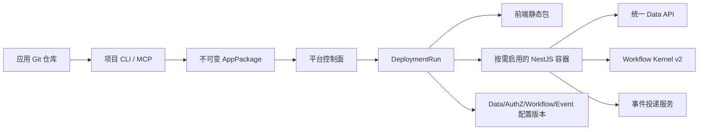

# 核心架构



## 工程边界

- Git 仓库是应用源码与声明的事实来源。
- AppPackage 是交付边界，包含前端摘要、后端镜像摘要、配置包摘要和契约版本。
- 平台是运行状态的事实来源，持久保存应用版本、部署运行、检查点与环境激活状态。
- AI、CLI、MCP 都是控制面客户端，不负责持有发布状态。

## 运行档位

纯 CRUD 和标准审批无需应用后端。需要后端时使用平台可控的运行方式：每应用独立容器，共享 Kubernetes 集群、节点池、网关和可观测基础设施。后续可以用资源配额形成共享档与独享档，但不建设多应用共用 Node 进程。

## 数据边界

首期不为应用创建独立数据库。业务后端通过统一 Data API 访问平台数据；Data API 提供资源化查询、字段策略、行级授权、并发修订和受限事务批处理。这样保留统一治理，又不限制应用后端表达业务逻辑。

应用后端声明具名 Operation 时，不应重新手写用户、部门、资源引用和文件字段协议。`openxiangda/config` 提供 `resourceRecordSchema`、`schemaRef`、`composeJsonSchema` 和 `composeAppOperationSchemas`：它们从同一 Resource declaration 和公共 `FIELD_VALUE_SCHEMAS` 投影请求/响应 JSON Schema，只允许有界的本地 `$defs`/`$ref`，不会改变 Data API、权限或业务事务 owner。

```ts
import {
  composeAppOperationSchemas,
  resourceRecordSchema,
  schemaRef,
} from 'openxiangda/config';

const schemas = composeAppOperationSchemas({
  request: {
    type: 'object',
    additionalProperties: false,
    required: ['record'],
    properties: { record: schemaRef('InstrumentRecord') },
  },
  response: schemaRef('InstrumentRecord'),
  definitions: {
    InstrumentRecord: resourceRecordSchema(instruments, {
      fields: ['name', 'owner'],
    }),
  },
});
```

## 版本列车

OpenXiangda 2.0 使用兼容版本列车，而不是要求所有 npm 包共享同一个版本号。各包按职责独立递增；应用只直接安装精确版本的 `openxiangda` 根包并提交锁文件，内部物理依赖由根包确定，不能使用范围或 `latest`。AppPackage 记录 AppPackage、configuration bundle、contract bundle 和 compiler contract 的原子兼容四元组；平台通过唯一的 `capabilities.configurationCompatibility` 契约声明完整可接受组合、验证端点与 validator 能力版本。CLI 必须把真实生成的 configuration/contract bundle 交给目标平台只读预检，并在应用生产构建、后端镜像构建和制品上传前拒绝不兼容组合；平台部署准备阶段继续权威复验，不允许删字段或向下协商。

AppPackage 的 `compatibility.requiredPlatformCapabilities` 也是 compiler 输出：每项固定包含 `code`、`contractVersion` 和只覆盖该能力相关规范化声明的 `usageDigest`。平台 `features[code]` 必须处于 `available` 且 `contractVersion` 精确相等；`preview`、缺失或版本不同都不能部署。应用配置没有 `platform.requiredCapabilities`，构建 API 也没有追加入口；不得手改 AppPackage 或用字符串能力名绕过 compiler。摘要不包含运行期业务数据或 secret 值，平台部署准备仍须根据原始 config/contract bytes 权威重算。CLI、MCP、Skills 和文档随相关包变更发布，不因无关包升级而强制全量重发。
