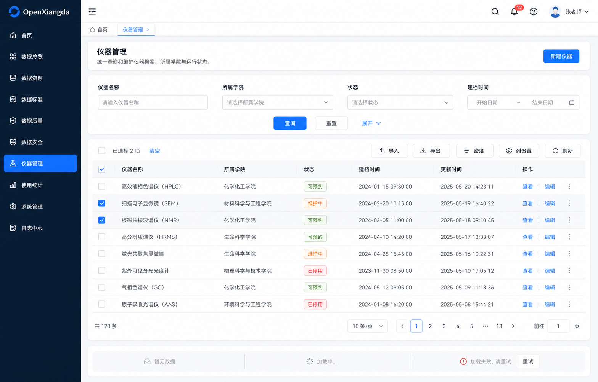
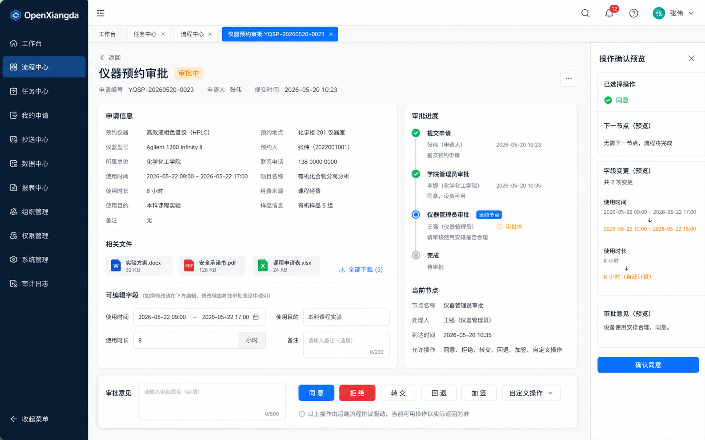

# OpenXiangda 2.0 Admin 设计基线

状态：2026-08-16 已退役，仅保留历史记录。当前实现基线是 [Vite / Refine 前端决策](../../architecture/frontend-stack-decision-v2.md)与[产品北极星](../../architecture/product-north-star-v2.md)，本目录图片不再是验收或 AI 开发输入。

## 设计判断

OpenXiangda 2.0 Admin 面向应用开发者、应用管理员和业务角色用户。界面采用冷静、干净、中低密度的企业级产品语言，组件与交互基于 Ant Design 6，并吸收 ProComponents 的数据管理页面模式。

设计参数：

- `DESIGN_VARIANCE: 4`
- `MOTION_INTENSITY: 2`
- `VISUAL_DENSITY: 5`
- 单一强调色：`#1677ff`
- 输入框与按钮圆角：8px
- 主内容容器圆角：12px
- 页面间距：24px
- 表格常规行高：约 48px

## 设计稿

### 应用壳与工作台

评审结论：

- 保留侧栏、顶栏、身份切换、缓存标签栏和三列洞察区的层级。
- 指标区降低图标装饰，数字必须来自真实接口。
- 快捷入口采用紧凑操作带或非等宽布局，避免三张装饰性等宽卡片。
- 待办列表不使用无语义状态点。
- 不实现设计稿中的伪监控数字。应用模板只能展示真实可获取的数据。

### 标准数据管理页

评审结论：

- 页面由紧凑标题区、搜索区、表格工具区、数据表格和分页组成。
- 搜索字段使用上方标签，不使用占位符代替标签。
- 批量操作只在已选择数据时出现。
- 导入、导出、密度、列设置和刷新归入统一工具区。
- 空、加载、错误是互斥运行状态，设计稿底部三态条仅用于评审说明。
- 侧栏完全由应用路由清单生成，不采用设计稿自行扩展的菜单。

### 流程详情与审批任务页

评审结论：

- 业务字段始终放在申请信息区，由 Data API 或 App API 保存。
- 流程状态、当前节点和审批记录放在审批进度区。
- 同意、拒绝、转交、回退、加签和应用自定义操作都由后端协议返回。
- 操作确认抽屉只在执行前展示动作、下一处理人、字段变化和审批意见。
- 不显示 BPMN 画布、引擎内部节点或低代码配置细节。
- 侧栏完全由应用路由清单生成。

## 应用壳基线

- 桌面侧栏宽度 232px，折叠宽度 68px。
- 顶栏高度 56px，标题使用当前路由名称。
- 稳定角色切换器必须始终可见，并明确显示当前角色与数据范围。
- 缓存标签栏支持刷新、关闭当前、关闭其他和关闭全部。
- 页面存在未保存内容时，导航、关闭标签、切换身份和退出都进入统一的脏状态确认流程。
- 移动端使用抽屉导航，内容区域单列排列。

## 标准页面协议

### 数据管理页

- 必需能力：搜索、排序、分页、列配置、密度切换、刷新。
- 可选能力：创建、编辑、详情、删除、批量操作、导入、导出。
- 权限决定能力是否出现，不在前端复制数据权限规则。
- 列配置和表格密度按应用、身份、资源持久化。
- 请求失败保留现有查询条件，并提供就地重试。

### 表单提交页

- 标题区包含返回、页面标题和简短说明。
- 表单正文使用最大宽度约束，字段标签位于控件上方。
- 主操作为保存或提交，取消为次操作。
- 字段错误就地展示，服务器错误保留已填写内容。
- 页面离开、标签关闭、身份切换时接入统一脏状态管理。

### 表单详情页

- 标题区包含业务标题、状态、关键元数据和允许的操作。
- 字段信息按业务分组显示，不把所有字段堆进一个大表格。
- 文件、长文本和子表拥有独立展示区。
- 编辑入口由能力和字段策略共同决定。

### 流程提交页

- 业务字段表单和流程预览分区展示。
- 提交前解析主部门、角色身份、审批人和条件分支。
- 预览结果由后端返回，前端不自行模拟审批人解析。
- 提交失败保留业务字段和准备阶段答案。

### 流程详情页

- 业务数据与流程状态分离。
- 审批流只展示条件分支、审批节点、处理人、状态、时间和意见。
- 当前允许操作完全由 Workflow Surface 协议返回。
- 应用自定义操作与标准操作共享确认、幂等、审计和结果刷新机制。

### 工作台

- 指标、图表和待办必须来自真实 Data API、App API 或 Workflow API。
- 快捷入口由应用声明，不在框架写死业务菜单。
- 页面提供加载、空和错误状态。
- 图表延迟加载，避免进入应用时加载全部 ECharts 代码。

## 实现预检

- 页面使用 Ant Design 默认组件。
- 不使用渐变、玻璃效果、紫色光晕和装饰性状态点。
- 卡片只用于表达层级，不给每个内容块套卡片。
- 所有按钮文本在桌面端保持单行。
- 表单标签、占位符、帮助文本和错误文本满足可读性要求。
- 空、加载、错误、无权限和成功状态都可独立验证。
- 所有 Admin 页面在 1440px、1024px 和移动端宽度下通过布局验证。
- 所有新增 Ant Design API 在编码前通过本地 `antd` CLI 按 6.4.2 版本核对。
