# OpenXiangda 2.0 三端标准页面高保真设计

本目录定义 OpenXiangda 2.0 的标准后台、业务用户 PC 端和移动端页面基线。设计以 OpenXiangda 1.0 已验证的字段功能、交互和移动适配为行为基线，只把稳定值、文件事务、工作流解析和页面生命周期迁移到 2.0 协议。

这些稿件不是概念海报。每张图对应一个可实现、可测试、可截图回归的产品页面或关键交互状态。

## 设计判断

- 产品类型：面向应用管理员和业务用户的企业操作型产品。
- 视觉语言：克制、可信、高信息密度的 Ant Design 和 Ant Design Mobile。
- `DESIGN_VARIANCE`: 4。
- `MOTION_INTENSITY`: 2。
- `VISUAL_DENSITY`: 8。
- 重设计模式：保留 1.0 的成熟功能和交互，重构 2.0 协议与页面封装。
- 单一组件系统：桌面端使用 Ant Design，移动端使用 Ant Design Mobile，不混入第二套视觉组件库。

## 页面清单

### 后台管理端

| 页面 | 文件 | 评审重点 |
| --- | --- | --- |
| 工作台 | `admin-workbench.png` | 管理导航、指标、待办、趋势、快捷入口、活动时间线 |
| 数据列表与新建抽屉 | `admin-data-form.png` | 服务端查询、表格、分页、表单校验、上传中和上传成功 |
| 组件验收 | `admin-component-acceptance.png` | 字段分组、文件状态、图片、定位、签名、富文本、只读和错误计数 |
| 标准资源列表默认态 | `standard-resource-list-v3.png` | 紧凑路由栏、网络进度、历史标签、折叠筛选和分层工具栏 |
| 标准资源列表展开态 | `standard-resource-list-expanded-v3.png` | 更多筛选、个人信息菜单、现有成员与部门选择入口 |
| 标准资源详情 | `standard-resource-detail-collapsed-v2.png` | 单主表面、无右侧审计栏、变更记录默认折叠 |
| 标准资源表单布局参考 | `standard-resource-form-directory-v2.png` | 两列表单和固定操作栏；图中的成员抽屉方案已经撤回 |
| 变更记录展开态 | `standard-resource-detail-audit-expanded-v2.png` | 中文动作、操作者、时间、字段旧值与新值 |
| 应用待办中心 | `todo-center-desktop-v2.png` | 全宽列表、真实未读筛选、无常驻详情、按规范路由查看详情 |

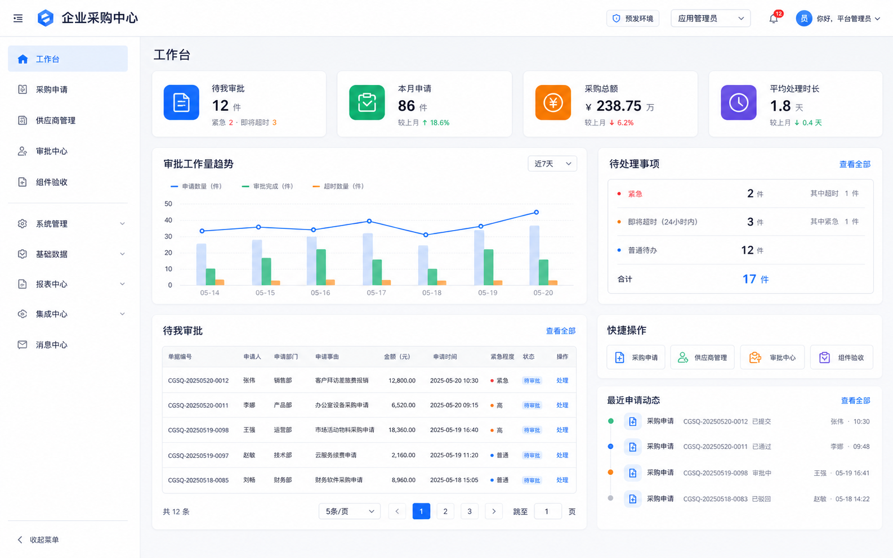

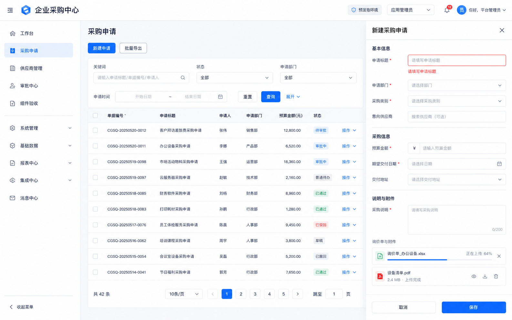

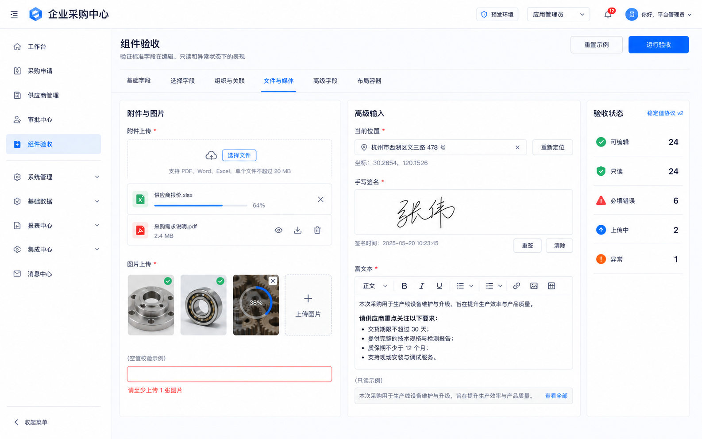

`standard-resource-list-v2.png`和`standard-resource-form-directory-v2.png`中的列表工具排列及成员抽屉属于上一轮探索，不作为对应交互的实施标准。成员和部门编辑态继续复用平台当前选择器。

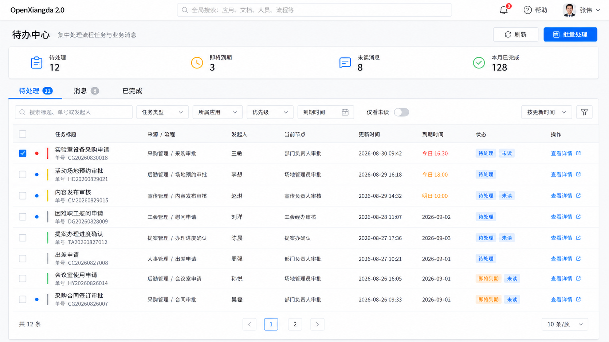

列表、详情、表单、人员与部门、审计和加载交互的完整规范见
[标准资源 CRUD 页面 UI 规范](standard-resource-crud-v2.md)。

### 业务用户 PC 端

| 页面 | 文件 | 评审重点 |
| --- | --- | --- |
| 工作台 | `user-pc-workbench.png` | 独立用户壳层、待办、快捷发起、流程配置提醒、我的申请 |
| 我的申请 | `user-pc-data-list.png` | 状态切换、服务端筛选、列表选中、详情抽屉、附件和分页 |
| 发起申请与审批预览 | `user-pc-form-workflow-preview.png` | 详细表单、文件生命周期、定位、签名、审批人实时解析和提交校验 |

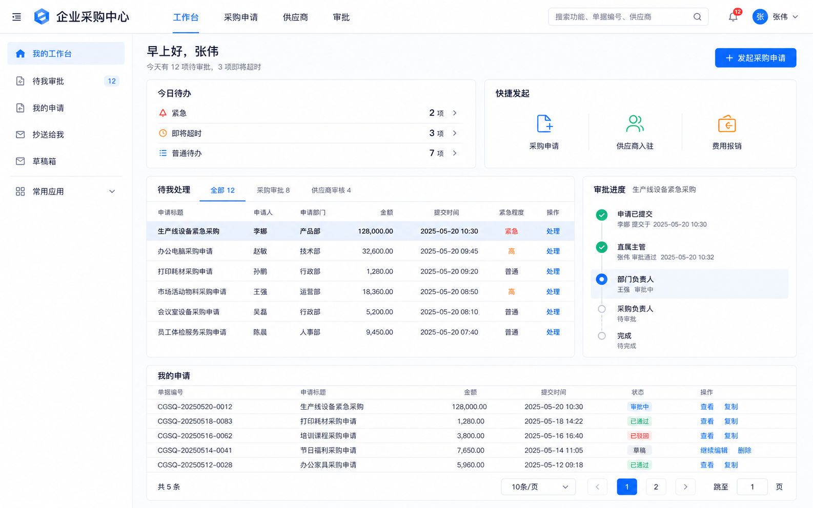

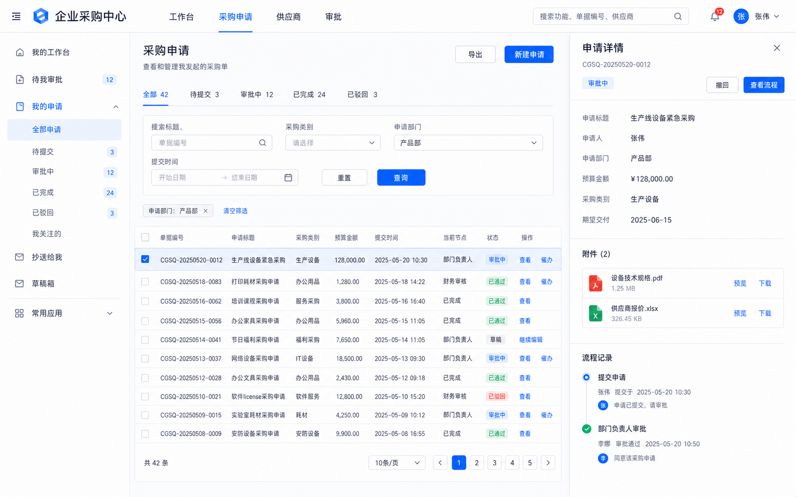

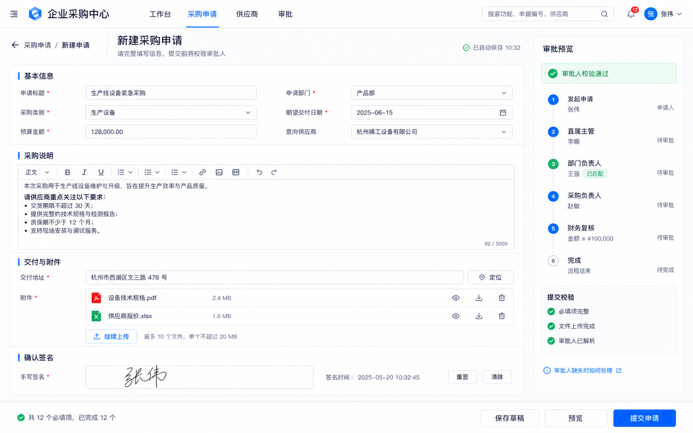

### 移动端

| 页面 | 文件 | 评审重点 |
| --- | --- | --- |
| 工作台 | `mobile-workbench.png` | 拇指操作区、待办、快捷入口、最近事项、流程提醒、底部导航 |
| 采购申请列表 | `mobile-data-list.png` | 搜索、状态筛选、卡片列表、浮动新建入口 |
| 发起采购申请 | `mobile-form.png` | 单列字段、显式必填星号、内联错误、附件去重、图片、定位、签名 |
| 提交与审批预检 | `mobile-submit-workflow-preflight.png` | 底部弹层、审批人缺失、业务化错误、阻止无效提交 |
| 流程任务详情 | `mobile-workflow-detail.png` | 表单摘要、附件、流程时间线、审批意见、驳回和同意 |

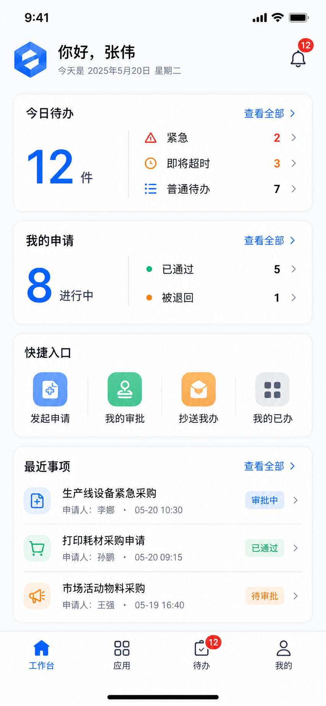

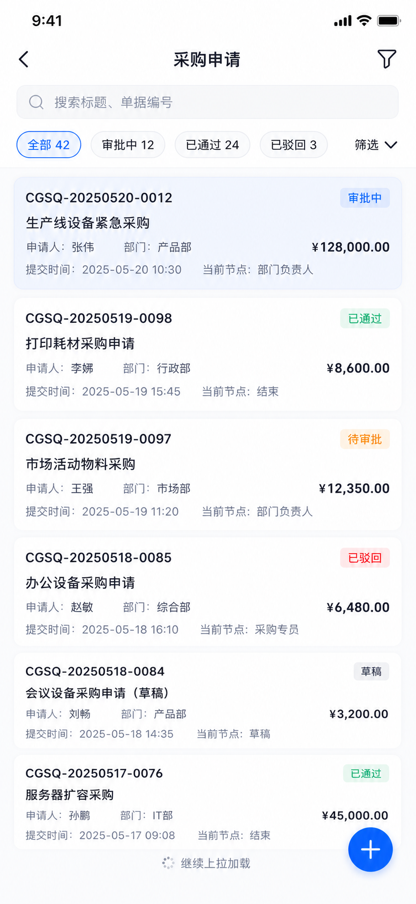

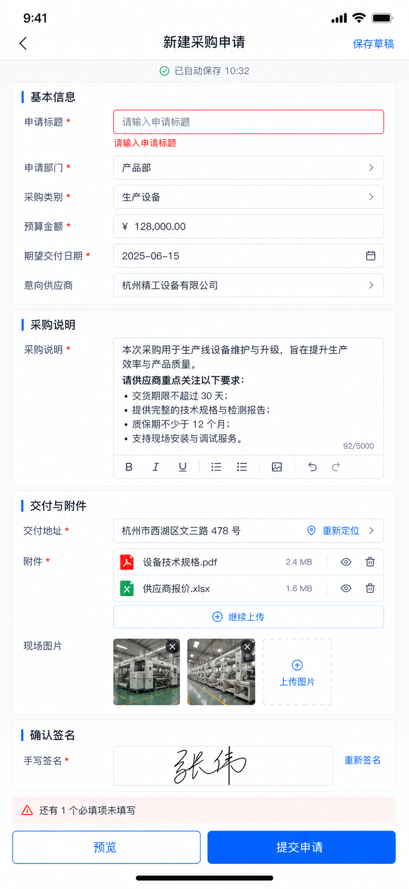

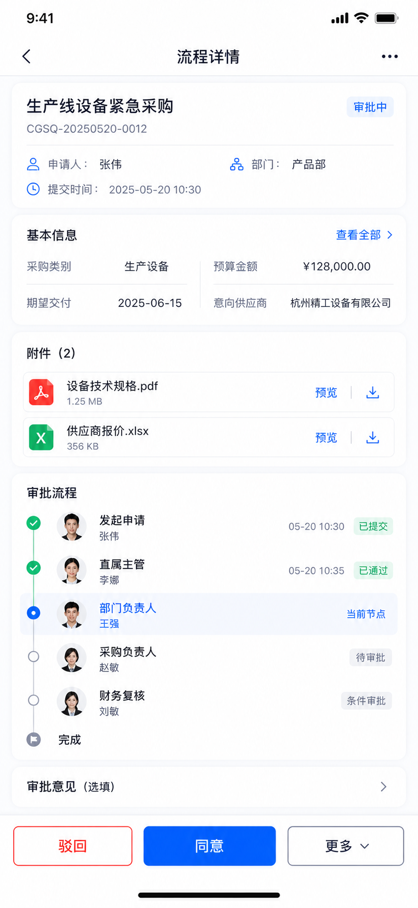

目录中的 `user-pc-request-list.png`、`user-pc-request-form-approval.png`、`mobile-request-list.png`、`mobile-request-form.png` 和 `mobile-approval-preview.png` 是第一轮方案探索稿。上述页面清单中的文件是本轮实施基线，截图回归和组件落地以实施基线为准。

## 组件与布局

使用组件库默认外观，不增加平台配色配置。

### 字体与字号

- 字体栈：系统中文无衬线字体，保持 Ant Design 默认可读性和跨平台稳定性。
- 桌面页面标题：24px，600。
- 桌面分区标题：16px，600。
- 桌面正文和控件：14px。
- 移动导航标题：18px，600。
- 移动分区标题：16px，600。
- 移动字段标签和正文：14px 至 16px。
- 表格数字、金额和编号保持等宽数字特性，右对齐金额。

### 间距与形状

- 基础间距单位：4px。
- 桌面内容间距：16px、20px、24px。
- 移动页面边距：12px 至 16px。
- 桌面控件圆角：8px。
- 移动分区圆角：12px。
- 标签和状态 Tag 可使用 6px 圆角，不使用装饰性胶囊。
- 桌面控件高度：32px 至 40px。
- 移动可点击区域最小高度：44px。
- 阴影只用于抽屉、弹层、底部操作栏和真正有层级关系的表面。

## 页面壳层

### 后台管理端

- 紧凑路由栏高度 48px，只显示面包屑和精简个人入口。
- 路由栏底边提供 2px 全局网络请求进度线。
- 路由栏下方提供 36px 浏览历史标签，缓存列表查询上下文。
- 左侧导航宽度 248px。
- 导航选中态使用浅蓝底和主色文字。
- 主内容区允许高密度表格、查询区、抽屉和组件验收页面。
- 数据查询、分页、权限、加载和错误由页面控制器统一管理。

### 业务用户 PC 端

- 顶栏高度 64px，不显示后台管理导航。
- 工作台和数据列表允许使用 208px 个人视图侧栏，只承载我的待办、我的申请、抄送和草稿等个人范围导航。
- 聚焦表单不显示个人侧栏，使用返回路径、主表单和审批预览三段结构。
- 主内容在 1280px 至 1586px 桌面宽度内保持稳定信息密度。
- 工作台、发起申请、我的申请、待办审批和消息共享一个独立用户 renderer。
- 表单页使用主表单加审批预览双栏布局。窄屏时审批预览下移或切换为抽屉。

### 移动端

- 使用安全区，底部操作栏不覆盖系统手势区域。
- 一级页面使用底部导航，表单、预览和任务详情不重复显示底部导航。
- 表格转换为可扫描的单列记录，不把桌面表格压缩到移动屏幕。
- 表单标签置于控件上方，错误紧贴当前字段。
- 固定提交栏只包含当前页面最重要的操作。

## 标准字段分组

组件验收页按以下组组织。实现阶段需通过 1.0 registry 逐项校对具体字段名、默认值、编辑器和移动端行为。

| 分组 | 字段能力 |
| --- | --- |
| 基础字段 | 单行文本、多行文本、数字、金额、日期、日期范围、时间、开关 |
| 选择字段 | 单选、多选、下拉、级联选择 |
| 组织与关联 | 人员、部门、关联记录、子表 |
| 文件与媒体 | 附件、图片、上传进度、预览、下载、删除、失败重试 |
| 高级字段 | 定位、签名、富文本 |
| 布局容器 | 分区、栅格、说明、只读详情容器 |

每个字段至少验收以下状态：

- 空值和默认值。
- 可编辑、只读和禁用。
- 必填、格式、长度和业务校验错误。
- 加载、空态和请求失败。
- PC 和移动端输入方式。
- 稳定值序列化、反序列化和提交回显。

## 文件与图片交互

附件和图片只允许一条状态链：

1. 用户选择文件。
2. 客户端校验类型、大小和数量。
3. 创建唯一的本地上传项。
4. 显示上传进度和取消操作。
5. 上传成功后用平台文件引用替换本地项。
6. 稳定身份去重后回写字段值。
7. 表单提交时绑定业务记录。
8. 删除时同步更新展示值和稳定值。

禁止同时维护 Ant Upload 内部列表和第二份业务列表。文件身份优先使用平台文件 ID，其次使用稳定上传 ID，不使用文件名作为唯一身份。

错误处理：

- 文件字段未在资源协议声明时，字段附近显示可操作错误，不继续产生孤儿文件。
- 上传失败保留文件名、失败原因和“重试”操作。
- 上传中阻止最终提交，但允许保存草稿。
- 同一文件不得在成功回调后重复展示。

## 定位、签名和富文本

### 定位

- 编辑态只通过钉钉定位或浏览器 Geolocation 重新采集经纬度，不提供地址输入框。
- 移动端直接调用钉钉或浏览器定位能力，不提供地图选点或手工地址入口。
- 拒绝、超时或不支持定位时显示原因和重试操作，不允许用手工值绕过。
- 只读态显示经纬度、定位来源和精度；定位服务返回的地址或 POI 只作为只读快照辅助展示。

### 签名

- 编辑态提供手写画布、清除、重签和签名时间。
- 移动端画布应支持横屏或扩大输入区域。
- 稳定值包含托管 PNG 文件引用、轨迹、时间戳和哈希；业务数据不保存 data URL。
- 只读态提供清晰预览，不显示可编辑工具。

### 富文本

- 工具栏只保留业务表单常用格式。
- 编辑值提交前做安全清洗，只读渲染再次做安全处理。
- 内联图片使用富文本字段自身的 Native managed-file 上传、事务绑定和孤儿清理。
- 移动端使用简化工具栏，不压缩桌面工具栏。

## 表单与错误

- 所有必填字段在桌面和移动端都显示红色 `*`。
- 字段错误紧贴控件下方，不只使用 Toast。
- 首次提交失败后滚动并聚焦第一个错误字段。
- 页面级错误只用于跨字段、权限、网络或工作流阻断。
- 保存草稿允许未完成字段，但必须保存完整稳定值状态。
- 正在上传、签名未完成或审批人解析失败时禁用最终提交。

## 工作流解析

`WORKFLOW_V2_APPROVER_RESOLUTION_EMPTY:department-review` 不能被前端吞掉，也不能自动回退到任意审批人。

标准映射：

- 用户消息：`产品部未配置部门负责人，暂时无法提交`。部门名称来自当前表单上下文。
- 影响：提交按钮禁用。
- 修复建议：`请先为产品部配置部门负责人`。
- 辅助操作：`查看处理方式`、`联系管理员`、`返回修改`。
- 管理员工作台同时显示流程配置提醒。

审批预览必须基于当前表单数据实时计算，并展示条件分支、匹配到的审批人和未解析节点。

## 状态规范

### 加载

- 使用与最终布局一致的骨架屏。
- 上传进度使用文件行内进度，不用全屏转圈。
- 审批预览重新计算时保留原布局，局部展示加载状态。

### 空态

- 空列表说明原因并提供唯一的下一步操作。
- 无最近事项时不占用大面积空白。
- 空文件字段显示选择文件和限制说明。

### 错误

- 字段错误行内显示。
- 网络错误保留用户输入并提供重试。
- 权限错误说明缺少的权限和申请入口。
- 工作流错误展示业务语言，同时保留可观测的技术错误码供日志使用。

### 只读

- 只读字段保持与编辑态相同的信息顺序。
- 隐藏编辑按钮和上传入口。
- 附件保留预览和下载，是否允许下载由权限策略决定。

## 动效

- 动效只服务于反馈和状态变化。
- 控件按下使用轻微缩放或位移，持续时间 120ms 至 180ms。
- 抽屉和底部弹层使用 200ms 至 240ms 的进入和退出。
- 上传进度平滑更新，不使用循环装饰动画。
- 尊重 `prefers-reduced-motion`。

## 可访问性与验收尺寸

- 正文和控件文字满足 WCAG AA 对比度。
- 错误不能只靠颜色表达，必须包含文字或图标。
- 键盘焦点清晰可见。
- 桌面重点截图尺寸：1586x992。
- 移动重点截图尺寸约 852x1844，对应约 430px 逻辑宽度的高分屏设备。
- 额外验证宽度：1440、1280、1024、768、430、390、375、320。

## 生成说明

- 生成方式：Codex 内置 `imagegen`。
- 用例分类：`ui-mockup`。
- 用户提供的图片只作为现状问题和信息结构参考。
- 后台、业务 PC 和移动端分别使用上一张已确认稿作为风格锚点，保证三端同源但壳层独立。
- 生成提示分别约束了页面结构、可见中文、上传状态、必填错误、审批分支和禁止项。
- 最终图片已经复制到本目录，项目文档不依赖默认生成目录。

## 实施验收

设计落地后至少覆盖：

1. 全量 1.0 字段矩阵和 PC、移动交互对照。
2. 文件唯一状态链和重复回显回归测试。
3. 图片字段资源声明和上传、绑定、删除测试。
4. 钉钉/浏览器定位成功、拒绝、超时、不支持、重试，以及手工来源和缺失经纬度拒绝测试。
5. 签名输入、清除、重签、只读和稳定值测试。
6. 富文本编辑、清洗、只读和移动工具栏测试。
7. 必填错误、保存草稿、提交聚焦和移动底栏测试。
8. 审批人解析成功、空结果和条件分支测试。
9. 后台、业务 PC 和移动端 Playwright 截图回归。
10. 构建、Changeset、发布门禁和发布后冒烟测试。
