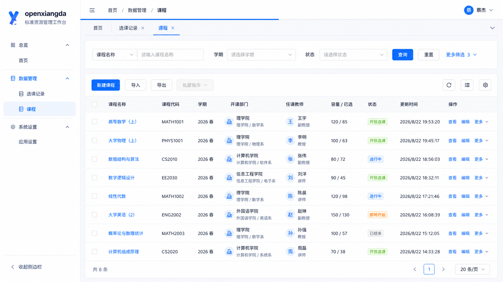
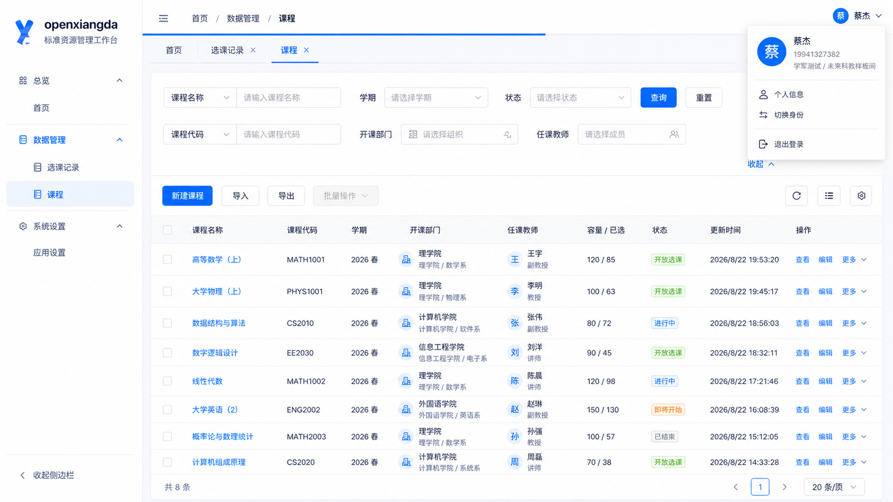
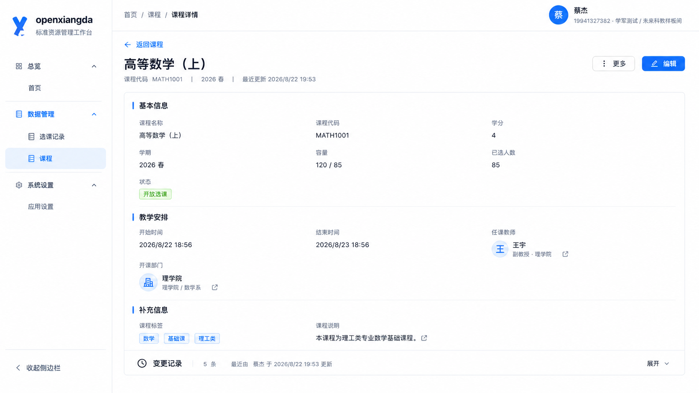
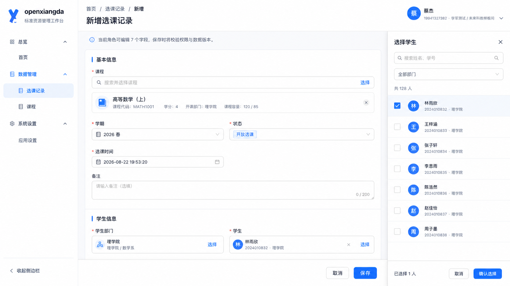
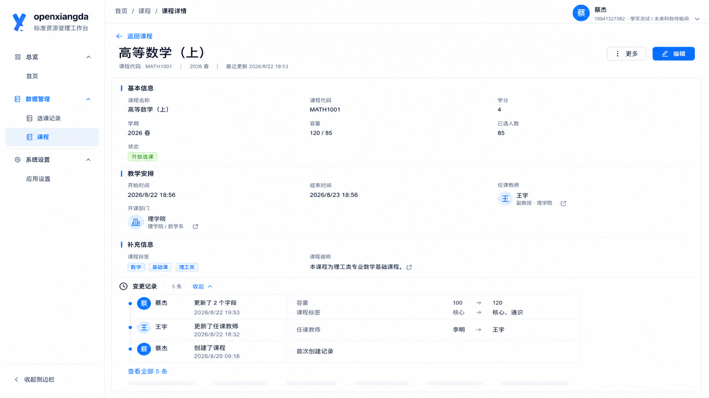

# OpenXiangda 2.0 标准资源 CRUD 页面 UI 规范

状态：高保真设计基线，进入通用生成器实现前的视觉合同

日期：2026-08-23

## 1. 设计判断

- 产品类型：面向应用管理员的企业资源管理后台。
- 重设计模式：保留现有品牌、导航和页面路径，重构内容层级与通用组件表现。
- 视觉语言：克制、可信、高信息密度的 Ant Design 6。
- `DESIGN_VARIANCE`：4。
- `MOTION_INTENSITY`：2。
- `VISUAL_DENSITY`：8。
- 桌面组件系统：Ant Design 6.4.3。
- 移动组件系统：Ant Design Mobile，不压缩桌面表格和桌面选择器。

本规范只定义平台标准资源页。复杂业务页仍可覆盖标准布局，但应复用同一壳层、Directory Identity、加载反馈和审计展示。

## 2. 当前问题与设计决策

| 当前问题 | 设计决策 |
| --- | --- |
| 顶部壳层同时显示面包屑和大标题，占用高度并重复表达当前位置 | 顶部改为 48px 紧凑路由栏，只显示面包屑；标准列表不再显示额外标题 |
| 顶部默认展示手机号、部门等完整个人信息 | 默认只显示头像、姓名和下拉箭头，完整身份信息与账户操作进入头像菜单 |
| 页面切换和数据查询缺少统一进度反馈 | 在紧凑路由栏底边提供 2px 全局网络请求进度线 |
| 多页面往返完全依赖侧栏，列表查询上下文容易丢失 | 在路由栏下增加浏览历史标签，缓存筛选、排序、分页和滚动位置 |
| 筛选区、标题区、表格区层层套卡片 | 最多保留筛选表面和数据表面两层功能容器，不再嵌套标题卡片 |
| 筛选字段多时全部平铺，挤压表格首屏 | 默认展示高频筛选项，其余字段由 `更多筛选` 展开为第二行 |
| 新建、导入导出、列设置和密度堆叠在右侧 | 业务动作放在表格工具栏左侧，表格视图工具放在右侧 |
| 人员、部门使用大边框卡片，破坏描述列表和表格对齐 | 统一使用轻量 Directory Identity，图标或头像加主文本和次级路径，不使用外层卡片 |
| 新设计的成员选择抽屉与平台现有成熟选择器不一致 | 撤回新的选择器交互，Surface 字段继续映射平台当前成员和部门选择器 |
| 最近变更长期占据详情右栏 | 变更记录放到详情内容下方，默认折叠，首次展开时读取 |
| 变更只显示 created、updated | 使用中文动作摘要，并显示操作者、时间、字段旧值和新值 |
| 列表请求时缺少稳定加载反馈 | 路由级使用顶部进度线，列表级保留表格布局并显示骨架或局部加载态 |
| 表单权限说明占据大面积首屏 | 仅在确有必要时显示紧凑信息行，不默认显示大号 Alert |

## 3. 高保真设计图

### 3.1 标准列表页默认态



### 3.2 标准列表页展开态与个人菜单



### 3.3 标准详情页，变更记录默认折叠



### 3.4 标准表单布局参考

下图只保留表单分区、字段布局和底部操作栏作为参考。图中的成员抽屉方案已经撤回，不属于实施基线。



### 3.5 标准详情页，变更记录展开



## 4. 平台壳层

### 4.1 紧凑路由栏

- 顶部壳层高度为 48px，只显示菜单折叠入口和面包屑，例如 `首页 / 数据管理 / 课程`。
- 顶部壳层不得再显示独立大标题。
- 标准列表不再显示额外的 `课程` 标题，侧栏选中态、面包屑和历史标签已经提供足够定位。
- 详情和表单可在内容区显示业务上下文标题，例如 `课程详情`、`新增选课记录`，但顶部路由栏不重复该标题。
- `由 courses 资源 Surface 自动生成的标准 CRUD 页面` 属于开发说明，不进入运行页面。
- 资源说明只允许出现在帮助入口、空状态或显式业务介绍中。

### 4.2 个人信息菜单

- 默认态只显示 28px 头像、姓名和下拉箭头，不显示手机号、组织和身份路径。
- 鼠标移入或点击头像区域打开 280px 至 320px 下拉菜单。
- 键盘 Enter、Space 和移动端点击必须同样可用，不能只有 hover 交互。
- 菜单头部显示头像、姓名、账号和当前身份路径。
- 菜单操作固定为 `个人信息`、`切换身份` 和 `退出登录`，退出登录前使用分隔线。
- 鼠标进入延迟建议为 120ms，移出关闭延迟建议为 200ms，避免经过头像时误触闪烁。
- 切换身份成功后清理当前身份的页面缓存并重新计算权限，不能继续复用旧身份的列表结果。

### 4.3 全局网络请求进度

- 进度线固定在紧凑路由栏底边，高度 2px，不占用额外布局空间。
- 路由切换、资源查询、详情读取和显式业务动作进入同一个请求计数器。
- 120ms 内完成的请求不显示进度线，避免快速请求造成闪烁。
- 开始时从 8% 进入，活动期间缓慢推进到 85%，全部前台请求完成后到 100% 并在 180ms 内淡出。
- 并发请求未全部完成前不得消失，旧请求结束不能错误关闭新请求的进度。
- 后台轮询、预取和不影响当前页面的静默请求默认不触发进度线。
- 请求失败时进度线完成并淡出，具体错误仍在对应内容区域展示，进度线不承担错误说明。
- `prefers-reduced-motion` 下取消缓动，只保留出现、完成和消失三个状态。

### 4.4 浏览历史标签

- 历史标签位于路由栏下方，高度 36px，属于平台壳层而不是应用页面代码。
- `首页`固定且不可关闭，资源列表、详情和表单按实际访问顺序增加可关闭标签。
- 同一路由重复进入时激活已有标签，不重复创建；列表筛选参数不作为新标签身份。
- 每个标签缓存筛选条件、排序、分页、滚动位置和展开状态，切换回来时恢复界面并按数据新鲜度决定是否后台刷新。
- 缓存写入 `sessionStorage`，刷新页面后可恢复；键名必须包含用户、应用和环境，退出登录或切换身份时清理。
- 默认最多保留 12 个标签，超过后按最近最少使用顺序关闭无脏数据的标签。
- 新建和编辑表单存在未保存内容时显示脏状态，关闭标签前确认。
- 关闭当前标签后优先激活右侧相邻标签，没有右侧时激活左侧。
- 标签过多时横向滚动，右侧下拉用于搜索、定位、关闭其他和关闭全部。

### 4.5 桌面尺寸

| 项目 | 标准值 |
| --- | --- |
| 紧凑路由栏高度 | 48px |
| 浏览历史标签高度 | 36px |
| 左侧导航宽度 | 248px |
| 主内容边距 | 24px |
| 功能表面圆角 | 8px |
| 控件圆角 | 6px 至 8px |
| 常规控件高度 | 36px 至 40px |
| 表格表头高度 | 44px |
| 表格行高 | 56px 至 60px |

主内容在 1280px 至 1920px 宽度保持同一信息层级。宽屏增加列间距，不放大字体和按钮。

## 5. 标准列表页

### 5.1 结构

```text
紧凑路由栏
├── 全局请求进度线
└── 浏览历史标签
    ├── 筛选表面
    │   ├── 高频筛选项
    │   └── 更多筛选项，按需展开
    └── 数据表面
        ├── 左侧业务动作 / 右侧表格工具
        ├── 表格
        └── 结果统计与分页
```

- 筛选表面与数据表面是两个明确功能区，不再套标题 Card。
- 默认展示最多 3 个高频筛选项，剩余字段收进 `更多筛选`。
- 展开后增加第二行或后续紧凑网格，不能把筛选项压成难以使用的窄控件。
- `更多筛选（3）`中的数字表示隐藏字段数量。隐藏条件已有值时额外显示激活数量。
- 收起更多筛选不会清空隐藏条件，查询仍包含这些条件。
- `重置`使用次级文字按钮，不与`查询`争夺主操作层级。
- 展开和收起只做 160ms 高度与透明度过渡，不产生新的数据请求。

### 5.2 操作工具栏

- 左侧是业务动作：`新建`、`导入`、`导出`和按需出现的`批量操作`。
- `新建`是唯一主按钮，导入和导出为次级按钮。
- 未选中记录时批量操作禁用；选中后显示选中数量和当前可用批量动作。
- 右侧是表格工具：`刷新`、`密度`、`列设置`，使用同一尺寸的紧凑图标按钮并提供 Tooltip。
- 表格工具不得与新建按钮垂直堆叠，也不得占用筛选行。
- 低于 1280px 时，低频业务动作可收进 `更多操作`，新建和表格工具保持可见。
- 列设置与密度按用户、应用和资源保存偏好，不修改 Surface 声明。

### 5.3 表格信息顺序

- 第一列优先使用业务主标识，例如课程名称、会议名称、访客姓名。
- 资源声明顺序不能直接决定列表顺序。
- 默认顺序建议为：主标识、业务编码、状态、核心关联、时间、操作。
- 数字、容量和金额使用等宽数字并按业务语义对齐。
- 关联记录、部门和人员使用统一轻量 renderer。
- 操作列使用 `查看`、`编辑`、`更多`。删除进入 `更多` 菜单并二次确认。
- 行内图标按钮必须有 Tooltip 和可访问名称，不使用无说明的眼睛、铅笔、垃圾桶组合。

### 5.4 列表交互

- 点击业务主标识进入详情。
- Enter 提交当前搜索。
- 修改筛选条件后不立即连发多个请求，显式点击查询或使用 300ms 去抖的单字段搜索。
- 搜索、排序和分页改变时，旧请求不得覆盖新结果。
- 列设置和密度属于当前用户偏好，不改变 Surface 和后端数据。
- 表格横向空间不足时固定主标识与操作列，中间列横向滚动。

### 5.5 加载、空态和错误

- 路由切换和前台数据请求使用路由栏底部的 2px 全局进度线。
- 查询加载保留表头、分页和容器高度，表体使用骨架或 Ant Design Table 局部加载。
- 加载期间保留当前筛选条件，避免页面闪回空白。
- 空状态说明当前筛选无结果，并提供 `清除筛选`。
- 首次无数据时提供唯一主操作 `新建记录`。
- 请求错误在表格区域显示原因和重试，不销毁工具栏。

## 6. 标准详情页

### 6.1 页面头

- 返回路径、业务主标题、少量元数据和操作保持在紧凑区域。
- 不显示 UUID。
- 版本号仅用于冲突和诊断，不作为主要视觉信息。
- 页头只保留 `编辑` 与 `更多`，不再额外放置 `操作记录`。

### 6.2 信息布局

- 详情使用一个宽主表面，不使用右侧审计栏。
- 字段按 Surface 分区组织。默认分区名为 `基本信息`。
- 分区之间使用留白和单条分隔线，不为每个分区增加 Card。
- 桌面使用三列 Descriptions，1024px 以下切为两列，768px 以下切为单列。
- 长文本、附件、富文本和地图类字段独占整行。
- 状态显示语义 Tag，布尔值显示业务文案，不显示原始 true 或 false。

## 7. 人员与部门统一组件

### 7.1 Directory Identity

统一组件包含以下元素：

1. 24px 至 32px 头像或浅蓝图标。
2. 14px 主名称。
3. 12px 次级信息，例如岗位、学号或部门路径。
4. 可选的跳转图标，仅在允许查看关联详情时显示。

### 7.2 使用规则

| 场景 | 表现 |
| --- | --- |
| 表格 | 28px 图标或头像，主名称单行，次级信息单行，整体不加边框 |
| 详情 | 28px 至 32px 图标或头像，主名称与路径左对齐，可显示关联跳转 |
| 表单已选值 | 位于控件边界内，显示主名称、次级信息和移除按钮 |
| 多选 | 展示前 2 项，其余使用 `+N`，展开后查看全部 |
| 空值 | 显示 `未选择`，不用短横线替代可操作状态 |

部门统一使用组织图标，不使用名称首字作为伪头像。人员优先显示真实头像，缺失时使用姓名首字和稳定浅蓝背景。一个页面不随机分配多种头像颜色。

### 7.3 选择器

- 本轮不修改平台现有成员和部门选择器的布局、交互与移动端实现。
- Surface 生成器只负责把成员、部门字段映射到现有平台选择器，不再生成新的 Drawer 或 Popup 方案。
- 已选值继续使用现有选择器的稳定值、回显和提交合同。
- 本规范的 Directory Identity 只约束表格与详情中的只读展示，不替换现有编辑态选择体验。
- `standard-resource-form-directory-v2.png`中的右侧成员抽屉是已撤回探索方案，实现时必须忽略。

## 8. 变更记录

### 8.1 默认状态

- 位于详情主表面底部。
- 默认折叠，不占用首屏宽度和高度。
- 折叠标题显示 `变更记录`、总数、最近操作者与时间。
- 首次展开时读取数据，关闭后保留已读取结果，记录 revision 变化后失效。

### 8.2 展开状态

每条记录必须显示：

- 中文动作：`创建了记录`、`更新了 2 个字段`、`删除了附件`。
- 操作者姓名和头像。
- 操作时间。
- 发生变化的字段。
- 旧值和新值。

字段差异使用紧凑行，不为每个字段创建大卡片。旧值使用次级文字，新值使用主文字。只有真实新增或删除才使用成功色或错误色。

### 8.3 数据规则

- 未修改任何字段的保存不得产生更新记录。
- 相同稳定值的重新提交不得产生更新记录。
- 日期、人员、部门、附件和关联记录使用格式化业务值，不显示原始 JSON。
- 当前用户无权读取的字段不得在变更记录中泄露字段值。
- 列表默认显示最近 3 条，`查看全部`进入完整历史或继续分页加载。

## 9. 标准表单

### 9.1 布局

- 页面标题只显示一次。
- 表单使用一个主表面和多个语义分区。
- 普通字段使用两列，长文本和复杂字段占满整行。
- 标签位于控件上方，错误位于控件下方。
- 权限提示仅在确有字段受限时显示紧凑信息行。
- 底部操作栏在内容区内 sticky，包含 `取消` 与唯一主操作 `保存`。

### 9.2 表单状态

- 保存按钮显示局部 loading，并防止重复提交。
- 校验失败后滚动并聚焦第一个错误字段。
- 网络失败保留所有输入。
- revision 冲突显示可理解说明，并提供重新读取和比较操作。
- 只读字段保留原字段顺序，但不伪装成 disabled 输入框。

## 10. 移动端适配

- 移动列表使用单列记录卡片，不缩小桌面表格。
- 移动详情使用单列字段，变更记录仍位于底部且默认折叠。
- 移动表单为单列，固定底部操作栏遵守安全区。
- 人员、部门、关联资源、日期和附件使用移动专用 renderer。
- 人员和部门继续使用平台当前移动端选择器，点击区域不小于 44px。
- 表格列设置和密度不进入移动端。

## 11. Ant Design 6 实现映射

| 能力 | 组件建议 |
| --- | --- |
| 列表 | `Table`，使用 `loading`、`sticky`、`scroll`、服务端 `onChange` |
| 字段详情 | `Descriptions`，使用 `items` 与响应式 `column` |
| 变更折叠 | `Collapse`，默认无 `defaultActiveKey`，首次展开加载 |
| 变更时间线 | `Timeline`，使用 `items` 和中文动作摘要 |
| 人员与部门选择 | 复用平台当前选择器，生成器只做字段类型映射 |
| 页面加载 | 顶部 `Progress` 加局部 `Skeleton` 或 Table loading |
| 浏览历史 | 壳层 `Tabs` 加有界 `sessionStorage` 状态缓存 |
| 个人菜单 | `Dropdown`，桌面 hover 和 click，键盘与移动端 click |
| 更多筛选 | 响应式 Grid 加受控展开状态 |
| 状态 | `Tag`，颜色只表达真实业务状态 |
| 表单 | `Form`，标签置顶、两列 Grid、sticky footer |

禁止引入第二套表格、表单或状态管理协议。Ant Design 只承担表现与交互，Surface、Native Data API、权限和 revision 继续是事实源。

## 12. 后续 Surface 协议建议

以下内容是实现建议，不在本轮设计资产中修改协议：

- 列表需要显式 `primaryField` 与业务优先列顺序。
- 列表允许声明筛选优先级，平台据此决定默认展示和更多筛选顺序。
- 页面历史、个人菜单和全局进度属于壳层能力，不进入资源 Surface。
- 资源说明默认不进入列表标题区。
- 详情允许声明字段分区与跨列宽度。
- 人员、部门、关联资源统一选择 display variant，不由应用手写 renderer。
- 审计默认 `placement: bottom`、`defaultExpanded: false`。
- 审计读取、分页和字段差异格式化由标准详情控制器统一承担。

## 13. 验收清单

1. 顶部路由栏高度不超过 48px，只显示路由，不显示大标题。
2. 标准列表不再重复显示资源标题、资源代码或 Surface 生成说明。
3. 默认顶栏不显示手机号、部门和身份路径，头像菜单可完整访问个人信息、切换身份和退出登录。
4. 路由和前台数据请求能驱动同一条 2px 进度线，并发请求期间不会提前消失。
5. 历史标签能恢复筛选、排序、分页和滚动位置，退出登录或切换身份后不复用旧缓存。
6. 筛选超过 3 项时可以展开和收起，收起不丢失已填写的隐藏条件。
7. 新建、导入、导出位于左侧业务动作区，刷新、密度、列设置位于右侧表格工具区。
8. 平台现有成员和部门选择器保持不变，Surface 只做标准字段映射。
9. 详情页没有右侧审计栏，变更记录默认折叠并在首次展开时读取。
10. 变更条目显示中文动作、操作者、时间、字段旧值和新值。
11. 无字段变化的保存不生成审计记录。
12. 列表、详情和表单均具备加载、空态、错误和权限状态。
13. 1440、1280、1024、768、430、390 和 375 宽度截图回归通过。

## 14. 生成说明

- 生成方式：Codex 内置 `imagegen`。
- 用例分类：`ui-mockup`。
- 参考输入：用户提供的现有课程列表、课程详情和选课表单截图。
- 2026-08-23 使用上一版标准列表作为编辑目标，新增标准列表默认态和展开态两张稿。
- 新增提示分别约束了紧凑路由栏、全局请求进度、历史标签、折叠筛选、操作工具分层和个人信息菜单。
- 成员选择器明确保持平台现状，不再采用上一轮生成的右侧抽屉方案。
- 图片已经复制到本目录，不依赖默认生成目录。
